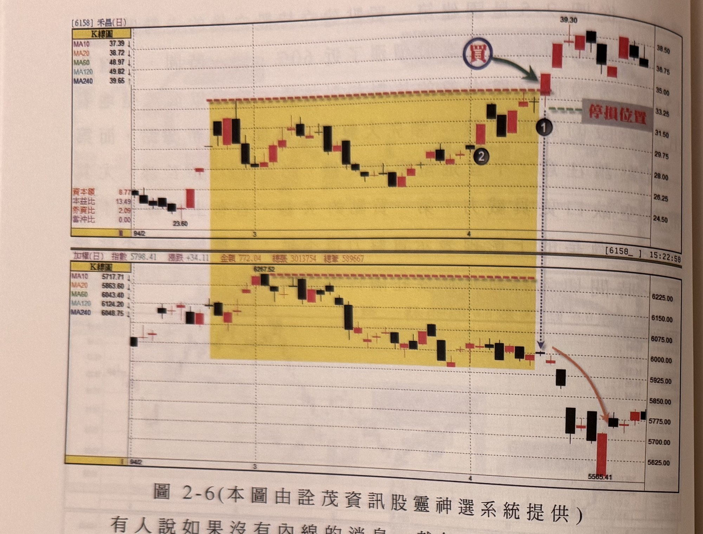
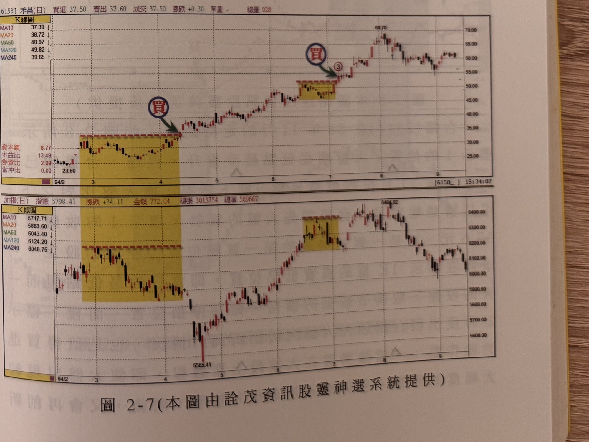

## p.66

**圖 2-6（本圖由詮茂資訊股靈神選系統提供）**

> 圖說（figure notes）: 上下兩格日線K線圖比對，上為禾昌（代號6158）K線圖（左側表列MA10 37.39、MA20 38.72、MA60 48.97、MA120 49.82、MA240 39.65，資本額8.77、本益比13.49、券資比2.09、當沖比0.00），黃色矩形標示94年2月至4月的橫向整理區間（低點23.60），區間內標示②（黑圓圈），區間右緣深藍圓圈「買」與綠色箭頭指向突破區間的紅K線（標示①），右側「停損位置」虛線標示於區間上緣。股價突破後急漲至39.30高點，再回落至35~38元區間整理。下為加權指數同期走勢，同樣以黃色矩形標示對應的整理區間（高點6267.52），區間右緣對應標示①之時間點，其後指數持續下跌，並以橙色曲線箭頭標示急跌走勢，指數下探至5565.41低點。此圖對應本文：94年2-4月間的行情，大盤自6257點逐漸盤跌，當四月初指數正防守6000點大關、忙得不可開交時，禾昌(6158)卻自四月初一步一步地回到二月底高點附近，大盤走勢陷入多空不明，禾昌卻在標示1的位置突破了高點頸線，當日以漲停收盤；其實在標示2時，它曾突破小區間高點，已然可以買進，本例以它創新高的狀況說明，大盤在隔二天下殺中，看到禾昌反常上揚。

有人說如果沒有內線的消息，就無法獲得驚人的利潤，在台灣股市裡，很多資金雄厚的金主，專門幫人鎖籌碼，也有很多投資人四處打探主力動態，甚至以當主力外圍為生，但這條食物鏈的革命感情，主要是在股價炒高過程中，但是到了主力該出貨的階段，爾虞我詐就會出現恐怖平衡，誰要先走？主力要出貨時，當然必須犧牲外圍來成就自己的獲利出場，最後外圍充其量只是空歡喜一場，甚至破產而歸；那不靠消息的散戶朋友，在股市中，自然要練得敏銳的觀察力，像圖 2-6 是 94 年 2-4 月間的行情，大盤自 6257 點逐漸盤跌，當四月初指數正防守 6000 點大關，忙得不可開交時，(6158) 卻自四月初一步一步地回到二月底高點附近，大盤走勢陷入多空不明，禾昌卻在標示 1 的位置，突破了高點頸線，

## p.67

當日以漲停收盤，其實在標示 2 時，它曾突破小區間高點，已然可以買進，本例以它創新高的狀況說明，大盤在隔二天下殺中，如果是一般不了解的散戶，可能在大盤下殺中，看到禾昌反常上揚，趕緊賣掉獲利走人，這是人之常情，但要賺強勢股的大利潤，就要抱持著：除非殺回成本，否則勇敢地跟下去，試想一個主力作手，面對大盤急跌，猶敢逆勢做漲，自然吃了壯膽藥，雖然主力也會誤判行情，這時候他要回頭猛砍？還是有所準備，頭已洗了，自然硬攻？

這些都不是我們應替主力煩惱的，只要仗著敢停損，看戲的就不用跟著焦慮，請看圖 2-7 是禾昌後來的走勢，足足漲了一倍的拉升行情，這不是特例，而是普遍存在的強勢股崛起的共同訊號及特徵。

**圖 2-7（本圖由詮茂資訊股靈神選系統提供）**

> 圖說（figure notes）: 上下兩格日線K線圖比對，延續圖2-6，上為禾昌（代號6158，頁首標示「買進37.50 賣出37.60 成交37.50 漲跌+0.30 單量- 總量928」）走勢，圖中兩處黃色矩形整理區間，第一處（低點23.60，對應圖2-6標示①）右緣深藍圓圈「買」與綠色箭頭指向突破K線；第二處（位於較高價位區，約50元附近）右緣同樣有深藍圓圈「買」與綠色箭頭指向、標示③（紅圈數字）。股價其後持續上攻至69.70高點，再回落至55~62元區間整理。下為加權指數同期走勢（指數5798.41，漲跌+34.11，金額772.04，總張3013754，總筆589667），同樣標示兩處對應黃色矩形整理區間，指數自5565.41低點回升，觸及6483.62高點後回落。此圖為圖2-6的延續：說明禾昌其後走勢足足漲了一倍的拉升行情，驗證強勢股崛起後普遍存在的共同訊號及特徵。
