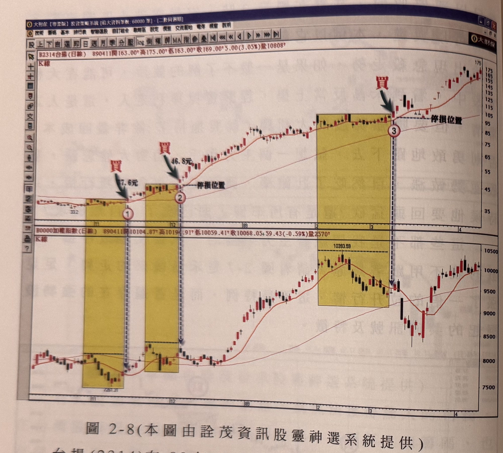
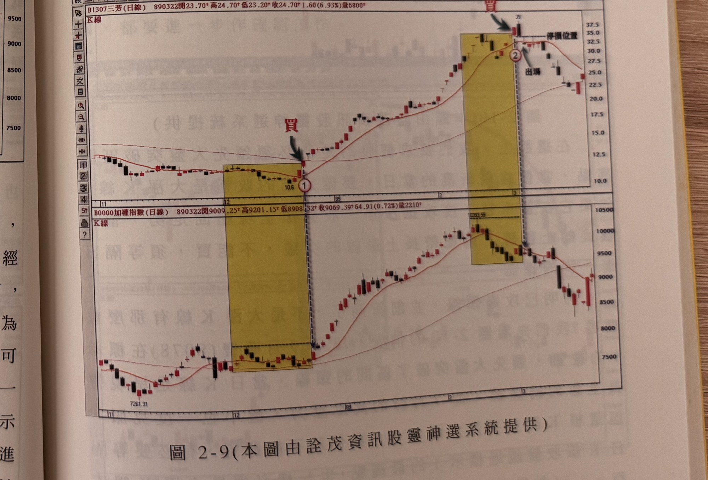

## p.68

**圖 2-8（本圖由詮茂資訊股靈神選系統提供）**

> 圖說（figure notes）: 上下兩格日線K線圖比對，上為台揚（代號2314）K線圖（頁首標示「B2314台揚(日線) 890411開163.00 高175.00 低163.00 收169.00 5.00(3.05%)量10808」），下為加權指數K線圖（頁首標示「加權指數(日線) 890411開10104.87 高10194.91 低10059.41 收10068.05 59.43(-0.59%)量2570」）。台揚圖中兩處黃色矩形整理區間：第一處右緣紅字「買」與綠色箭頭指向突破K線，標示「37.6元」（標示①），第二處右緣同樣紅字「買」指向，標示「46.8元」（標示②），兩處均有「停損位置」虛線標示。第三處黃色矩形位於高價區（約90~105元），右緣紅字「買」與綠色箭頭指向標示③，亦有「停損位置」虛線。股價持續上攻至175元高點。加權指數圖對應同樣三處黃色矩形整理區間，第三處標示「10393.59」為當時大盤高點，其後大盤陷入大回檔至9000點附近再回升至10000附近。此圖對應本文：台揚(2314)在88年11月的走勢圖中，標示1的位置，大盤剛從低點緩步推升，但台揚卻已經出現突破11月份的價格反壓，創下新高，與大盤比對之下，可以清楚地看見台揚領先大盤的氣勢，標示1的收盤價為37.6元，這是一個強勢股的第一買點位置，停損的設定可以設在標示1K線的真實低點位置；而後標示2再度出現台揚領先大盤突破創新高的情況，也是值得買進的操作點；標示3位置，大盤陷入從10393的大回檔，台揚卻稍作橫向整理，便再突破新高點，再度成為強勢股的光環。

台揚 (2314) 在 88 年 11 月的走勢圖中，如圖 2-8 所示，標示 1 的位置，大盤剛從低點緩步推升，但是，台揚卻已經出現突破 11 月份的價格反壓，創下新高，與大盤比對之下，可以清楚地看見，台揚領先大盤的氣勢，標示 1 的收盤價為 37.6 元，這是一個強勢股的第一買點位置，停損的設定，可以設在標示 1K 線的真實低點位置，即當天的收盤，取兩者較低的價格，做為停損位置。而後，標示 2 再度出現台揚領先大盤突破創新高的情況，也是值得買進的操作點，一檔強勢股在大波段上漲過程，即使大盤出現較大幅度的回檔，它仍然只是走橫向整理，隨後，又會再創新

## p.69

高點，像標示 3 位置，大盤陷入從 10393 的大回檔，台揚卻稍作橫向整理，便再突破新高點，再度成為強勢股的光環，從標示 1 買進到標示 3 的位置，台揚漲幅已經超過 2 倍以上，最後行情走到 175 元才結束多頭的格局。**挖掘強勢股的模式，其實就在於強勢股價格先行的觀念上**，像圖 2-9 的例子，三芳 (1307) 在 88 年 12 月下旬也是領先大盤突破 12 月初的高點反壓，創新高時，就要勇於買進，標示 1 位置 12.55 元，是第一買點，89 年 3 月最高拉升至 39 元，才結束多頭漲勢。

**圖 2-9（本圖由詮茂資訊股靈神選系統提供）**

> 圖說（figure notes）: 上下兩格日線K線圖比對，上為三芳（代號1307）K線圖（頁首標示「B1307三芳(日線) 890322開23.70 高24.70 低23.20 收24.70 1.60(6.93%)量6800」），下為加權指數K線圖（頁首標示「加權指數(日線) 890322開9009.25 高9201.15 低8908.32 收9069.39 64.91(0.72%)量2210」）。三芳圖中第一處黃色矩形整理區間（低點10.6）右緣紅字「買」與綠色箭頭指向突破K線（標示①），股價其後急漲至39元高點附近，第二處黃色矩形位於高點區右緣紅字「買」指向標示②，其右側另有「出場」文字與箭頭標示出場位置，「停損位置」虛線標示於區間上緣。股價其後自39元高點回落至20~25元區間整理。加權指數圖對應同樣兩處黃色矩形整理區間，第二處標示「10393.59」為大盤高點，大盤其後同樣回落。此圖對應本文：三芳(1307)在88年12月下旬領先大盤突破12月初的高點反壓，創新高時勇於買進，標示1位置12.55元為第一買點，89年3月最高拉升至39元才結束多頭漲勢，標示2位置則為出場參考點。
