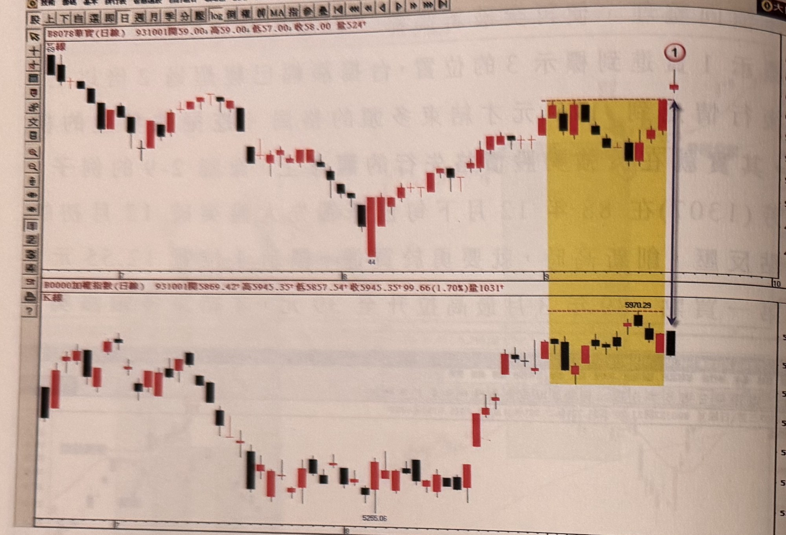
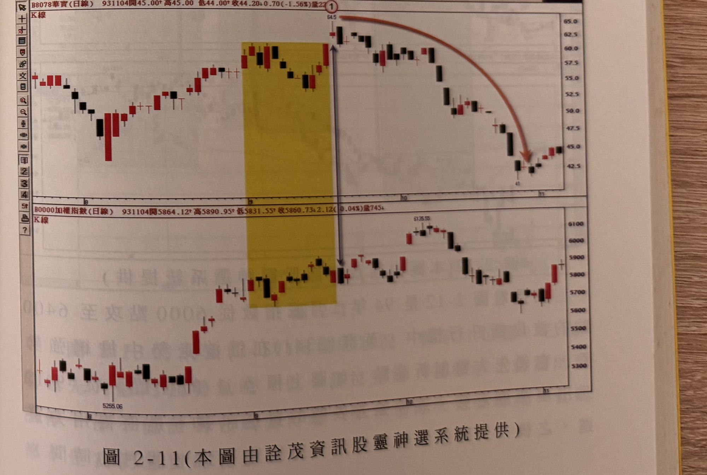

## p.70

**圖 2-10（本圖由詮茂資訊股靈神選系統提供）**

> 圖說（figure notes）: 上下兩格日線K線圖比對，上為華寶（代號8078）K線圖（頁首標示「B8078華寶(日線) 931001開59.00 高59.00 低57.00 收58.00 量524」），下為加權指數K線圖（頁首標示「加權指數(日線) 931001開5869.42 高5945.35 低5857.54 收5945.35 99.66(1.70%)量1031」）。華寶圖中黃色矩形標示區間（低點44附近至區間上緣），右緣標示①（紅圈數字），上方雙向箭頭標示區間高度（自區間上緣延伸至股價高點附近），該K線帶長上影線。加權指數圖對應同一時間區間，標示「5970.29」為區間對應高點。此圖對應本文：93年9月華寶(8078)在標示1的位置，領先大盤突破了區間的頸線，當日K線是呈現帶長上影的紡綞線，而7月份的高點壓力盤中也一度克服，但這根K線並不是大漲K線，不能躁進，須等隔日K線收盤越過標示1的最高點，也一樣必須是大漲K線才行。

在選股上，我們要求個股的走勢必須領先大盤突破區間高點，當價格創新高的當日，要確定它的收盤是大漲 K 線，如果它在盤中曾一度攻抵漲停，收盤卻呈現壓回走勢，留下很長的上影線，這種帶長上影線的突破，不能買，須等隔日進一步的確認。

明明已攻過頸線，並創新高了，不是大漲 K 線有那麼重要嗎？我們先看圖 2-10 的情況，93 年 9 月華寶 (8078) 在標示 1 的位置，領先大盤突破了區間的頸線，當日 K 線是呈現帶長上影的紡綞線，而 7 月份的高點壓力，盤中也一度克服，但這根 K 線並不是大漲 K 線，我們就不能躁進，有必要等隔日 K 線收盤越過標示 1 的最高點，也一樣必須是大漲 K 線才行。

## p.71

上影線過長，代表主力在拉升過程，不是遭遇賣壓大過他所能承接的量，就是主力在拉高時，見有追量，先作調節，這兩者都不是我們想要看到的，我們要看的是主力有魄力地過高點，並且讓收盤收在最高價附近，要有這般大漲突破時，我們才能追進持有。圖 2-11 是華寶出現突破區間，創新高後的接續走勢，在標示 1 的隔天行情，呈現開高走低盤，同時把標示 1 的跳空缺口填補掉，並沒有我們要的收盤越過標示 1 的最高點，所以就繼續觀察，結果華寶從此處緩跌再轉急跌，直下 41 元，共跌掉了 23.5 元，因此，定義上必須大漲才買，不是要刻意追高，而是買主力的氣魄，短小 K 線過關，都要進一步作確認工作。

**圖 2-11（本圖由詮茂資訊股靈神選系統提供）**

> 圖說（figure notes）: 上下兩格日線K線圖比對，延續圖2-10，上為華寶（代號8078，頁首標示「931104開45.00 高45.00 低44.00 收44.20 0.70(-1.56%)量22」）走勢，黃色矩形標示區間（同圖2-10之區間），右緣標示①，上方雙向箭頭指向股價高點64.5，其後以橙色曲線箭頭標示股價一路下滑至41附近。下為加權指數K線圖（頁首標示「加權指數(日線) 931104開5864.12 高5890.95 低5831.55 收5860.73 2.12(0.04%)量745」），對應同一黃色矩形區間，指數其後上攻至6135.55附近再回落。此圖對應本文：圖2-11顯示華寶出現突破區間創新高後，標示1隔天行情呈現開高走低盤，同時把標示1的跳空缺口填補掉，並沒有收盤越過標示1最高點，其後華寶從此處緩跌再轉急跌，直下41元，共跌掉23.5元，說明短小K線過關的突破仍須進一步確認，不宜貿然追買。
