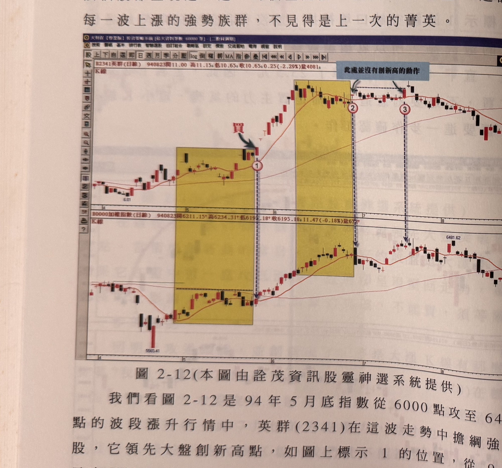
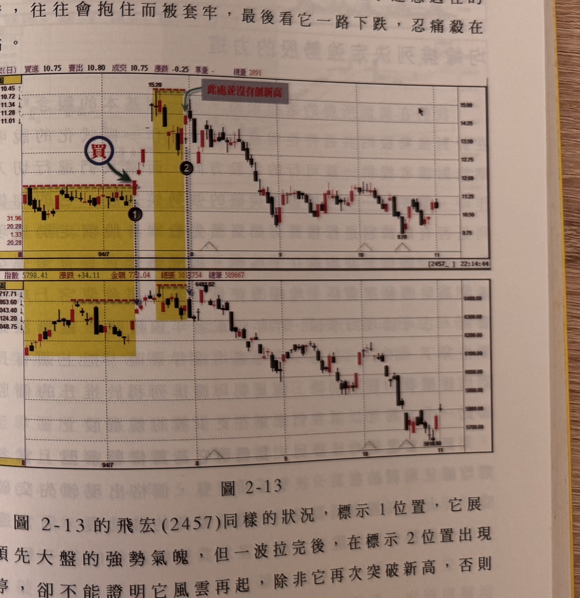

## p.72

# 不要與曾經讓你賺錢的股票談感情

我們常常會對曾經讓我們賺到錢的個股有好感，也因此當它這一波是強勢股，漲勢凌厲，獲利出場後，也見到它回檔修正了，就會趁其回檔時，逢低承接，結果下一波漲升時，該個股卻呈現進一退一的橫盤走勢，讓人大失所望，這說明每一波上漲的強勢族群，不見得是上一次的菁英。

**圖 2-12（本圖由詮茂資訊股靈神選系統提供）**

> 圖說（figure notes）: 上下兩格日線K線圖比對，上為英群（代號2341）K線圖（頁首標示「B2341英群(日線) 940823開11.00 高11.15 低10.65 收10.65 0.25(-2.29%)量4081」），下為加權指數K線圖（頁首標示「加權指數(日線) 940823開6211.15 高6234.31 低6195.18 收6195.18 11.47(-0.18%)量672」）。英群圖中兩處黃色矩形整理區間：第一處右緣紅字「買」與綠色箭頭指向突破K線（標示①），第二處位於高點區右緣標示②，右上角灰底藍字說明框「此處並沒有創新高的動作」以箭頭指向標示②與標示③之間的水平虛線區段（股價在此區間內盤整未創新高）。股價自6.01起漲，經標示①後急漲，至標示②③之間高檔盤整後回落。加權指數圖對應同樣兩處黃色矩形整理區間，標示③對應大盤位置，指數觸及6481.62高點後回落。此圖對應本文：94年5月底指數從6000點攻至6400點的波段漲升行情中，英群(2341)在這波走勢中擔綱強勢股，領先大盤創新高點（標示1），從9.12元出現漲停走勢；但標示2及標示3位置，看起來似乎又要續攻一波，但從與大盤比對中，可以了解它並沒有領先大盤走高，反而是落後大盤，說明沒有進行比對動作的話，看到標示2或標示3上漲買進等待它再次大漲的投資人，就犯了迷戀過往熱情、抱住而被套牢的錯誤。

我們看圖 2-12 是 94 年 5 月底指數從 6000 點攻至 6400

## p.73

點的波段漲升行情中，英群 (2341) 在這波走勢中擔綱強勢股，它領先大盤創新高點，如圖上標示 1 的位置，從 9.12 元出現漲停走勢，這種強力表態的買進訊號，是值得用力買進，之後，一路急漲至 15 元，而短短不到一個月的時間，從底部 7 元大漲了一倍，很多跟上車的股民，大賺了一波，當英群到達 15 元後，即進行近 2 個月的橫向盤整，期間在標示 2 及標示 3 位置，看起來似乎它又要續攻一波，但從與大盤比對中，我們可以了解它並沒有領先大盤走高，反而是落後大盤，所以，沒有進行比對動作的話，看到標示 2 或標示 3 上漲買進等待它再次大漲的投資人，就犯了迷戀過往的熱情，往往會抱住而被套牢，最後看它一路下跌，忍痛殺在低點。

**圖 2-13**

> 圖說（figure notes）: 上下兩格日線K線圖比對，上為飛宏（代號2457）K線圖（頁首標示「飛宏(日) 買進10.75 賣出10.80 成交10.75 漲跌-0.25 單量- 總量2891」，左側表列MA10 10.45、MA20 10.72、MA60 11.34、MA120 11.28、MA240 11.01，資本額31.96、本益比20.28、券資比1.33、當沖比20.28），下為加權指數K線圖（頁首標示「指數5798.41 漲跌+34.11 金額772.04 總張3013754 總筆589667」）。飛宏圖中兩處黃色矩形整理區間：第一處右緣深藍圓圈「買」與綠色箭頭指向突破K線（標示①），第二處位於高點區（高點15.20）右緣標示②，右上角紅底白字說明框「此處並沒有創新高」以綠色箭頭指向標示②右側區段。股價其後自15.20高點持續回落至9.70附近再小幅回升。加權指數圖對應同樣兩處黃色矩形整理區間，第二處對應大盤高點6481.62，指數其後同樣回落至5700~5900區間。此圖對應本文：飛宏(2457)同樣的狀況，標示1位置，它展現領先大盤的強勢氣魄，但一波拉完後，在標示2位置出現漲停，卻不能證明它風雲再起，除非它再次突破新高，否則都不是我們想買的股票。

圖 2-13 的飛宏 (2457) 同樣的狀況，標示 1 位置，它展現領先大盤的強勢氣魄，但一波拉完後，在標示 2 位置出現漲停，卻不能證明它風雲再起，除非它再次突破新高，否則都不是我們想買的股票。
