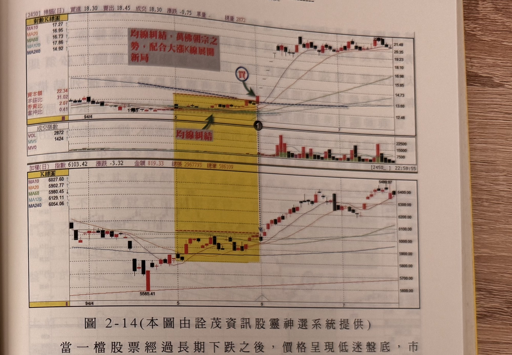

## p.74

上述兩檔股票之所以只走一波，當然是與其基本面乏善可陳的原因有關，沒有基本面支撐的個股，當它展現出強勢上攻架勢時，往往靠的是市場的熱度，在人氣可為及滾大量的手法下，大都採取快攻到頂，然後，橫盤出貨，所以攻頂後的整理區間的幅度及量能分佈，都是決定它能否續漲的重要觀察重點。這在後面的章節裡，我們會進一步討論。

## 均線排列決定強勢股的力道

我們在前面所提的選股策略，是一個基本的觀念，主要在於對強勢股的共通特性與發動訊號，作一模式化的說明，期能對讀者提供一條可行的選股方向，而當我們進行切入操作時，還要進一步考慮領先突破的強勢候選股，它的均線排列是否有助於它進行推升，如果領先股本身股價走勢呈現空頭排列，即長天期均線往下移動，那麼儘管它具有領先突破區間高點的候選資格，均線的背景因素，卻會使它上攻出現限制，它可能攻到季線、半年線或者年線附近，就無法進一步推升了，所以，在進一步考慮均線背景時，把上頭有長天期均線壓著的股票剔除，儘量朝均線排列利於推升的個股，如此一來，將可以讓我們聚焦在更少數的候選股上。

**第一首選的均線排列，我們稱它為萬佛朝宗型**，當各天期均線呈現糾結在某一狹窄區間盤整，價格出現領先突破區間，以大漲 K 線創新高點時，這是最佳的強勢股，通常這類型的個股都會出現跳空大漲，宣示其扭轉趨勢的第一擊。

## p.75

**圖 2-14（本圖由詮茂資訊股靈神選系統提供）**

> 圖說（figure notes）: 上下兩格對數K線圖比對，上為神腦（代號2450）K線圖（頁首標示「[2450]神腦(日) 買進18.30 賣出18.45 成交18.30 漲跌-0.75 單量- 總量2872」，左側表列MA10 17.27、MA20 16.95、MA60 16.73、MA120 17.86、MA240 14.92），下為加權指數K線圖（頁首標示「加權(日) 指數6103.42 漲跌-3.32 金額819.33 總張2967793 總筆586109」，MA10 6027.60、MA20 5902.77、MA60 5980.45、MA120 6129.11、MA240 6054.06）。神腦圖中黃色矩形標示94年4-5月間各天期均線糾結盤整的狹窄區間，右上角紅字說明框「均線糾結，萬佛朝宗之勢，配合大漲K線展開新局」以箭頭指向糾結區，另有紅字「均線糾結」與綠色箭頭指向區間內糾結均線處，區間右緣深藍圓圈「買」與綠色箭頭指向突破區間的紅K線（標示①）。股價自此大漲，持續墊高至21.48附近。下方成交張數面板（VOL 2872、MV5 1424、MV0）顯示標示①之後成交量明顯放大。加權指數圖對應同一時間區間的黃色矩形，指數自5565.41低點回升，其後上攻至5480.97附近。此圖對應本文：神腦(2450)在94年5月下旬之前，交投實在低迷，但它的均線除了年線之外，其餘天期的均線都經過糾結，呈現緩走現象，突然在標示1的位置，領先大盤突破區間高點，同時也突破年線的壓制，這一根K線有如春雷乍響，把過往的低迷無人問津的狀況，扭轉成眾人追詢為何而漲。

當一檔股票經過長期下跌之後，價格呈現低迷盤底，市場幾乎已忘了它的存在，成交量稀少得可憐，但是，當所有均線逐漸收斂糾結在一起時，就要預先注意這種股票的發展，突然它出現領先大盤突破區間高點，並以大漲 K 線一舉攻至年線之上，此時，並無法預知它後市會如何變化，我們可能尋遍所有消息面新聞，都無法知道為什麼它會漲，但唯一能做且當場做的動作，就是趕快上車。像圖 2-14 一樣，神腦 (2450) 在 94 年 5 月下旬之前，交投實在低迷，但它的均線除了年線之外，其餘天期的均線都經過糾結，呈現緩走現象，突然在標示 1 的位置，領先大盤突破區間高點，同時也突破年線的壓制，這一根 K 線有如春雷乍響，把過往的低迷無人問津的狀況，扭轉成眾人追詢為何而漲，出現這種均
