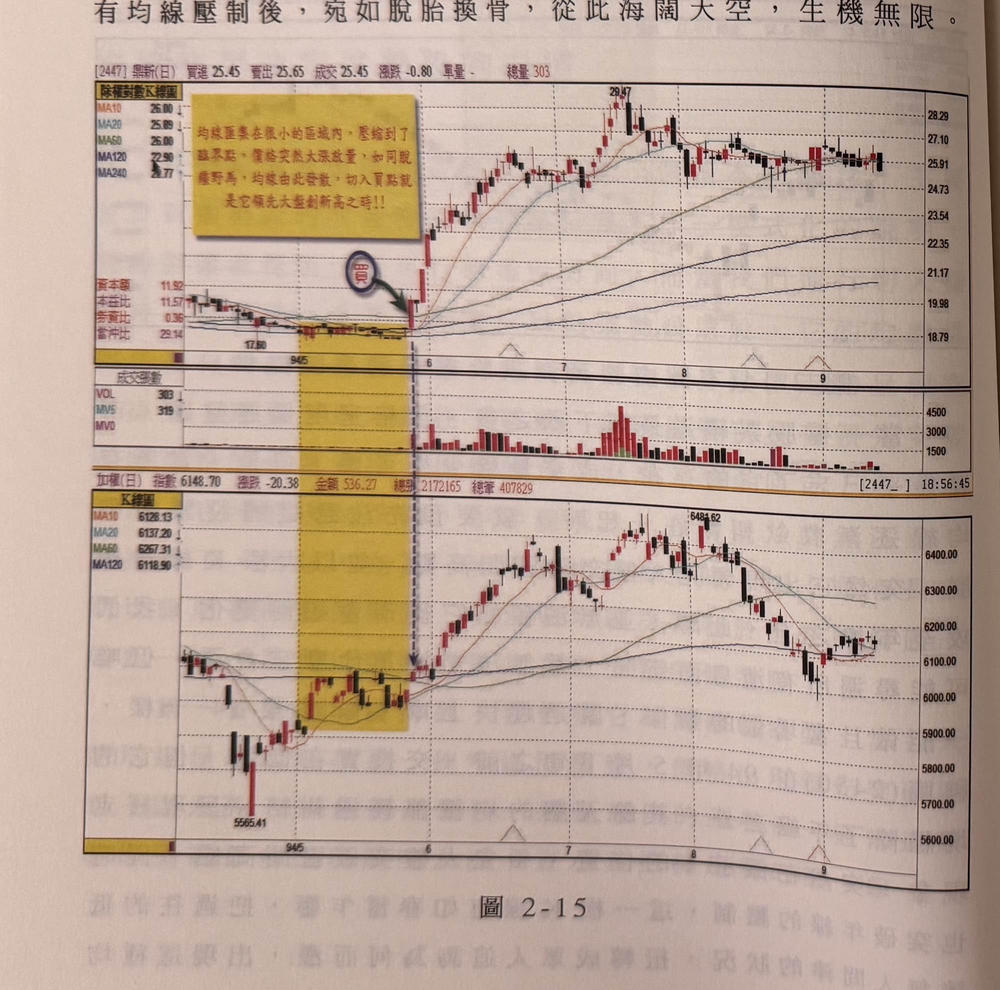
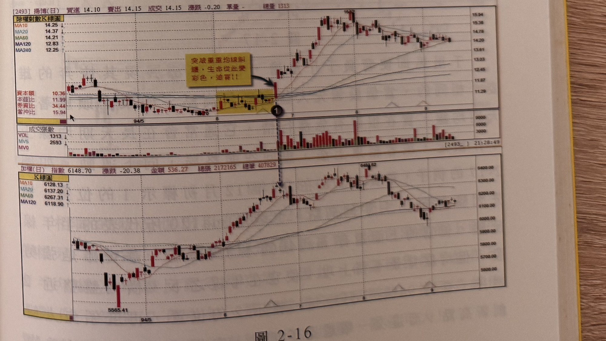

## p.76

線結構呈現萬佛朝宗，通常是大行情的起動，宜趁第一買點勇敢介入，從圖形上可以看到神腦經過 2 天的洗盤後，有如火箭升空，連拉 6 支漲停板，所以，選股的步驟除了必須具有領先大盤突破區間高點外，還要考慮個股的均線排列結構。

與神腦同一時間點發動，同樣也是屬於萬佛朝宗格局的是鼎新 (2447)，請看圖 2-15 所示，當大漲 K 線一舉突破所有均線壓制後，宛如脫胎換骨，從此海闊天空，生機無限。

**圖 2-15**

> 圖說（figure notes）: 上下兩格除權對數K線圖比對，上為鼎新（代號2447，頁首標示「[2447]鼎新(日) 買進25.45 賣出25.65 成交25.45 漲跌-0.80 單量- 總量303」，MA10 26.00、MA20 25.89、MA60 26.00、MA120 22.90、MA240 20.77，資本額11.92、本益比11.57、券資比0.36、當沖比29.14），下為加權指數（頁首標示「加權(日) 指數6148.70 漲跌-20.38 金額536.27 總張2172165 總筆407829」）。鼎新圖中黃色矩形標示94年5月各均線糾結的狹窄區間（低點17.60），左上角黃底紅字說明框「均線匯集在很小的區域內，壓縮到了臨界點，價格突然大漲放量，如同脫韁野馬，均線由此發散，切入買點就是它領先大盤創新高之時！！」，區間右緣深藍圓圈「買」與綠色箭頭指向突破區間的紅K線。股價自此大漲，持續墊高至29.47附近，其後在24~28元區間震盪整理。下方成交張數面板（VOL 303、MV5 319、MV0）顯示突破後成交量明顯放大（最高近4500張）。加權指數圖對應同一時間區間的黃色矩形，指數自5565.41低點回升，其後上攻至6481.62附近再回落。此圖對應本文：與神腦同一時間點發動，同樣屬於萬佛朝宗格局的是鼎新(2447)，當大漲K線一舉突破所有均線壓制後，宛如脫胎換骨，從此海闊天空，生機無限。

## p.77

再看揚博 (2493) 的情況，如圖 2-16 在標示 1 未出現之前，它的確落後大盤上升格局相當多，然而風水輪流轉，六月下旬，終於在大盤開始回檔之際，揚博突破了區間頸線反壓，以一根睽違甚久的漲停長紅 K 線一舉通過了重重均線糾結的反壓區，領先大盤走漲，敢在大盤回檔逆勢上揚的個股，都是有備而來，值得用力追買。我們對於陌生的股票往往會敬而遠之，最主要的原因是它的量太少，而且往往會演出一日行情，尤其氣結的是當天引量衝高後，在漲停位置爆量鎖住，但不一會就砍出打開漲停，直下半根停板，這種主力我們稱之為蟑螂主力，它的特性往往是當天莫名大量在過每一檔價，而採取跳躍式上漲奔至漲停，如同旱地拔蔥般，這種盤中的作法，量大於平日近十倍，都是主力意圖當沖的特性，反之，沒有上述的狀況，只要它突破的區間夠長，又是領先大盤，就值得跟進操作。

**圖 2-16**

> 圖說（figure notes）: 上下兩格除權對數K線圖比對，上為揚博（代號2493，頁首標示「[2493]揚博(日) 買進14.10 賣出14.15 成交14.15 漲跌-0.20 單量- 總量1313」，MA10 14.25、MA20 14.37、MA60 14.21、MA120 12.83、MA240 12.25，資本額10.36、本益比11.99、券資比34.44、當沖比15.94），下為加權指數（同圖2-15，指數6148.70）。揚博圖中黃色矩形標示均線糾結區間，右上角黃底紅字說明框「突破重重均線糾纏，生命從此變彩色，追買！！」以箭頭指向突破區間的紅K線（標示①），股價自此急漲，持續墊高至16.52附近，其後在13~15元區間整理。下方成交張數面板顯示標示①之後成交量明顯放大（最高近9000張）。此圖對應本文：揚博在標示1未出現之前，落後大盤上升格局相當多，六月下旬終於在大盤開始回檔之際突破了區間頸線反壓，以一根睽違甚久的漲停長紅K線一舉通過重重均線糾結的反壓區，領先大盤走漲。
