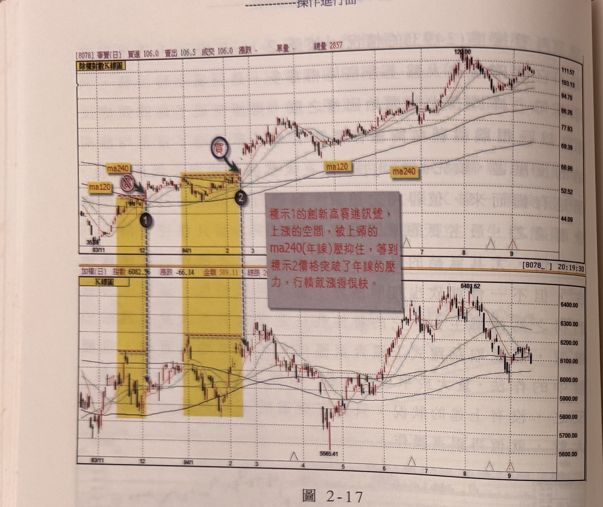
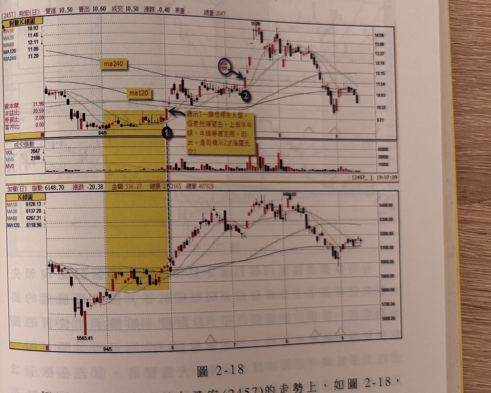

## p.78

**圖 2-17**

> 圖說（figure notes）: 上下兩格除權對數K線圖比對，上為華寶（代號8078，頁首標示「[8078]華寶(日) 買進106.0 賣出106.5 成交106.0 漲跌- 單量- 總量2857」），下為加權指數（頁首標示「加權(日) 指數6082.36 漲跌-66.14 金額589.11 總張2...」）。華寶圖中兩處黃色矩形整理區間標示均線壓力：第一處左緣「ma240」「ma120」標籤（其中ma240標籤上有紅色禁止符號），右緣深藍圓圈「賣」/「買」與綠色箭頭指向標示①之K線；第二處位於較右側，右緣標示②，其下方灰底紅字說明框「標示1的創新高買進訊號，上漲的空間，被上頭的ma240(年線)壓抑住，等到標示2價格突破了年線的壓力，行情就漲得很快。」；圖中另有「ma120」「ma240」標籤標示於股價上方後段均線。股價自35附近起漲，經標示①後於52~60元區間受年限壓抑橫向盤整近2個月，直到標示②突破年線後急漲至121.00高點，其後在95~112元區間整理。加權指數圖對應同樣兩處黃色矩形整理區間，指數自5565.41低點回升至6481.62附近後回落。此圖對應本文：華寶(8078)在93年12月初標示1的位置，領先大盤突破11月中間高點，也越過ma120所代表的半年線反壓，但它的上面還有ma240(年線)反壓在，華寶雖是強勢股，但均線背景不利上攻，使它在年線之下橫向盤整近2個月，直到94年2月中旬標示2的位置，再度領先大盤創新高點，而這次一舉越過了年線，宛如千里馬背上的重物卸下，壓力既除，過去不利之均線因素沒有了，華寶展開一倍的漲幅大行情。

千里馬即使背負千斤重擔，也是無法展現其快奔的雄姿，相同的，當個股領先大盤突破新高點，如果上頭壓著長天期均線，實在很難有急漲行情，它通常會在長天期均線上下作橫走，或者結束上漲，重回空頭格局，向下運動。如圖 2-17 的例子，華寶 (8078) 在 93 年 12 月初標示 1 的位置，領先大盤突破 11 月中間高點，也越過 ma120 所代表的半年線反壓，但它的上面還有 ma240(年線) 反壓在，華寶雖是強勢股，但均線背景不利上攻，使它在年線之下，橫向盤整近 2 個月，直到 94 年 2 月中旬，標示 2 的位置，再度領先大盤創新高點，而這次一舉越過了年線，宛如千里馬背上的重物

## p.79

卸下，壓力既除，過去不利之均線因素沒有了，華寶展開一倍的漲幅大行情，而標示 2 之後不久，大盤呈現盤跌破前波低點，來到 5565 點，但華寶卻從標示 2 開始逐步上攻，即使大盤出現破底走勢，它沒有再回標示 2 的買進價位，顯然選對強勢股，讓人免於被大盤驚嚇的苦惱。

相同的狀況也出現在飛宏 (2457) 的走勢上，如圖 2-18，在標示 1 位置，飛宏領先大盤過新高點，但它同樣的上頭仍有半年線及年線反壓等待克服，因此，在這裡我們不能作切入動作，等到 7 月中旬，飛宏越過年線反壓時，標示 2 的位置，就可以跳進去買，有沒有均線反壓，關係可大！！

**圖 2-18**

> 圖說（figure notes）: 上下兩格對數K線圖比對，上為飛宏（代號2457，頁首標示「[2457]飛宏(日) 買進10.50 賣出10.60 成交10.50 漲跌-0.40 單量- 總量2047」，MA10 10.93、MA20 11.46、MA60 12.11、MA120 11.06、MA240 11.20，資本額31.96、本益比20.59、券資比2.09、當沖比0.00），下為加權指數（頁首標示「加權(日) 指數6148.70 漲跌-20.38 金額536.27 總張2172165 總筆407829」）。飛宏圖中「ma240」「ma120」標籤標示於股價上方均線，黃色矩形標示94年5-6月間整理區間，右緣標示①（黑圓圈），右側灰底紅字說明框「標示1—雖然領先大盤，但是抬頭望去，上有半年線、年線等著克服，因此，直到標示2才海闊天空！」；標示②（黑圓圈，深藍圓圈「買」與綠色箭頭指向）位於7月份突破年線之K線。股價自標示②後急漲至15.20附近，其後回落至9.71~13元區間整理。加權指數圖對應同樣區間，指數自5565.41回升至6484.62附近後回落。此圖對應本文：飛宏(2457)在標示1位置領先大盤過新高點，但上頭仍有半年線及年線反壓等待克服，因此不能作切入動作，等到7月中旬飛宏越過年線反壓時（標示2），才是可以跳進去買的位置。
