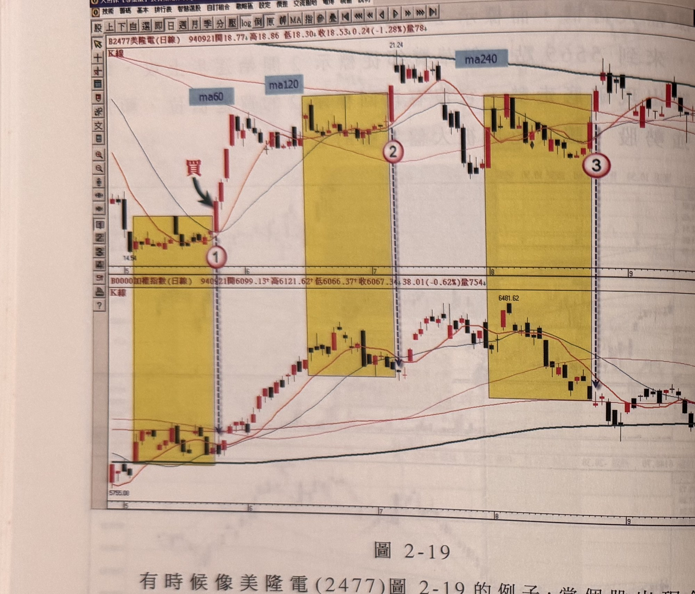
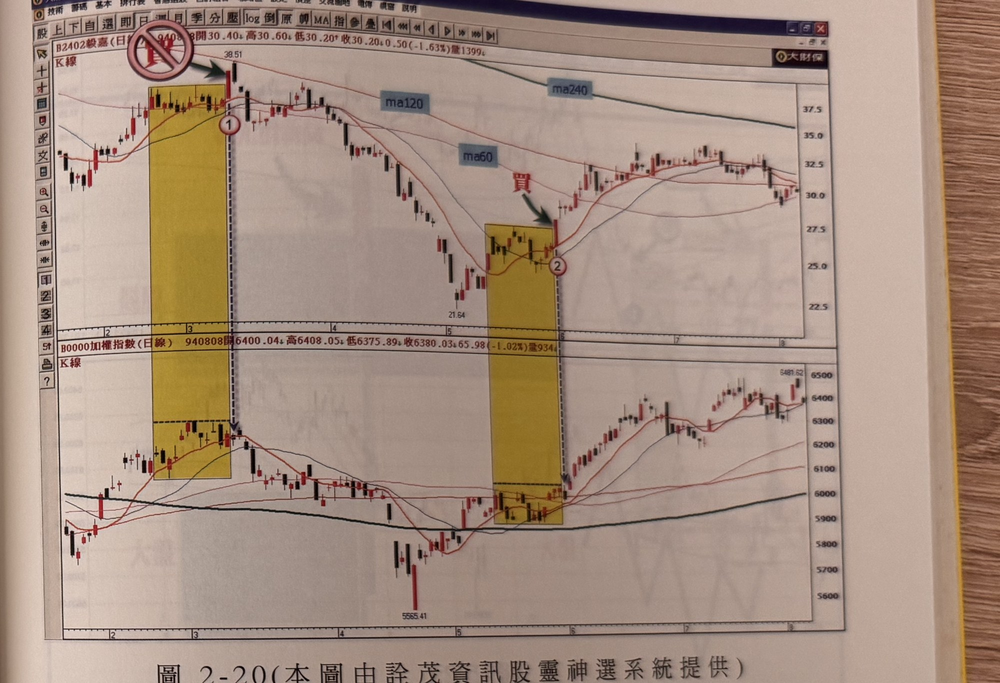

## p.80

可說是選股模式上的第二層濾網，透過均線的排列狀況，便可刪除掉一些冒牌強勢股混在其中。

**圖 2-19**

> 圖說（figure notes）: 上下兩格日線K線圖比對，上為美隆電（代號2477，頁首標示「B2477美隆電(日線) 940921開18.77 高18.86 低18.30 收18.53 0.24(-1.28%)量78」），下為加權指數（頁首標示「加權指數(日線) 940921開6099.13 高6121.62 低6066.37 收6067.34 38.01(-0.62%)量754」）。美隆電圖中「ma60」「ma120」「ma240」標籤標示於股價上方三條均線，深藍圓圈「買」與綠色箭頭指向標示①之突破K線（第一處黃色矩形區間左緣起漲點）。其後陸續三處黃色矩形區間，分別對應標示①、標示②（黑圓圈虛線延伸箭頭指向下方大盤對應處）、標示③（同樣有虛線箭頭指向下方大盤對應處）。股價自14.54起漲至21.24附近後回落整理，末端反彈。加權指數圖對應同樣時間區間走勢，自5755.08回升至6481.62附近。此圖對應本文：美隆電(2477)出現領先大盤突破新高，上頭雖有長天期均線壓著，但最接近的長天期均線（ma60季線）離目前價位仍有一段距離（標示1位置買點出現時，離最靠近的ma60尚有3元的空間，即2成的上漲幅度），這種狀況可以大膽買進；但標示2及標示3的位置，即使比大盤領先突破創新高點，一抬頭就面臨ma240(年線)的反壓考驗，如果買進的話，無法快速突破年線壓力，代表其空頭走勢仍是繼續向下發展，之後大盤連續向上漲，美隆電卻是在年線踢到鐵板般，橫走數日後便打退堂鼓，朝下回跌，顯見均線的背景因素小試，但像這樣均線呈現空頭排列的個股，不可抱長，以免出現抱上又抱回原點，白忙一場。

有時候像美隆電 (2477) 圖 2-19 的例子，當個股出現領先大盤突破新高，上頭雖有長天期均線壓著，但是最接近的長天期均線，離目前的價位仍有一段距離，如標示 1 位置的買點出現時，離最靠近的 ma60(季線) 尚有 3 元的空間，即 2 成的上漲幅度，這種狀況，是可以大膽買進，但若在標示 2 及標示 3 的位置，美隆電即使比大盤領先突破，創新高點，但一抬頭就面臨 ma240(年線) 的反壓考驗，如果買進的話，無法快速突破年線壓力，那代表它的空頭走勢仍是繼續向下發展，之後大盤連續向上漲，美隆電卻是在年線踢到鐵板般，橫走數日後，便打退堂鼓，朝下回跌，顯見均線的背景因素，

## p.81

小試，但像這樣均線呈現空頭排列的個股，不可抱長，以免出現抱上又抱回原點，白忙一場！

當個股出現領先大盤創新高點時，如果這個買進訊號太接近下移的長期均線反壓，最好不要躁進，圖 2-20 的毅嘉 (2402) 的走勢可當成一個經典例子，標示 1 位置的狀況領先大盤突破區間，看起來一付準備逆勢攻擊的架勢，但是上頭馬上面臨 ma120(半年線) 反壓，果不其然，隔日開高觸及半年線即開始折回，如果不明究裡地買進，以為是強勢股，又不知停損的話，那可跌得慘不忍睹。而標示 2 的位置，如同圖 1-17 的標示 1 狀況，當領先突破，創新高點時，上頭有長天期均線壓著，惟尚有距離可

**圖 2-20（本圖由詮茂資訊股靈神選系統提供）**

> 圖說（figure notes）: 上下兩格日線K線圖比對，上為毅嘉（代號2402，頁首標示「B2402毅嘉(日線) 940808開30.40 高30.60 低30.20 收30.20 0.50(-1.63%)量1399」），下為加權指數（頁首標示「加權指數(日線) 940808開6400.04 高6408.05 低6375.89 收6380.03 65.98(-1.02%)量934」）。毅嘉圖中左上角紅底禁止符號（斜線圓圈）與綠色箭頭指向標示①之K線（38.51高點附近，第一處黃色矩形區間），「ma120」「ma60」「ma240」標籤標示於股價上方三條均線。股價自標示①後持續下跌至21.64附近，再於第二處黃色矩形區間（標示②）出現深藍圓圈「買」與綠色箭頭指向突破K線，股價其後回升至27.5~32.5元區間整理。加權指數圖對應同樣兩處黃色矩形區間，指數自5565.41低點回升至6481.62附近。此圖對應本文：毅嘉(2402)標示1位置領先大盤突破區間，看似準備逆勢攻擊，但上頭馬上面臨ma120(半年線)反壓，隔日開高觸及半年線即開始折回，如果不明究裡買進又不知停損，會跌得慘不忍睹；標示2位置則如同圖1-17標示1狀況，領先突破創新高點時上頭雖有長天期均線壓著，但尚有距離可以突破。
