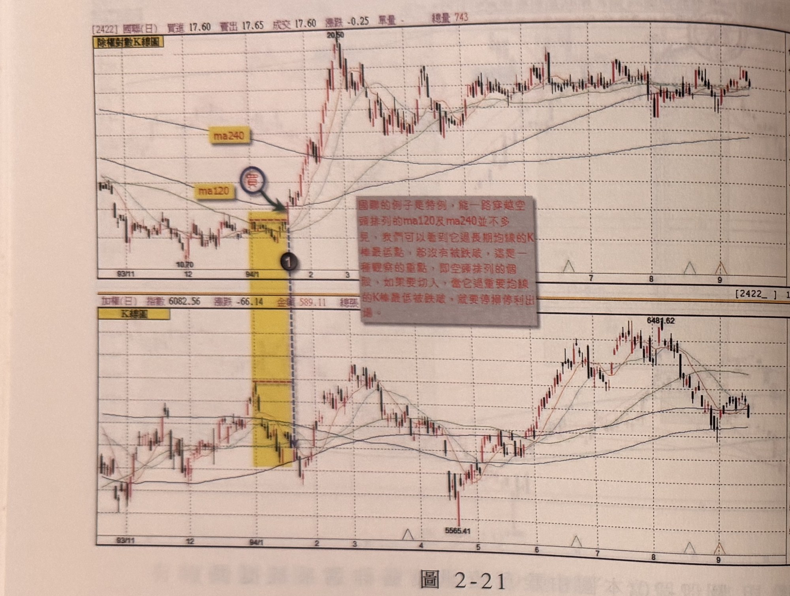
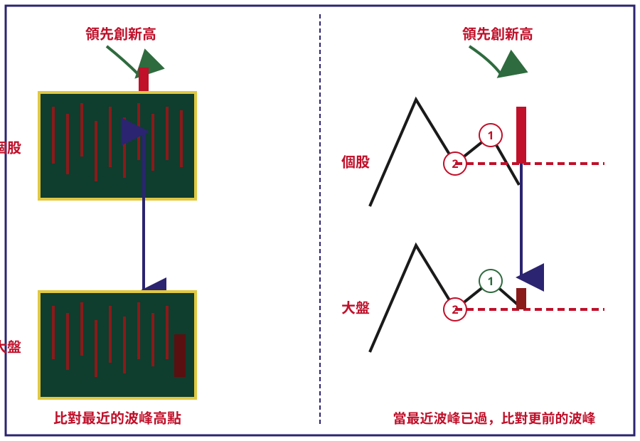

## p.82

出國聯過 ma120 及 ma240 的紅 K 線之最低點都沒有被跌破，所以，它是屬於過關斬將型的個股，這種例子是相當稀少的。

**圖 2-21**

> 圖說（figure notes）: 上下兩格除權對數K線圖比對，上為國聯（代號2422，頁首標示「[2422]國聯(日) 買進17.60 賣出17.65 成交17.60 漲跌-0.25 單量- 總量743」），下為加權指數（頁首標示「加權(日) 指數6082.56 漲跌-66.14 金額589.11 總張...」）。國聯圖中「ma240」「ma120」標籤標示於股價上方兩條均線，深藍圓圈「買」與綠色箭頭指向標示①之突破K線（黃色矩形區間右緣），右側灰底紅字說明框「國聯的例子是特例，能一路穿越空頭排列的ma120及ma240並不多見，我們可以看到它過長期均線的K棒最低點，都沒有被跌破，這是一種觀察的重點，即空頭排列的個股，如果要切入，當它過重要均線的K棒最低被跌破，就要停損停利出場。」。股價自10.70起漲，穿越ma120、ma240後急漲至20.50高點，其後在17~19元區間整理震盪。加權指數圖對應同一時間區間的黃色矩形，指數自5565.41低點回升至6481.62附近後回落。此圖對應本文：國聯(2422)在94年1月中旬，在大盤尚未落底成功時就出現領先突破新高點（標示1位置），上頭馬上頂到ma120(半年線)後繼續向ma240(年線)挑戰，進一步突破年線反壓，朝上繼續漲，這種狀況要注意的是當價格攻擊長天期均線時，那根過長天期均線的K線最低點，不能再被隨後的行情跌破，從圖上可以看出國聯過ma120及ma240的紅K線之最低點都沒有被跌破，所以它是屬於過關斬將型的個股，這種例子是相當稀少的。

當一檔股票出現領先大盤創出相對新高點時，它的均線背景的確是重要的第二層篩選依據，但是也有個股能夠強渡關山，向上直線攻克壓在上頭的長天期均線反壓，只是這種情況不多見，如圖 2-21 的國聯 (2422) 在 94 年 1 月中旬，在大盤尚未落底成功，它就出現領先突破新高點，如標示 1 位置，上頭馬上頂到 ma120(半年線) 後，繼續向 ma240(年線) 挑戰，進一步突破年線反壓，朝上繼續漲，這種狀況，我們要注意的是當價格攻擊長天期均線時，那根過長天期均線的 K 線最低點，不能再被隨後的行情跌破，從圖上我們可以看

## p.83

# 比對篩選強勢股的進階觀念

在比對篩選強勢股過程中，最早是比對最近的波峰高點，如果大盤指數也突破了最近的波峰，那麼這個階段的比對位置，就比較更前面的波峰，也就是看哪一檔個股領先大盤突破，如圖 2-22 裡，標示 1 位置是最近的波峰，盤也突破了，那麼強勢股的篩選動作，就得比對更前的波峰，如標示 2，即個股在相對於大盤標示 1 的更前波高點位置，

**圖 2-22**

> 圖說（figure notes）: 示意圖（概念圖，已重繪為SVG，原圖見 操作進行曲-fig-2-22.orig.jpg），以深藍色粗框圍成一長方形說明框，內分左右兩部分。左半部：上方紅字「領先創新高」與綠色箭頭指向一深綠底K線示意圖（標「個股」，圖右緣有一根突出的紅色長條代表個股創新高的K線），其下以雙向箭頭連接至下方另一深綠底K線示意圖（標「大盤」，右緣為一根較短的暗紅色條，表示大盤尚未創新高），下方文字「比對最近的波峰高點」。右半部：以黑色鋸齒狀折線分別繪出「個股」與「大盤」兩組波浪走勢圖，各自標示波峰①②：「個股」折線中，波峰②以紅色虛線水平延伸，波峰①以綠色虛線水平延伸且低於②，折線末端一根紅色長條突出於②虛線之上（標示「領先創新高」，綠色箭頭指向），並以雙向箭頭連接至下方「大盤」折線圖對應位置；「大盤」折線同樣標示波峰①②（②為紅色虛線、①為綠色虛線），末端一根較短的暗紅色條僅與②虛線切齊（尚未創新高）。下方文字「當最近波峰已過，比對更前的波峰」。此圖說明比對篩選強勢股的方法：先比對雙方最近的波峰高點（左半部），若大盤也已突破最近波峰，則需比對更前一個波峰的相對位置（右半部），以判斷個股是否仍領先大盤創新高。
