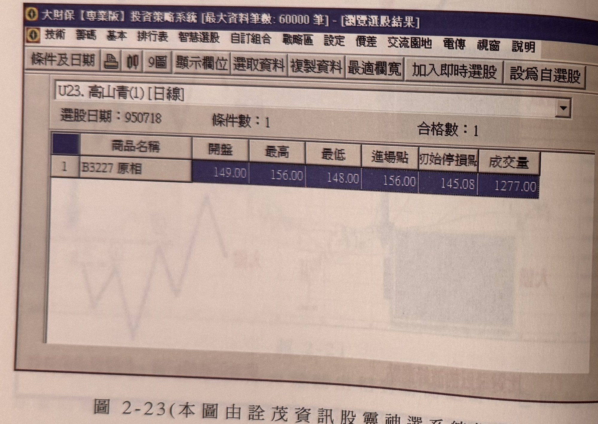
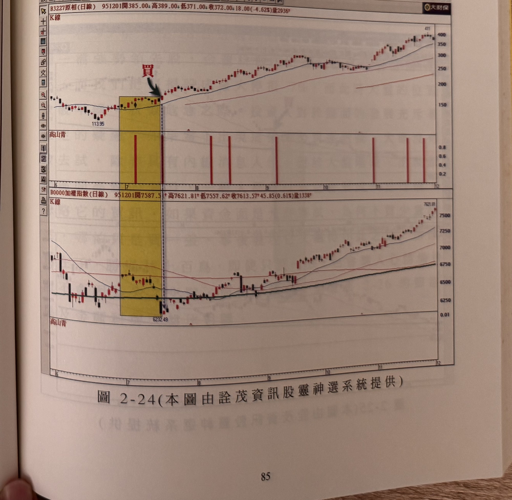

## p.84

準此，可見得強勢股出頭必須是大盤未突破重要峰點時，它就領先出線，所以第一階段的篩選動作結束在大盤也突破標示 1 時，如果大盤已然突破高點了，個股仍未突破對應的高點位置，顯然是較弱的族群，而第二階段的篩選強勢股便是比對更前一波的峰頂位置，這種漸次尋高比對，就能有系統的篩選出理想的強勢股出來。

**圖 2-23（本圖由詮茂資訊股靈神選系統提供）**

> 圖說（figure notes）: 「大財保【專業版】投資策略系統」選股結果視窗截圖，標題列「U23.高山青(1)[日線]」，選股日期：950718，條件數：1，合格數：1。結果表格欄位：商品名稱、開盤、最高、最低、進場點、初始停損點、成交量；唯一一筆結果為「B3227 原相」，開盤149.00、最高156.00、最低148.00、進場點156.00、初始停損點145.08、成交量1277.00。背景另有淡淡透印的鋸齒折線圖（非本圖內容，屬透印痕跡）。此圖對應本文：以95年7月18日為例，進行所有上市上櫃股票篩選動作，只篩選出一檔個股——原相(3227)，當時指數正不知能不能在6200點止穩，但原相卻逆勢突破了低迷的市況，領先大盤創新高，當天漲停價是156元，經過半年後最高來到596元的天價。

## p.85

年 7 月 18 日為例，進行所有上市上櫃股票篩選動作，如圖 2-23 所示，只篩選出一檔個股---原相 (3227)，當時的指數正不知能不能在 6200 點止穩，但是原相卻逆勢突破了低迷的市況，領先大盤創新高，當天漲停價是 156 元，經過半年後，來到了 596 元的天價，而大盤雖在 6232 點止穩，接下來的兩個月卻都陷入區間震盪，原相一支獨秀，大漲了近 70%，這就是本法最精彩之處，請參閱圖 2-24 原相日線圖與大盤的比對。

**圖 2-24（本圖由詮茂資訊股靈神選系統提供）**

> 圖說（figure notes）: 上下兩格日線K線圖比對，上為原相（代號3227，頁首標示「B3227原相(日線) 951201開385.00 高389.00 低371.00 收372.00 18.00(-4.62%)量2936」），下為加權指數（頁首標示「加權指數(日線) 951201開7587.5 高7621.81 低7557.62 收7613.57 45.85(0.61%)量1338」）。原相圖中黃色矩形標示區間（低點113.95），區間右緣深藍圓圈「買」與綠色箭頭指向突破K線，中間「高山青」指標列以紅色直條標示多處訊號位置（區間內一處較高，其後陸續數處）。股價其後急漲，持續墊高至411附近，其後在250~400元區間整理。加權指數圖對應同一時間區間的黃色矩形，指數自6232.49止穩回升至7621.81附近。此圖對應本文：原相(3227)在95年7月領先大盤創新高（黃色區間右緣突破點），當時大盤僅在6232點止穩尚在盤整，原相卻一路大漲，是「高山青」比對篩選指標最精彩的實例。
