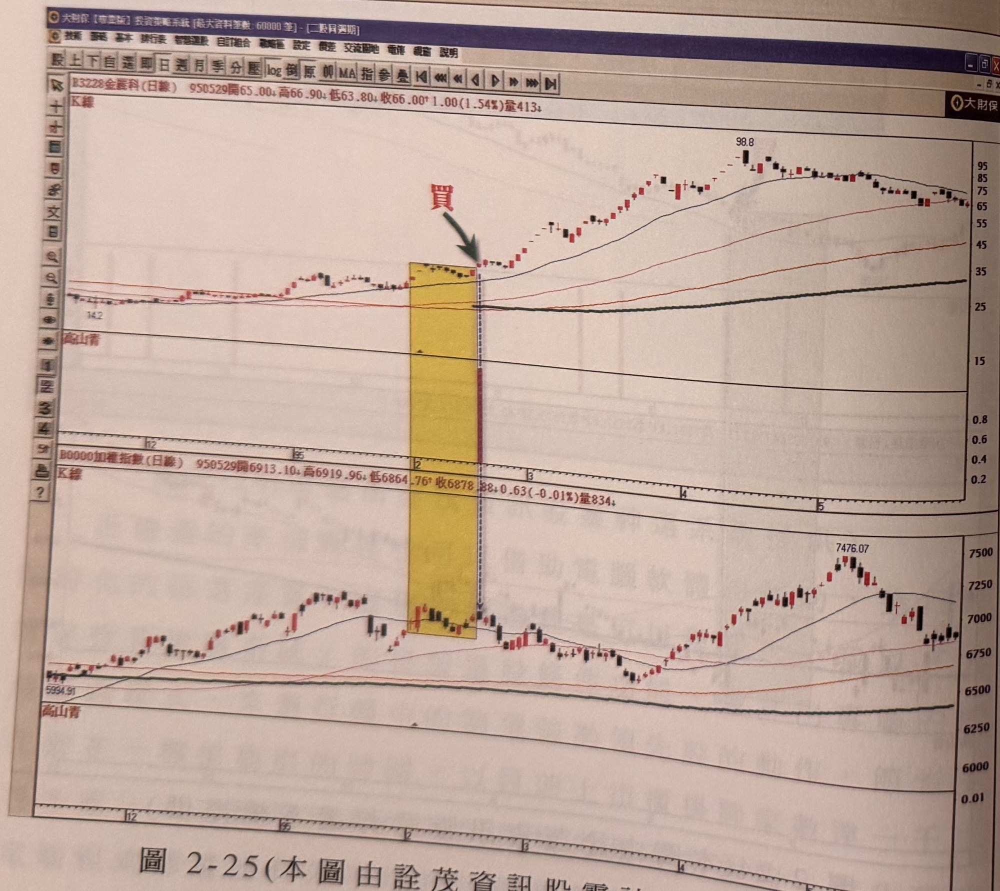

## p.86

而篩選的準備動作也可以借助電腦軟體的輔助，進行最即時化的篩選運算，這個篩選過程是可以程式化，我以『大財保投資策略系統』的自設選股條件功能，設計出專屬的即時篩選程式，來進行盤中的篩選強勢領先股的動作，節省了花費在一檔檔觀察的時間，以目前上市櫃掛牌家數達一千二百多家，人工篩選所費的時間與精力是非常大的，因此藉助電腦程式篩選能有效率地找出強勢股的第一買點，我們以 95

**圖 2-25（本圖由詮茂資訊股靈神選系統提供）**

> 圖說（figure notes）: 「大財保【專業版】投資策略系統」選股結果視窗（U23.高山青(1)[日線]，選股日期：950217，條件數：1，合格數：1；結果為「B3228 金麗科」，開盤28.00、最高28.75、最低27.75、進場點28.75、初始停損點26.74、成交量1764.00），下方接續K線圖視窗，上為金麗科（代號3228，頁首標示「B3228金麗科(日線) 950529開65.00 高66.90 低63.80 收66.00 1.00(1.54%)量413」），下為加權指數（頁首標示「加權指數(日線) 950529開6913.10 高6919.96 低6864.76 收6878.88 0.63(-0.01%)量834」）。金麗科圖中黃色矩形標示區間（低點14.2），區間右緣深藍圓圈「買」與綠色箭頭指向突破K線，中間「高山青」指標列以紅色直條標示對應訊號位置。股價其後急漲，持續墊高至98.8附近，其後回落整理至65~75元區間。加權指數圖對應同一時間區間的黃色矩形，指數自5994.91回升至7476.07附近後回落。此圖對應本文：95年2月17日透過電腦程式篩選結果，也是只有一檔個股領先突破創新高——金麗科(3228)，當天也是漲停收盤28.75元，其後不到兩個月時間逐步拉高至98.8元，漲幅高達兩倍以上，而那段時間大盤也是處在6800~6400點之間來回震盪。

## p.87

而同樣的狀況，我們看 95 年 2 月 17 日透過電腦程式篩選結果，也是只有一檔個股領先突破創新高 --- 金麗科 (3228)，當天它也是漲停收盤 28.75 元，其後也是不到兩個月時間逐步拉高至 98.8 元，漲幅高達兩倍以上，而那段時間，大盤也是處在 6800~6400 點之間來回震盪，金麗科雖然十足的主力炒作，但是如果能搭上順風車，控制好資金與風險的管理，投機就是潛伏著暴利的機會。圖 2-25 是金麗科與大盤指數的比對圖，而我們所設計的比對指標『高山青』也同時出現買進的訊號。

在 95 年 8 月 28 日透過高山青篩選程式在盤中即時搜尋到一檔強勢領先股，金麗科再次出線，當日收盤價為 75.1 元，而我們把停損設成最大停損 7%，而此時大盤的位置正跌破年線，狀似危急之際，投資人對於盤面的發展充斥著不確定的疑慮，如果當下出現這檔強勢買進訊號，大概沒有人敢去試，除非具有內線消息人仕，對於大盤階段，出現領先創區間高點的個股，一般人都會以為它會形成一日行情，而忽略它的買訊，如果資金面是允許嘗試，為何不買少量試一下，哪怕只是買一張，事後發現它又飆得如此之猛，所謂一鳥在手，勝過林上百鳥，即使只買一張，也會讓人心情愉快，而不會因為失之交臂，而徒呼無奈，請看圖 2-26 的篩選結果及金麗科與大盤比對圖。
