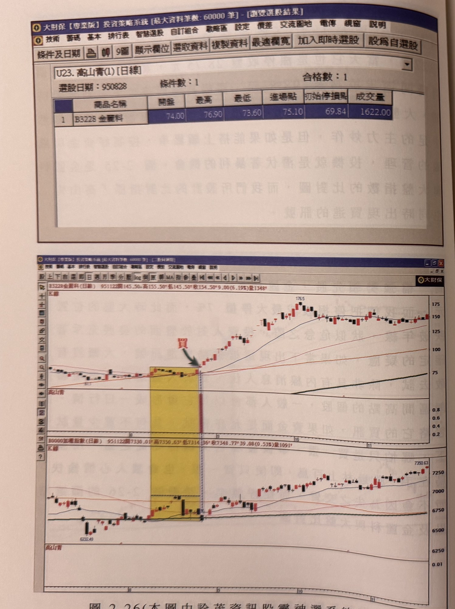
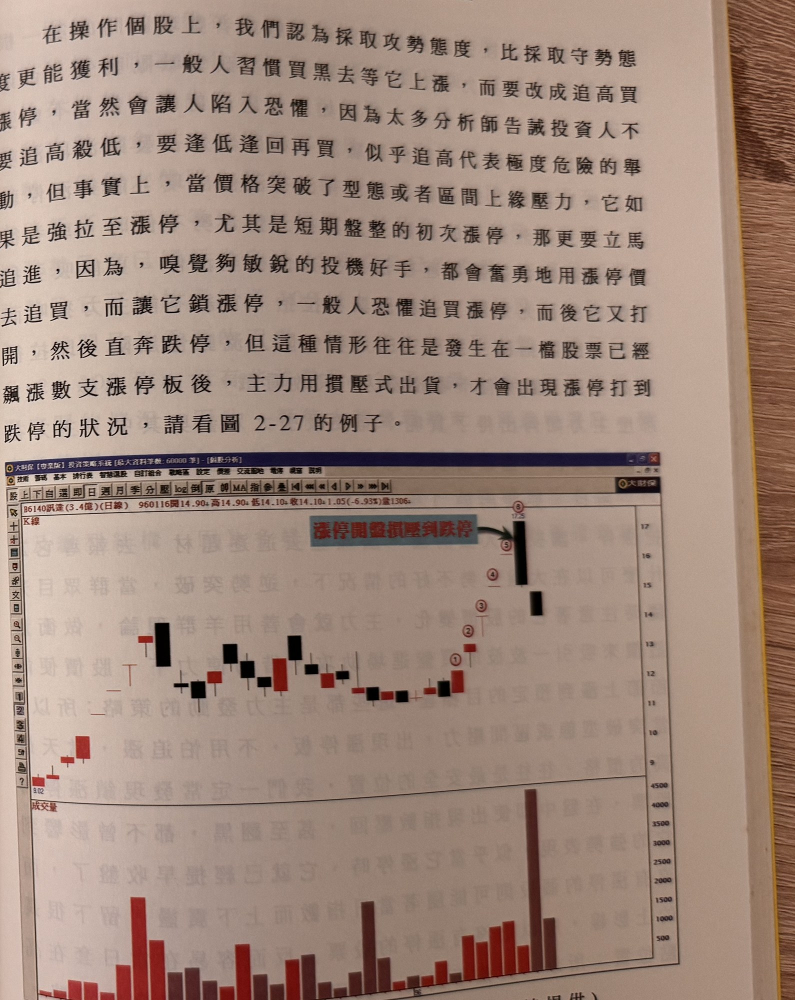

## p.88

**圖 2-26（本圖由詮茂資訊股靈神選系統提供）**

> 圖說（figure notes）: 上方為「大財保【專業版】投資策略系統」選股結果視窗（U23.高山青(1)[日線]，選股日期：950828，條件數：1，合格數：1；結果為「B3228 金麗科」，開盤74.00、最高76.90、最低73.60、進場點75.10、初始停損點69.84、成交量1622.00），下方為金麗科（頁首標示「B3228金麗科(日線) 951122開145.50 高155.50 低145.50 收154.50 9.00(6.19%)量1348」）與加權指數（頁首標示「加權指數(日線) 951122開7330.01 高7350.63 低7314.36 收7348.77 39.08(0.53%)量1091」）K線圖比對，黃色矩形標示區間（金麗科低點81.3），區間右緣深藍圓圈「買」與綠色箭頭指向突破K線。股價其後急漲至176.5附近，其後在125~155元區間整理。加權指數對應同一區間，指數自6222.46回升至7350.63附近。此圖對應本文：95年8月28日透過高山青篩選程式在盤中即時搜尋到金麗科再次出線，當日收盤價75.1元，停損設成最大停損7%，此時大盤正跌破年線。

## p.89

在操作個股上，我們認為採取攻勢態度，比採取守勢態度更能獲利，一般人習慣買黑去等它上漲，而要改成追高買漲停，當然會讓人陷入恐懼，因為太多分析師告誡投資人不要追高殺低，要逢低逢回再買，似乎追高代表極度危險的舉動，但事實上，當價格突破了型態或者區間上緣壓力，它如果是強拉至漲停，尤其是短期盤整的初次漲停，那更要立馬追進，因為，嗅覺夠敏銳的投機好手，都會奮勇地用漲停價去追買，而讓它鎖漲停，一般人恐懼追買漲停，而後它又打開，然後直奔跌停，但這種情形往往是發生在一檔股票已經飆漲數支漲停板後，主力用攙壓式出貨，才會出現漲停打到跌停的狀況，請看圖 2-27 的例子。

**圖 2-27（本圖由詮茂資訊股靈神選系統提供）**

> 圖說（figure notes）: 訊達（代號6140，成交金額3.4億，日線）K線圖（頁首標示「B6140訊達(3.4億)(日線) 960116開14.90 高14.90 低14.10 收14.10 1.05(-6.93%)量1306」）。股價自9.02低點緩步墊高，圖中依序標示①②③④（紅圈數字，股價逐步墊高），右上角紅底黑字說明框「漲停開盤損壓到跌停」以綠色箭頭指向標示⑤（紅圈數字，一根長黑K線，由漲停開盤重挫至跌停附近）之上方另一標示⑧（紅圈數字，位於最高點附近，時間「12:25」）。股價於標示⑤附近觸頂後迅速重挫。下方成交量面板顯示標示⑤對應位置有全圖最大量柱（約4500）。此圖對應本文：一檔股票已經飆漲數支漲停板後，主力用攙壓式出貨，才會出現漲停打到跌停的狀況，訊達(6140)即為此例，漲停開盤卻遭盤中賣壓打到跌停。
