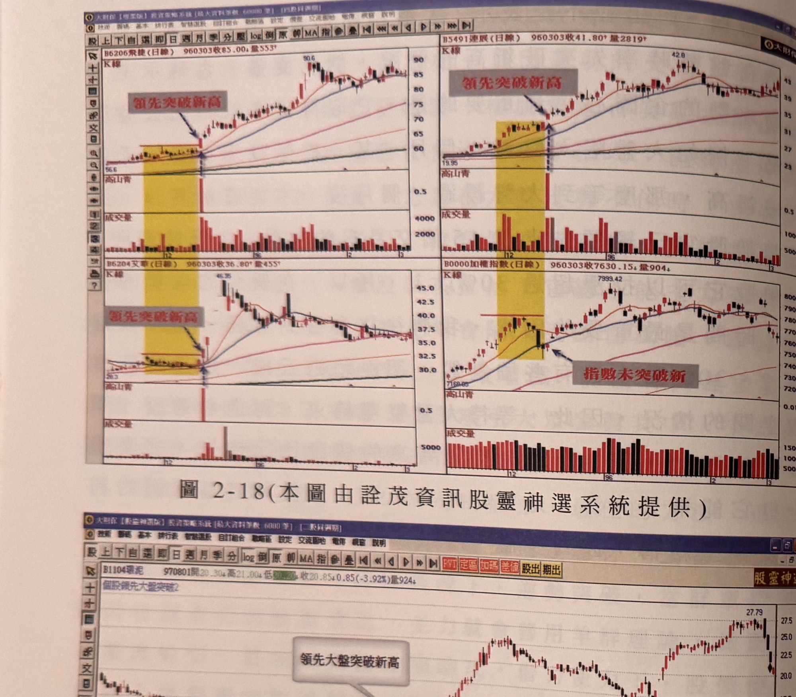
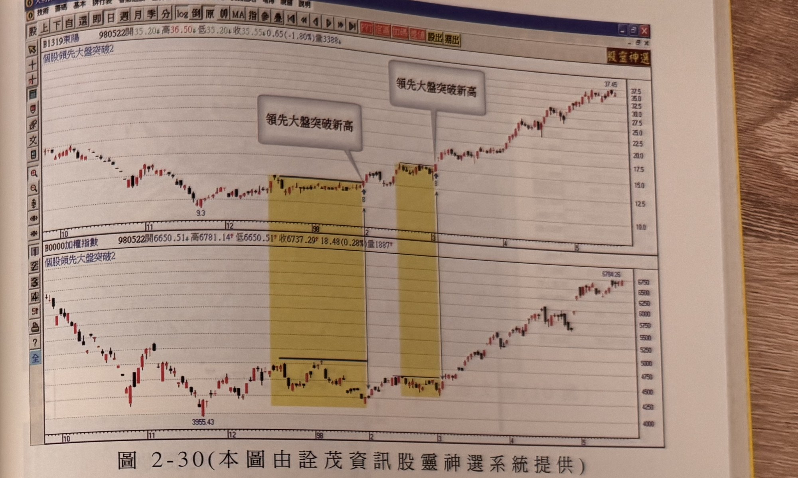
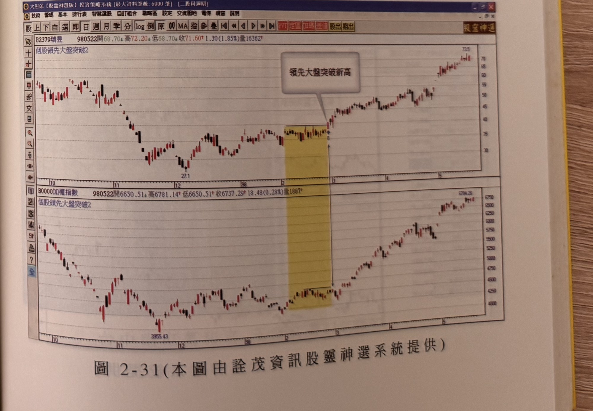

## p.92

以下附圖，請參考。

**圖 2-18(本圖由詮茂資訊股靈神選系統提供)**

> 圖說（figure notes）: 2x2四格日線K線圖組合。左上：飛捷（代號6206，頁首標示「B6206飛捷(日線) 960303收85.00 量553」），灰底黑字說明框「領先突破新高」與藍色箭頭指向黃色矩形區間右緣突破點（56.6起漲），股價其後急漲至90.6高點。右上：連展（代號5491，頁首標示「B5491連展(日線) 960303收41.80 量2819」），同樣「領先突破新高」框與箭頭指向黃色區間右緣突破點（19.95起漲），股價急漲至42.8。左下：艾華（代號6204，頁首標示「B6204艾華(日線) 960303收36.80 量455」），「領先突破新高」框指向黃色區間右緣（28.3起漲），股價急漲至46.35後回落整理。右下：加權指數（頁首標示「B0000加權指數(日線) 960303收7630.15 量904」），灰底黑字說明框「指數未突破新」以箭頭指向對應同一時間的黃色區間右緣（7169.85），指數當時尚未創新高，其後才觸及7999.42高點。此圖對應本文：以四檔個股（飛捷、連展、艾華）分別領先大盤突破新高的實例，與同時期加權指數尚未突破新高做對比，驗證前述比對篩選強勢股的方法。

## p.93

**圖 2-30(本圖由詮茂資訊股靈神選系統提供)**

> 圖說（figure notes）: 上下兩格日線K線圖，上為東陽（代號1319，頁首標示「B1319東陽 980522開35.20 高36.50 低35.20 收35.55 0.65(-1.80%)量3388」，副標「個股領先大盤突破2」），下為加權指數（頁首標示「B0000加權指數 980522開6650.51 高6781.14 低6650.51 收6737.29 18.48(0.28%)量1887」）。東陽圖中兩處黃色矩形區間，第一處灰底黑字說明框「領先大盤突破新高」以箭頭指向區間右緣突破點（9.3起漲），第二處同樣「領先大盤突破新高」框指向右緣突破點，股價其後急漲至37.45附近持續墊高。加權指數圖對應同樣兩處黃色矩形區間（3955.43起漲），指數其後上攻至5784.26附近。

**圖 2-31(本圖由詮茂資訊股靈神選系統提供)**

> 圖說（figure notes）: 上下兩格日線K線圖，上為瑞昱（代號2379，頁首標示「B2379瑞昱 980522開68.70 高72.20 低68.70 收71.60 1.30(1.85%)量16362」，副標「個股領先大盤突破2」），下為加權指數（同圖2-30）。瑞昱圖中黃色矩形區間（低點27.1），灰底黑字說明框「領先大盤突破新高」以箭頭指向區間右緣突破點，股價其後急漲，持續墊高至73.5附近。加權指數圖對應同一黃色矩形區間（3955.43），指數其後上攻至5784.26附近。
