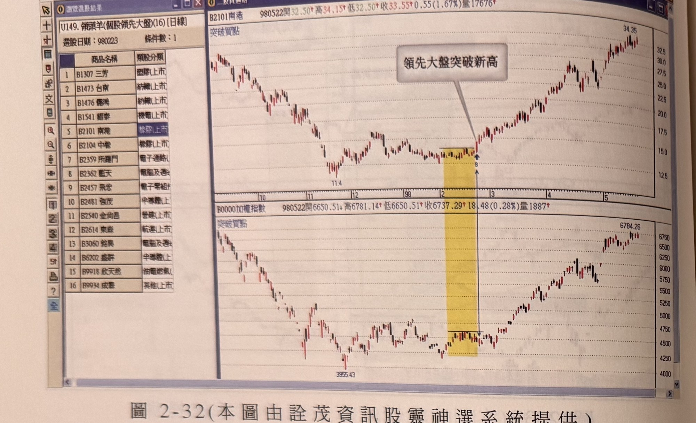
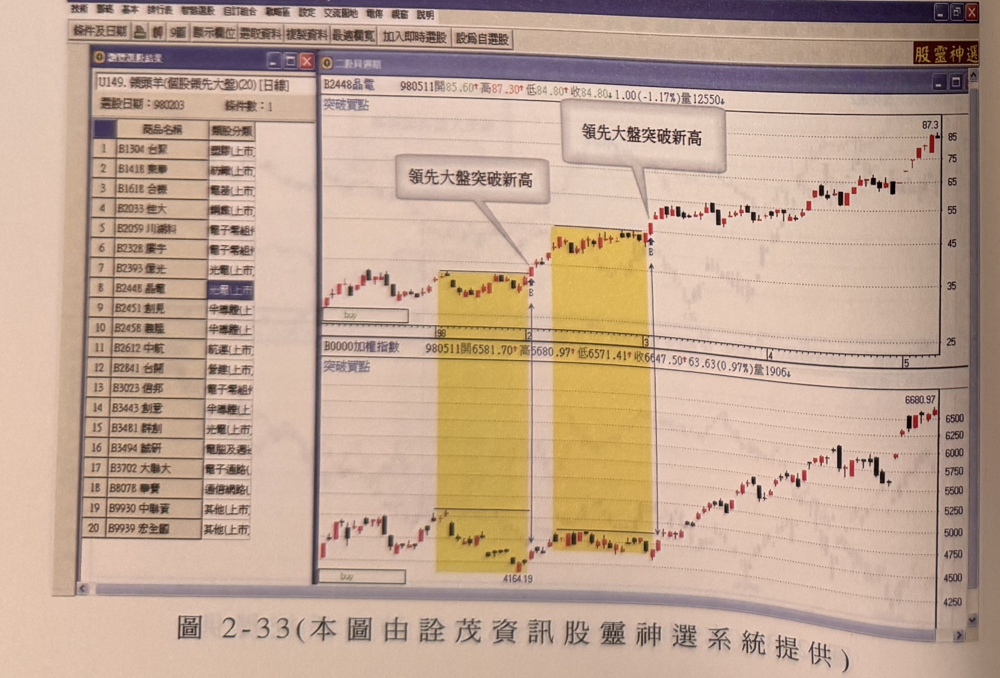
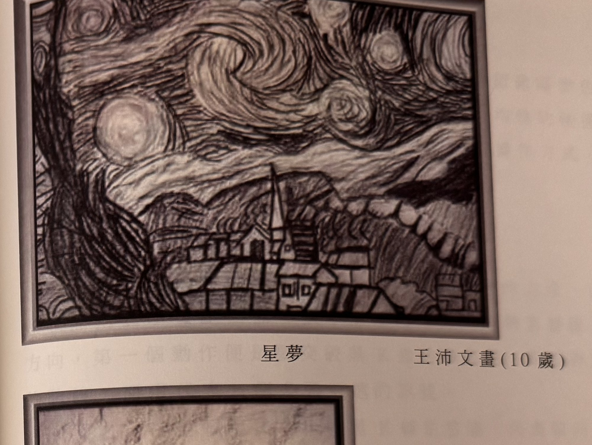
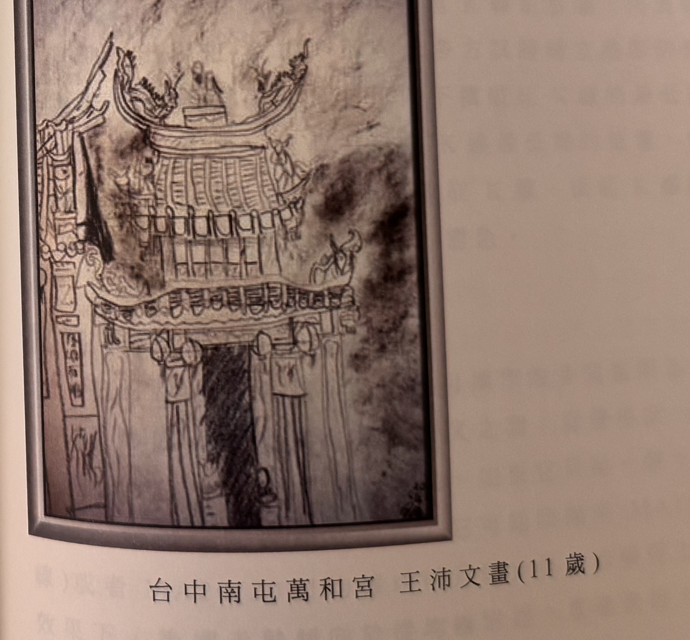

## p.94

**圖 2-32(本圖由詮茂資訊股靈神選系統提供)**

> 圖說（figure notes）: 左側為「大財保【股靈神選版】投資策略系統」選股結果視窗（U149.領頭羊(個股領先大盤)(16)[日線]，選股日期：980223，條件數：1；結果列表16檔個股：三芳、台南、僑鴻、翹泰、南港、中橡、所羅門、藍天、飛宏、強茂、金尚昌、東森、鈺昊、盛群、欣天然、成霖），右側為南港（代號2101，頁首標示「B2101南港 980522開32.50 高34.15 低32.50 收33.55 0.55(1.67%)量17676」）與加權指數（頁首標示「B0000加權指數 980522開6650.51 高6781.14 低6650.51 收6737.29 18.48(0.28%)量1887」）K線圖比對，各自副標「突破買點」。南港圖中黃色矩形區間（低點11.4），灰底黑字說明框「領先大盤突破新高」以箭頭指向區間右緣突破點，股價其後急漲至34.35附近。加權指數圖對應同一黃色矩形區間（3955.43），指數其後上攻至6784.26附近。

**圖 2-33(本圖由詮茂資訊股靈神選系統提供)**

> 圖說（figure notes）: 左側為選股結果視窗（U149.領頭羊(個股領先大盤)(20)[日線]，選股日期：980203，條件數：1；結果列表20檔個股：台聚、東華、合機、佳大、川湖科、廣宇、億光、晶電、創見、裘脂、中航、台開、僑邦、創意、群創、誠研、大聯大、華資、中聯資、宏全國），右側為晶電（代號2448，頁首標示「B2448晶電 980511開85.60 高87.30 低84.80 收84.80 1.00(-1.17%)量12550」）與加權指數（頁首標示「B0000加權指數 980511開6581.70 高6680.97 低6571.41 收6647.50 63.63(0.97%)量1906」）K線圖比對，各自副標「突破買點」。晶電圖中兩處黃色矩形區間，各自右緣有灰底黑字說明框「領先大盤突破新高」以箭頭指向突破點，股價其後急漲至87.3附近。加權指數圖對應同樣兩處黃色矩形區間（4164.19），指數其後上攻至6680.97附近。

## p.95

**星夢　王沛文畫（10歲）**

> 圖說（figure notes）: 章節插圖，非交易圖表，為一幅仿梵谷「星夜」風格的鉛筆／炭筆兒童畫作照片。畫面上半部為漩渦狀星空，以粗獷筆觸描繪多個螺旋狀星雲與圓形星體（含一輪明月），下半部為連綿山丘剪影及山腳下錯落的村莊屋舍，村莊中央有一座帶尖頂的教堂／塔樓。畫作下方印有標題「星夢」及作者署名「王沛文畫（10歲）」。此為書中穿插的兒童畫作頁，與交易內容無直接關聯。

**台中南屯萬和宮　王沛文畫（11歲）**

> 圖說（figure notes）: 章節插圖，非交易圖表，為一幅描繪台灣傳統廟宇建築（台中南屯萬和宮）牌樓/山門的鉛筆素描照片。畫面呈現廟宇屋頂燕尾脊、雕花斗栱、對聯柱及廟門立柱等細節，右側有暈染較深的陰影處理。畫作下方印有標題「台中南屯萬和宮」及作者署名「王沛文畫（11歲）」。此為書中穿插的兒童畫作頁，與交易內容無直接關聯。
