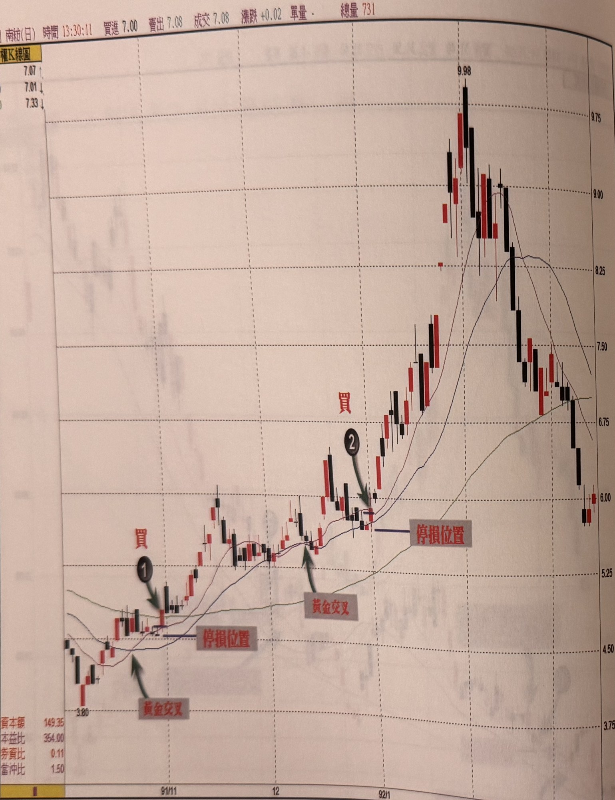

## p.114

**圖 3-15**

> 圖說（figure notes）：南紡(1440) 除權 K 線圖（與圖 3-13 同檔股票，此為正確答案標示版），左上角報價列「[1440]南紡(日) 時間13:30:11 買進7.00 賣出7.08 成交7.08 漲跌+0.02 單量－ 總量731」，均線區「MA10 7.07↑」「MA20 7.01↓」「MA60 7.33↓」。K 線圖左側低點 3.80 附近，灰底紅字「黃金交叉」箭頭指向均線交叉處，紅字「買①」標示於其後第一次回測均線的豬陽變色買點，下方「停損位置」畫水平線。價格續漲後在中段再度出現灰底紅字「黃金交叉」，紅字「買②」標示於第二次回測均線的買點（箭頭指向），下方同樣標示「停損位置」。價格其後急漲至最高點 9.98，再拉回至圖右側低點約 6.00 附近。橫軸標示 91/11、12、92/1、2、3。左下角資訊：資本額149.35、本益比354.00、券資比0.11、當沖比1.50。

## p.115

價格自某一個上漲的高點，回跌至均線位置，到產生豬陽變色的買進訊號，如果時間拖得過久，則容易使均線彎頭(通常是十日均線)，而其後產生的豬陽變色訊號，容易出現騙線，最佳的狀況是碰觸均線在三天內即出現豬陽變色，換言之，一個好的漲勢回測均線，應該是價格觸及均線後，很快地就從均線位置產生豬陽變色的買進訊號，而不是價格觸及均線後，一直在均線位置橫向游走，拖久就容易讓豬陽變色的買進訊號失效。

如果回檔過程促使十日均線彎頭，此時出現的豬陽變色訊號 K 線收盤宜收在十日均線之上，因為一旦十日均線下彎，價格上漲的第一個關卡就是均線位置，訊號 K 線若收盤在均線之下，並非好的買點位置，最好再確認隔天的 K 線是否能收在十日均線之上，再行買入，這是針對以 MA10 及 MA20 交叉所形成的最佳操作區域進行操作時，特別要注意的細節，而此並沒有與交易訊號之直覺操作中的論述相左。

另一個要注意的地方，當 MA10 及 MA20 形成黃金交叉後，它所代表的是理想的操作區域，因此，當價格拉升一波後，回探均線時，不宜跌到 MA20 之下，這包括時間及幅度上都要留意，時間不宜超過 3 天，而幅度上不宜跌超過 MA20 之下 3%以上，發生這種狀況時，該檔個股就必須重新觀察價格回升至 MA10 之上，再視其回測均線後，有無出現豬陽變色的買進訊號，即整個訊號發生的步驟，要重新開始，通常 MA10 及 MA20 交叉的開口角度小，易發生這種狀況，所以，只有選擇 MA10 及 MA20 黃金交叉後，價格快速揚升漲一段的個股，它的均線開口角度大，這也顯示該個股的上漲

[頁面下方有極淡背面透印文字，非本頁內容，未轉錄]
