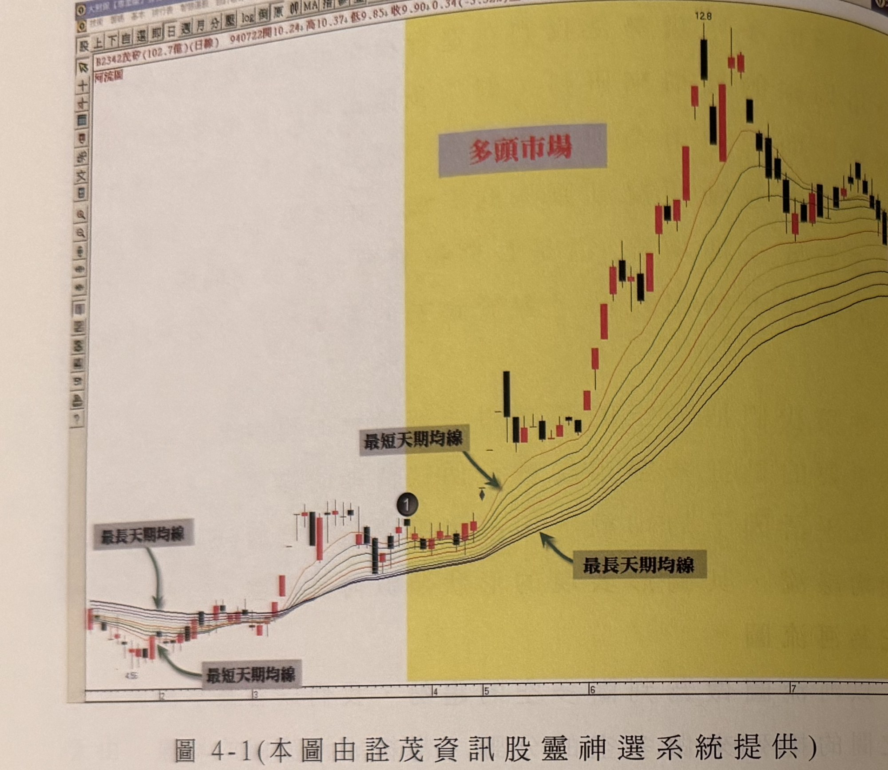
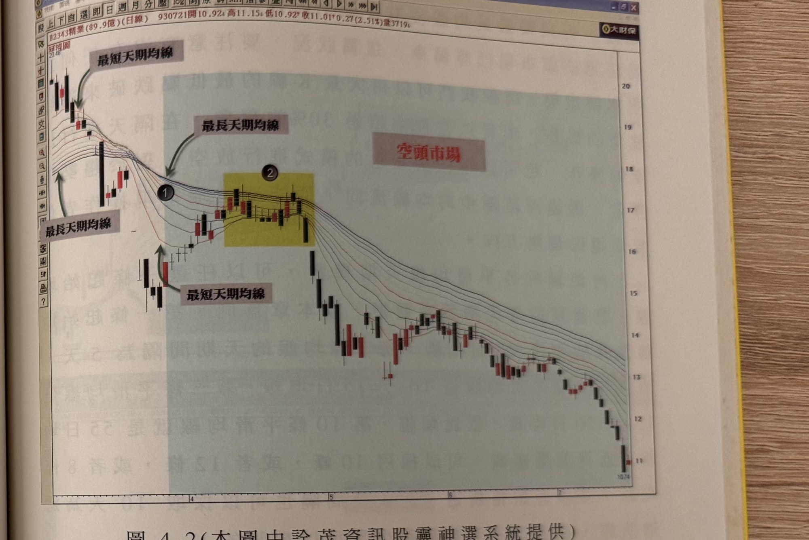

## p.130

出現時，不致於對多頭產生懷疑。

**圖 4-1(本圖由詮茂資訊股靈神選系統提供)**

> 圖說（figure notes）：茂矽(2342) 河流圖，左上角報價列「B2342茂矽(102.7億)(日線) 940722開10.24↑高10.37↑低9.85↑收9.90↓0.34(-3.32%)量8209」，圖中以河流圖（多條平滑均線束）呈現。左段白底區域，均線排列為最長天期均線在上、最短天期均線在下（空頭排列），灰底文字「最長天期均線」「最短天期均線」分別標示對應線；標示①位置，均線開始收斂糾結。右段黃底區域標示「多頭市場」，此後均線排列轉為最短天期均線在上、最長天期均線在下，同樣以灰底文字標示兩線，價格持續上攻至最高點 12.8，後段於高檔區間震盪回落。橫軸標示月份 2、3、4、5、6、7。

從圖 4-1 可以看出，平滑過的均線由原本最長天期均線在上，最短天期均線在最下方的空頭市場，各均線逐漸收斂到糾結在一起，這是一種市場轉變的過渡調整期，在調整過程中，最短天期均線由下往上仰升，均線收斂集結後，轉為向上發散，當最長天期均線移至河道最下方時，均線的排列依序由最短天期在上方，最長天期均線在最下方時，多頭趨勢就此正式轉換完成，如標示 1 位置就是多頭排列完成，而黃色的區域是多頭市場的範圍，均線的河流向上移動，這是目視即可了解，在最長均線未移動到河道的最上方之前，它代表多頭走勢仍未改變，這樣的界定，使得較大的修正走勢

## p.131

多頭走勢行進到頭部區域，河流圖的各均線逐漸收斂糾結，如果價格跌落至河道之下，仍未見快速拉升，則均線收斂糾結到臨界點後，將向下發散，即河流走向轉為向下移動，當最長天期均線移動到各河流均線排列的最上方時，空頭市場即告確認，操作也應由多翻空，不宜買進，如圖 4-2 所示，從標示 1 位置，河流圖的各均線排列正式完成空頭排列，即表示行情進入空頭市場。在河流圖中，有時會出現像標示 2 位置的狀況，河流圖的河道(即最短天期均線與最長天期均線之間的距離)縮小，這表示價格正處於反彈修正格局，當河道

**圖 4-2(本圖由詮茂資訊股靈神選系統提供)**

> 圖說（figure notes）：精業(2343) 河流圖，左上角報價列「B2343精業(89.9億)(日線) 930721開10.92↑高11.15↓低10.92↑收11.01↑0.27(2.51%)量3719」。左側高點 20.48 附近，灰底文字「最短天期均線」「最長天期均線」標示對應線，標示①位置為均線交叉轉為空頭排列處，其後灰底紅字「空頭市場」標示於右側大範圍區域。標示②位置以黃底標出一段反彈整理區間（河道縮小處）。價格其後持續下跌至最低點 10.74。橫軸標示月份 4、5、6、7、8、9、10、11、12。

[頁面中段有前頁文字的極淡背面透印痕跡，非本頁內容，未轉錄]
