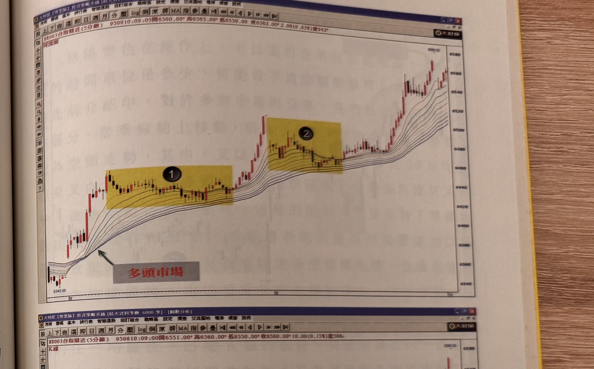
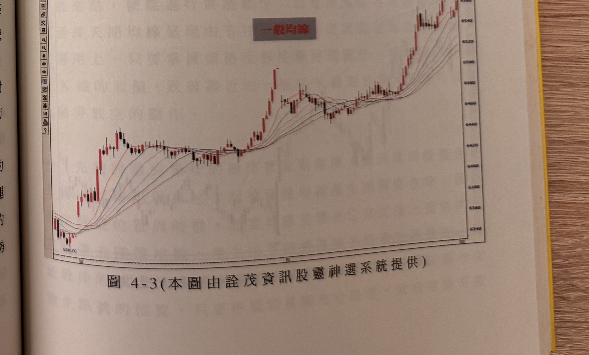

## p.132

由內縮又重新變寬，表示反彈結束，重新向下發展另一波的跌勢，有時候出現更大幅度反彈修正走勢，會造成河道向上翻轉，但只要最長均線沒有從最上方轉至最下方時，不要輕易認定空頭市場已經結束，這種狀況，要注意有沒有任何放空訊號出現，例如我們可以用大量 K 線的最低點跌破來進行放空的動作，或者以當沖率超過 30%的現象，在隔天進行放空的操作，也可以用豬陽變色的模式進行放空。對於趨勢的界定，透過河流圖中的均線流向，便能清楚地呈現操作者最想知道的趨勢方向。

河流圖的各平滑均線天期參數，可以任選一條起始均線，然後採取等天期逐漸遞增，以本章為例，第一條起始均線為採取平滑 10 日均線，每二條均線的天期間隔為 5 天，所以第二條平滑均線是 10+5=15 日均線，第三條平滑均線是 15+5=20 日均線，依此類推，第 10 條平滑均線就是 55 日均線；而河流圖組成，可以採用 10 條，或者 12 條，或者 8 條均線，並沒有嚴格規定，而天期間隔也可以採取 10 天為增基礎，或者以 3 天為基礎也是可以嘗試的。

同樣的，我們也可以把河流圖運用在期貨的操作上，對於變化快速的當日沖銷，在短趨勢的掌握上，順著河流的方向做順勢操作，不失為一簡單有效的模式，在期貨的操作，可以搭配豬陽變色或者以過區間高低的方式，進行訊號式的操作，這些操作方式，我們將做完整的介紹；圖 4-3 即是運用河流圖的 5 分鐘 K 線走勢圖，而圖 4-4 是以 1 分鐘 K 線的河流圖，任何時間單位的 K 線，都可以用河流圖來做為趨勢的判斷。

## p.133

[頁面上方章名標題下、圖 4-3 左側空白處有極淡背面透印文字，非本頁內容，未轉錄；本頁內文以下方圖 4-3 開始]

**圖 4-3(本圖由詮茂資訊股靈神選系統提供)之上半部**

> 圖說（figure notes）：台指期近(5分線) 河流圖，左上角報價列「BX003台指期近(5分線) 950810:09:05開6560.00↑高6565.00↑低6550.00 收6562.00↑2.00(0.03%)量942」。價格自低點 6340.00 持續盤堅上攻，兩處以黃色網底標示整理區間並標號①②，紅字「多頭市場」箭頭指向河流圖均線束由收斂轉為多頭排列（最短天期在上）處，價格其後持續上攻至 6580 附近。橫軸標示 8、9、10（時間刻度）。

**圖 4-3(本圖由詮茂資訊股靈神選系統提供)之下半部**

> 圖說（figure notes）：台指期近(5分線) 一般均線對照圖，左上角報價列「BX003台指期近(5分線) 950810:09:00開6551.00↑高6560.00↑低6550.00↑收6560.00↑10.00(0.15%)量588」，灰底紅字「一般均線」標示於圖上方，呈現與上圖同一時段但採用一般（非河流）均線的走勢，價格自低點 6340.00 上攻至 6580 附近，均線多次交叉纏繞不如河流圖清晰。橫軸標示 8、9、10。
