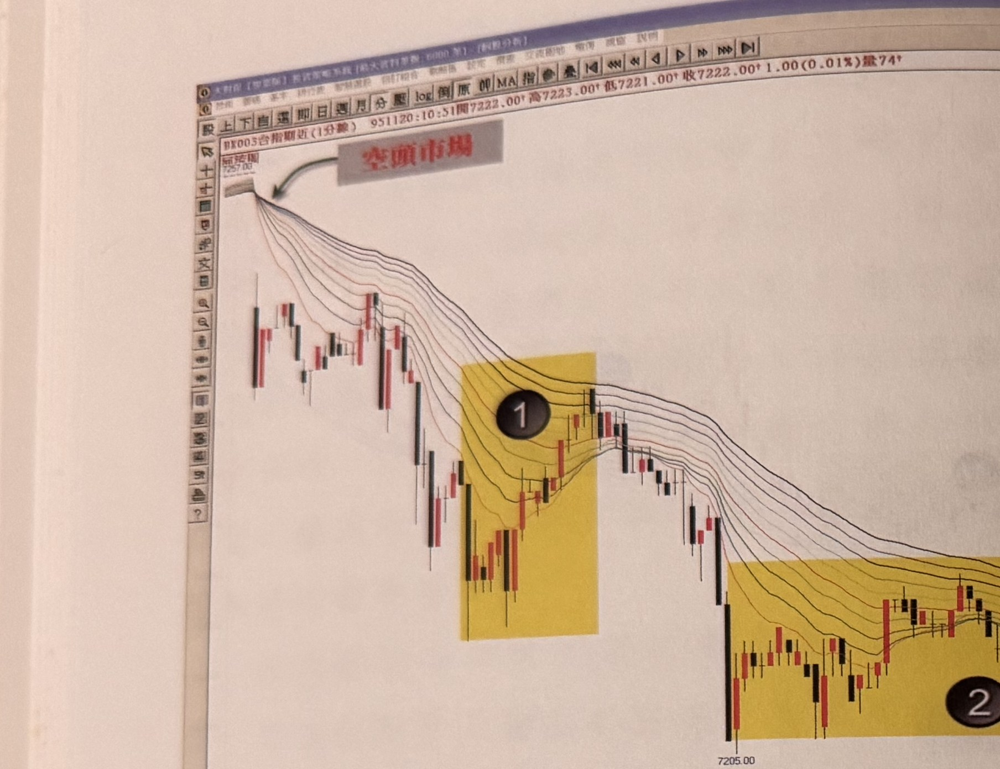
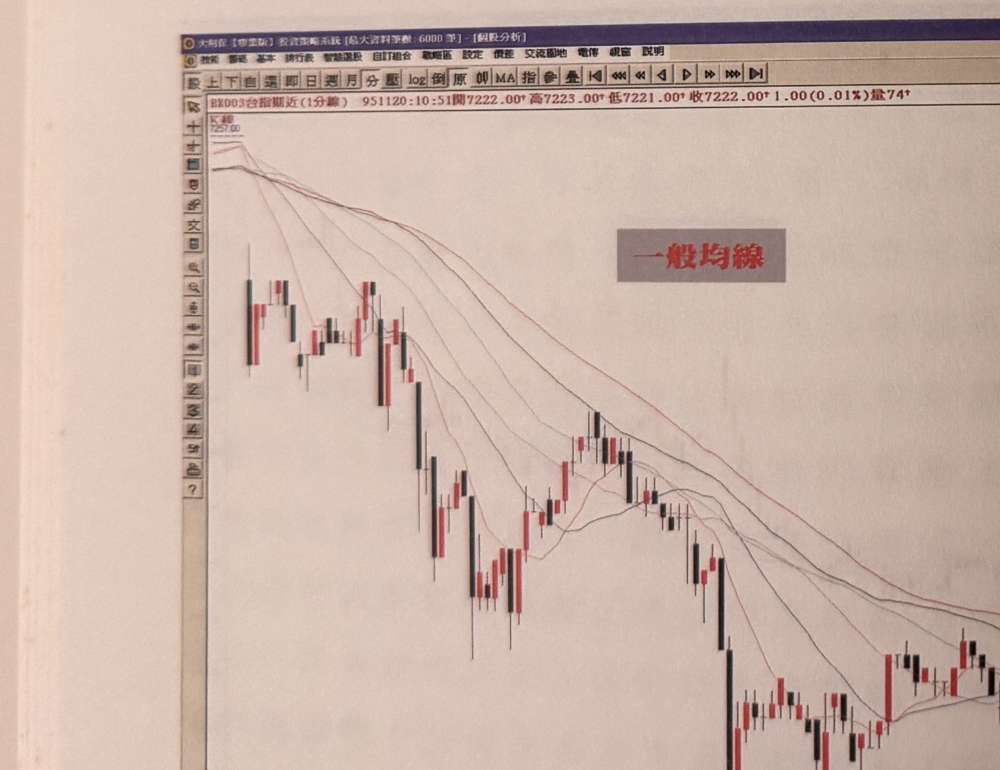

## p.134

**圖 4-4(本圖由詮茂資訊股靈神選系統提供)之上半部**

> 圖說（figure notes）：台指期近(1分線) 河流圖，左上角報價列「BX003台指期近(1分線) 951120:10:51開7222.00↑高7223.00↑低7221.00↑收7222.00↑1.00(0.01%)量74」。價格自高點 7257.00 反轉持續下跌，紅字「空頭市場」箭頭指向河流圖均線束轉為空頭排列（最長天期在上）處，其後兩處以黃色網底標示反彈整理區間並標號①②，價格續跌至低點 7205.00 後小幅反彈。

**圖 4-4(本圖由詮茂資訊股靈神選系統提供)之下半部**

> 圖說（figure notes）：台指期近(1分線) 一般均線對照圖，左上角報價列「BX003台指期近(1分線) 951120:10:51開7222.00↑高7223.00↑低7221.00↑收7222.00↑1.00(0.01%)量74」，灰底紅字「一般均線」標示於圖右側，呈現與上圖同一時段但採用一般（非河流）均線的走勢，價格自高點 7257.00 持續下跌，均線多次交叉纏繞不如河流圖清晰。

## p.135

# 河流圖配合豬陽變色操作

豬陽變色在操作上，可以運用在所有金融商品，不管選用的時間單位是多少，皆能做不錯的順勢操作；在豬陽變色的先前介紹中，對於多空市場的分界，我們是以季線的走向來區分，當季線朝上移動，稱為多頭走勢，而季線向下移動，則為空頭走勢，其中，又以短均線的 10 日均線及 20 日均線的交叉向上，做為多頭市場可操作區域，而兩條均線交叉向下，做為空頭可操作區域，這樣的限制，主要是為了準確地做出順勢操作的要求，本章趨勢的判斷用河流圖來加以輔助，效果同樣不錯，有效地解決多空模糊地帶，也就是當河流圖各均線排列，由短至長天期均線依序由上往下排列，這就是多頭市場，在操作上，只要注意任何價格回檔觸及河流圖的任一均線後，出現 K 線的收盤，突破最靠近的一根黑 K 線最高點，便能進行買進動作；而當河流圖各均線排列，由短至長天期均線呈現由下往上排列，這就認定為空頭市場，在運用上，只要掌握價格反彈接觸河流圖任一條均線後，觀察 K 線的收盤，跌破靠近的一根紅 K 線最低點，那就可以進行融券放空的動作。

先前討論到最佳的操作買賣點選擇，提到當均線黃金交叉後，行情出現第一次回檔碰撞均線產生豬陽變色時，就是最佳買進位置與時機，而當均線呈現死亡交叉後，價格第一次反彈去碰撞均線，產生向下的豬陽變色的賣出訊號時，這是最佳的放空位置。波段買賣點的最佳切入點，記住第一次發生訊號的位置，只要停損的風險充分控管，就能抱股至最
