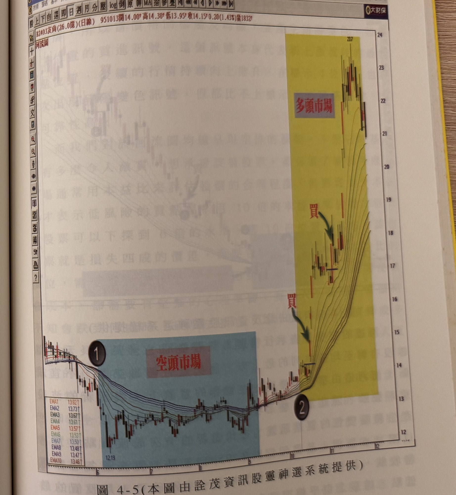

## p.136

大利潤。因此，在河流圖運用上，我們把最佳的操作點，規定在河流圖各均線完成全多排列後，第一次價格回檔至河流圖任何一條均線後，產生豬陽變色形成買進訊號；當河流圖的河道，在往上流動過程，出現河道變窄後，再度變寬，這代表新的一次多頭攻勢發動，所以，自它變寬後，價格由某一高點回檔去碰撞到河流圖的任一條均線，這種狀況，我們同樣視為另一次的最佳操作點。

當河流圖所組成的均線，出現壓縮，即各均線有數條彼此之間的距離幾乎重疊在一起，視為河道變窄，而當它重新變寬時，我們把它視為價格整理結束，重新展開向上的多頭攻擊走勢，換言之，它就像另一次黃金交叉的相同意義，因此，像圖 4-5 所示，友尚(2403)在 95 年 6 月時，從標示 1 的位置開始進入空頭走勢，因為河流圖的各均線完成了短天期均線在最下方，而長天期均線在最上方的排列，一直到 9 月中旬短天期均線翻上最長天期均線之上，此時，正是空轉多的調整階段，在標示 2 位置出現河流圖的各均線完成全多排的狀況，開始根據價格回檔碰撞均線後，產生豬陽變色訊號進行買進動作，圖上第一個標示(買)位置，就是第一次回檔的最佳買點位置，也就是最佳的波段初入點。

用河流圖的最大優點是清晰地指引趨勢的方向，不易有一般用簡單平均計算的均線，常有反向交叉的狀況出現；在河流圖上只會出現河道變窄，不會因有反向交叉出現而影響到我們對趨勢的判斷。

## p.137

**圖 4-5(本圖由詮茂資訊股靈神選系統提供)**

> 圖說（figure notes）：友尚(2403) 河流圖，左上角報價列「B2403友尚(26.0億)(日線) 951013開14.00↑高14.30↑低13.95↑收14.15↑0.20(1.43%)量1832」，左下角列出均線參數「EMA1 13.82↑、EMA2 13.73↑、EMA3 13.67↑、EMA4 13.61↑、EMA5 13.57↑、EMA6 13.53↑、EMA7 13.50↑、EMA8 13.48↑、EMA9 13.47↑、EMA10 13.46↑」。圖左段藍底標示「①」與紅字「空頭市場」，涵蓋價格自 12.19 起持續盤跌整理的區間；標示「②」位置河流圖均線完成全多排列，其後黃底標示「多頭市場」，兩處紅字「買」與綠色箭頭分別標示第一次與第二次回檔碰撞均線的豬陽變色買進點，價格其後持續急漲至最高點 23.7。橫軸標示月份 7、8、9、10、11、12。

[頁面上方及右側有前頁文字的極淡背面透印痕跡，非本頁內容，未轉錄]
