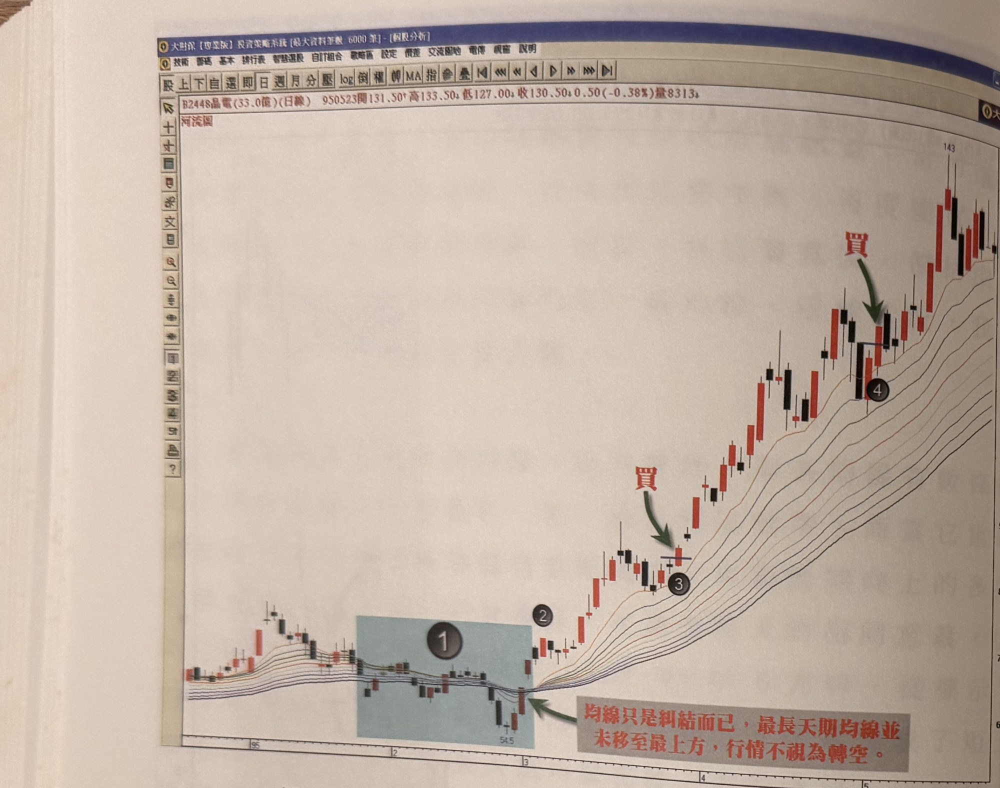

## p.138

**圖 4-6(本圖由詮茂資訊股靈神選系統提供)**

> 圖說（figure notes）：晶電(2448) 河流圖，左上角報價列「B2448晶電(33.0億)(日線) 950523開131.50↑高133.50↓低127.00↓收130.50↓0.50(-0.38%)量8313」。左段藍底標示「①」區域，均線糾結整理（低點54.5附近），紅字「均線只是糾結而已，最長天期均線並未移至最上方，行情不視為轉空。」箭頭指向糾結處；標示「②」「③」位置，均線重新發散向上，「③」處紅字「買」標示買進點；價格續攻，標示「④」處再次出現紅字「買」買進點，價格持續上攻至圖右側高點。橫軸標示 95、2、3、4、5。

圖 4-6(本圖由詮茂資訊股靈神選系統提供)

河道的變窄，表示行情進入整理格局，只要最長天期均線沒有轉至均線排列的最上方，趨勢是否轉為空頭，不宜武斷；而河道由窄重新變寬，在操作的意義上，表示新的波段重新發動，因此當價格上攻後，回探河流均線的任一條時，它代表新的一次最佳買點位置，以圖 4-6 為例，晶電(2448)在 95 年 2 月，河流圖各均線轉趨收斂，甚至在 2 月底時，價格進一步跌破了 1 月股價的最低點，線形上似乎轉空已定，但是河流圖的最長天期均線並沒有轉移至均線排列的最上方，我們只能將它視為調整期，不必急於下結論；而當 3 月開始，價格立刻翻

## p.139

上河流圖之上，各均線排列也重新呈現向上發散狀況，這代表新的多頭攻勢正在進行，如標示 2 位置，各均線再度呈現全多排，所以當價格回檔觸及均線，並產生豬陽變色，如標示 3 位置的買進訊號，這個訊號本身代表新上漲波段的最佳買點位置，後續的行情持續向上推升，在標示 4 位置，也再一次出現豬陽變色訊號，但都比不上標示 3 的買進訊號，來得可靠性高。

而我們對於河流圖均線呈現空排的個股，不管它的基本面有多麼令人激賞，想承接該檔股票，都必須了審慎考慮。市場通常用本益比來評估股價的合理程度，但到底多少本益比才表示低風險的買點呢？用 10 倍的本益比來估嗎？但有些股票可以下探到 6 倍的水準，那 10 倍位置買進來，該檔股票就是損失四成的價差，而要它回到我們 10 倍本益比的價位，需要漲六成以上，才能回到成本，所經歷的時間及機會成本，都需要有堅強的心理準備；而令人不解的，當價格不知會跌到何處時，硬要去接它，為什麼不能等股價轉成多頭時候，去跟進它的漲勢，其間最大的差別是想買比別人更便宜的心理在做怪。

每個投資股市的人，都曉得去頭去尾，吃八分的觀念，也有老生常談提到，不要去猜底在哪裡；當股票的均線排列處於空排狀況時，實在不必介意它落底與否，即使買到底部區，在震盪測試底部過程中，不知要承受多少時間的磨練，有人因為等待過久，當股價一上漲，就想獲利下車，當然也有少數老手，禁得起山起山落，一路持有，但那種意志力是否為你所擁有？為了避免過度等待，必須在多頭發展過程中，做有效率的操作，不要想去買正在趨向便宜的股價，而要買
