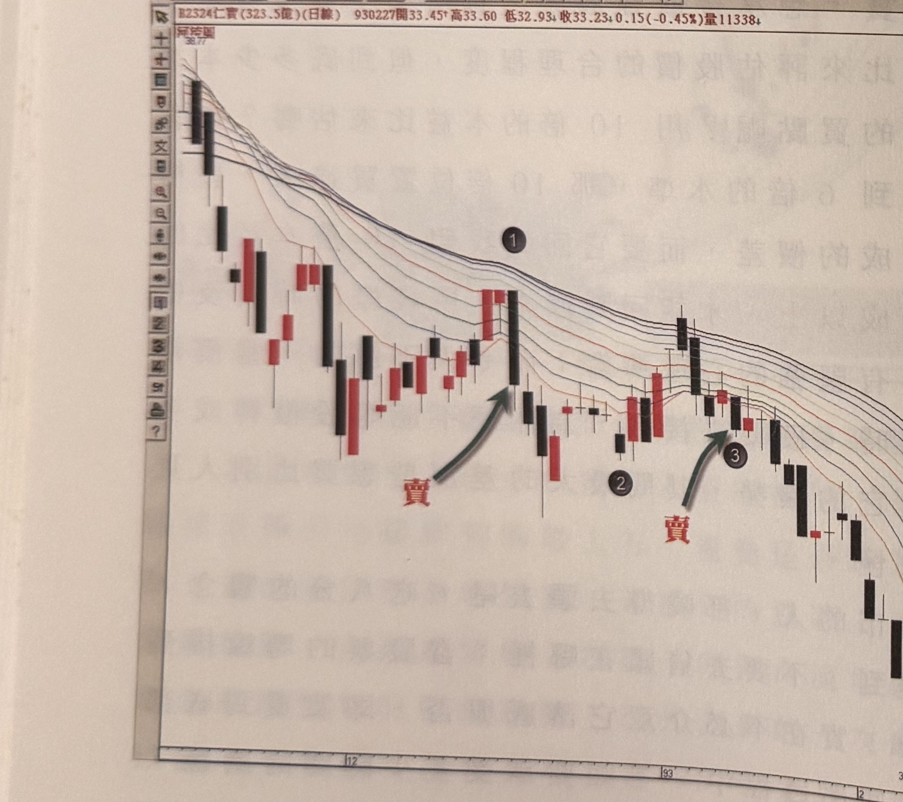

## p.140

它正在上漲的時候。當你使用河流圖時，河道向上流動，你只要記住在股價回測河流圖的均線的其中一條時，出現豬陽變色的買進訊號，就能跟上它上漲的趨勢，這是最簡單有效的操作方式，不必去看 RSI 有無超買，不必緊盯著 KD 指標是否上衝到 80 以上，擔心超買過熱，用的方法越簡單，你的思維就越空明，就不會像布袋戲中的老和尚，學得高深的功夫，卻老是不知用哪一招對付敵人。

**圖 4-7(本圖由詮茂資訊股靈神選系統提供)**

> 圖說（figure notes）：仁寶(2324) 河流圖，左上角報價列「B2324仁寶(323.5億)(日線) 930227開33.45↑高33.60 低32.93↓收33.23↓0.15(-0.45%)量11338」。K 線圖自左側高點 38.77 持續下跌，均線呈現空排（最長天期在上）。標示①位置，紅字「賣」與綠色箭頭標示第一個放空訊號點；標示②位置為反彈整理區（不建議放空處）；標示③位置再次出現紅字「賣」放空訊號。價格持續下跌至圖右側低點 30.79 附近。橫軸標示 12、93、2、3。

當河流圖的均線排列呈現最長天期均線在最上方，而短天期均線在最下方，就表示它進入了空頭市場，那麼可以的話，你開始要進行放空的動作，如果不善於做空，也要了解

## p.141

在空排列的過程中，不值得你多費心在它線形的發展上。在圖 4-7 的例子，價格在標示 1 位置是呈現空排後，第一個賣出放空的訊號點，也是最佳的放空點，標示 2 最好不要空，因為它不屬於反彈格局，關於空頭市場中的反彈格局，至少價格走勢必須出現收盤突破前二天內的最高點，即過二天高的模式，才可認定它具有反彈的動作。

空頭市場中的反彈走勢，漲幅若很大，在一般的均線中，容易讓我們誤以會行情已經扭轉跌勢，而想去做買進的動作，如果我們使用河流圖的河道趨向，就可以觀察河流圖的各條均線排列，是否轉變為最長天期均線在最下方，用這個簡單的判斷方式，能夠讓我們避免誤判；而透過價格的回測均線的步驟，則能減少某些反彈超強到均線的確被扭轉成多頭排列，但是，它回測均線時，卻無法出現豬陽變色的買點訊號。換言之，如果反彈波是一波到底，那麼當它一下跌，往往會快速地跌破所有的均線，無法產生豬陽變色的情況。

準此，操作的先決條件是你了解趨勢的方向是多還是空，才能運用其它的操作策略進行交易；透過運用河流圖的均線排列，以最長天期均線是位在排列的最上方或者最下方，定出多空的方向，就不會被過大的修正行情，而誤以為市場轉向了。
