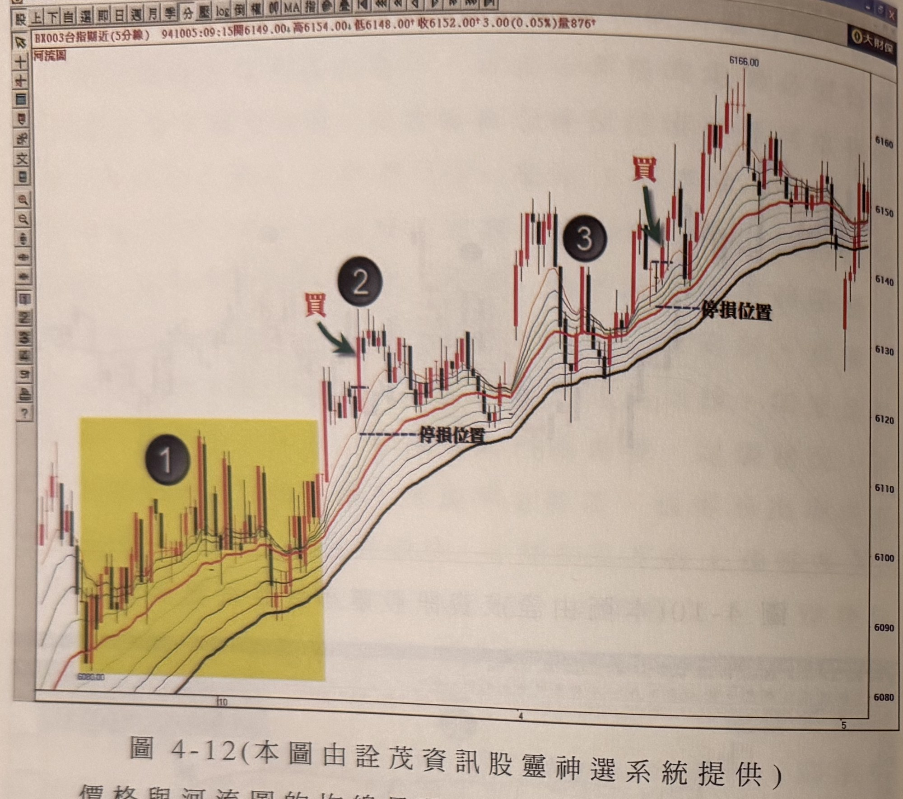
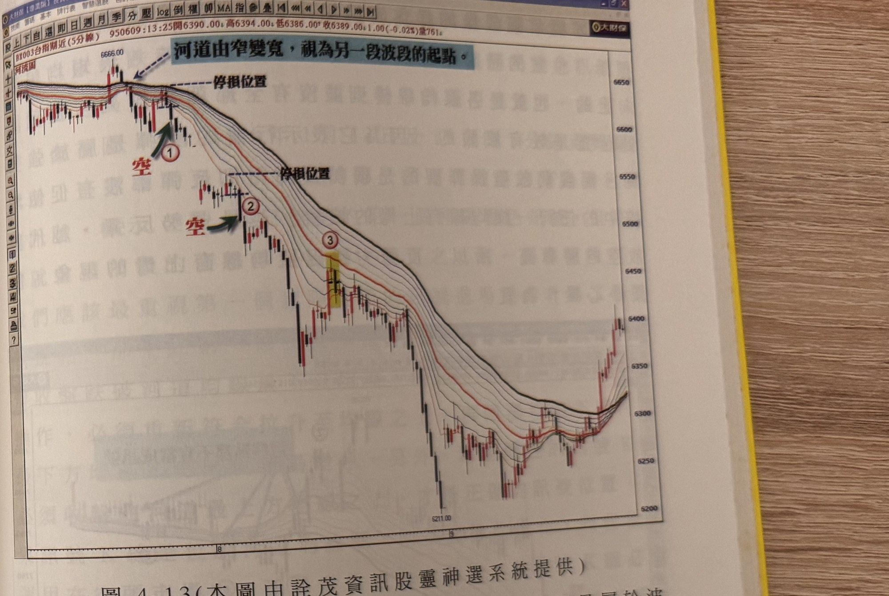

## p.148

**圖 4-12(本圖由詮茂資訊股靈神選系統提供)**

> 圖說（figure notes）：台指期近(5分線) 河流圖，左上角報價列「BX003台指期近(5分線) 941005:09:15開6149.00↑高6154.00↑低6148.00↑收6152.00↑3.00(0.05%)量876」。左段標示①（黃底）區域，價格與均線多所重疊，屬盤整；標示②處紅字「買」與綠色箭頭標示買進點，下方「停損位置」水平虛線；價格續攻後標示③處，均線一度下彎但隨即恢復，其後再度標示紅字「買」買進點，旁「停損位置」水平虛線；價格持續上攻至最高點 6166.00，其後回落整理。橫軸標示 10、4、5。

價格與河流圖的均線呈現貼近，分不出價格是否從脫離均線的某一高點位置回測均線，這種狀況，並不適用豬陽變色的訊號，如圖上標示 1 區域的情形，必須等到標示 2 位置，才是價格從某一頂點回測均線後，產生的豬陽變色訊號，這個限制用法要切記。而豬陽變色的訊號位置，最好是河道的各均線沒有任一條均線是下彎，以圖上為例，標示 3 位置，均線仍處於下彎狀況，表示短期的價格回跌大到使得河道變窄，這種狀況可能促使盤面陷入盤整格局，必須讓河流圖的各均線重新向上發展，再找尋豬陽變色訊號進行操作，因此，訊號點發生時，最好各均線的排列都

## p.149

是朝向上的；反之，在空頭走勢也是要特別注意這個細節。

**圖 4-13(本圖由詮茂資訊股靈神選系統提供)**

> 圖說（figure notes）：台指期近(5分線) 河流圖，左上角報價列「BX003台指期近(5分線) 950609:13:25開6390.00↑高6394.00↓低6386.00↑收6389.00↓1.00(-0.02%)量761」。藍底文字「河道由窄變寬，視為另一段波段的起點。」箭頭指向高點 6666.00 河道轉寬處，下方「停損位置」水平虛線；標示①處紅字「空」與綠色箭頭標示第一次放空點；價格續跌後標示②處，再次紅字「空」標示第二次放空點，下方「停損位置」水平虛線；標示③處（黃底標示）為短暫反彈整理區。價格持續下跌至低點 5211.00，其後反彈回升。橫軸標示 8、9。

當採取河流圖作為趨勢的方向進行操作，它便是屬於波段式的操作策略，如果資金規劃上是允許留倉，不管訊號點是出現在接近收盤時刻，都是可以進場操作的，如果你害怕留倉的風險，那麼你也必須在隔天開盤的第一個豬陽變色訊號進場，如圖 4-13 是 95 年 6 月 7 日至 9 日的走勢圖，在 7 日尾盤河道由窄向下變寬，視為另一個跌勢的發展起點，所以在標示 1 位置出現了第一個豬陽變色的放空訊號，如果無法作留倉動作，也必須在 8 日開盤後的標示 2 出現當日第一個豬陽變色放空訊號進場放空單，當然並不是每次隔天的第
