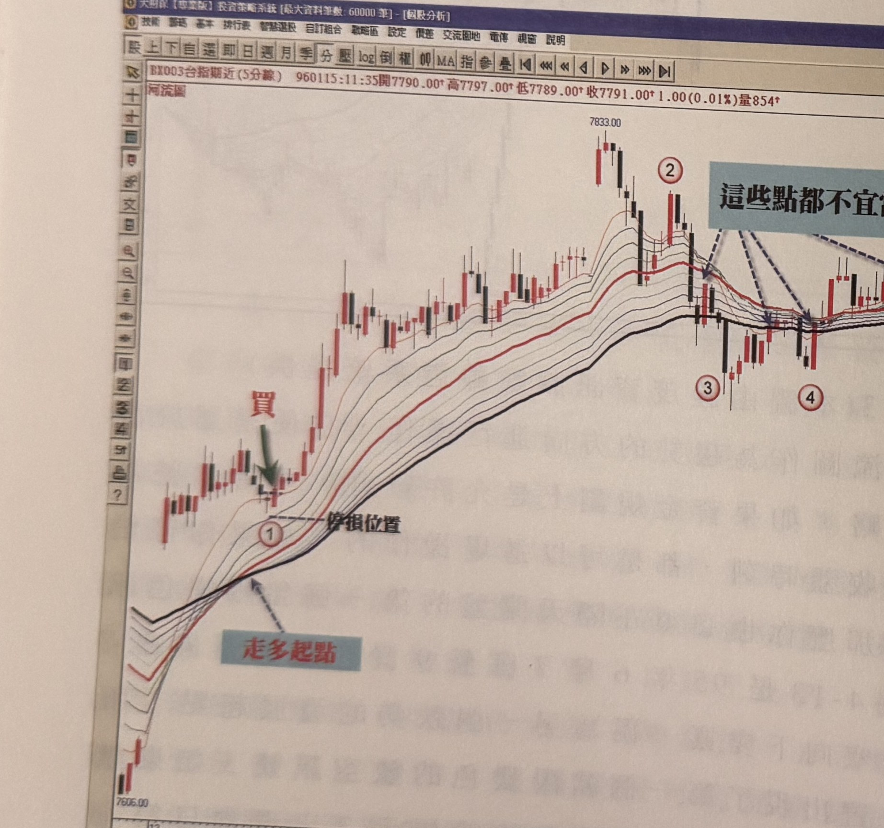

## p.150

一個豬陽變色訊號都會發生在開盤不久，所以，我們仍強烈建議在整個跌勢開始的第一個豬陽變色訊號出現，即進場操作，才能掌握最佳的操作時機點，也是較安全的操作位置，標示 3 位置的豬陽變色訊號，請注意它發生時，最短均線是向上的，也就是各條均線排列並沒有全部朝下排列，這個訊號位置是較有風險的，因為它表示行情的反彈是屬於強勢的，而我們放空操作要的是弱勢反彈，即反彈都沒有促使均線中的任何一條均線有上彎的機會，越是弱勢反彈，越代表放空的勝算高，所以，反彈力道促使均線有上彎的現象，都要小心操作為宜。

**圖 4-14(本圖由詮茂資訊股靈神選系統提供)**

> 圖說（figure notes）：台指期近(5分線) 河流圖，左上角報價列「BX003台指期近(5分線) 960115:11:35開7790.00↑高7797.00↑低7789.00↑收7791.00↑1.00(0.01%)量854」。價格自低點 7606.00 持續上攻，紅字「走多起點」標示均線轉為多排起始處，標示①處紅字「買」與綠色箭頭標示第一次回測均線的買進訊號，下方「停損位置」；價格續攻至高點 7833.00，其後標示②③④⑤處價格反覆於均線間震盪，藍底文字「這些點都不宜當成訊號」以虛線箭頭指向②③④⑤各點，說明這些訊號 K 線最短均線仍向上、不符合弱勢反彈的放空條件。

## p.151

價格的趨勢走多頭格局，最好價格都是保持在河流均線的最上方，當價格若拉回到河道最下方均線之下，那麼它必須重新回升至河道均線最上方後，拉升脫離均線，再回測均線，且未再跌破河道最下方均線，然後出現豬陽變色訊號，始能認定為買進訊號。在空頭走勢中的運用也是同一個理。

像在圖 4-14 為 96 年 1 月 12 日及 15 日的 5 分鐘走勢圖，標示 1 是標準的多頭排列後的第一個回測均線的豬陽變色買進訊號，標示 2 是 15 日盤勢的第一個豬陽變色訊號，但是，它就會被稍後的價格停損出場，換言之，每一個多頭排列，我們應該最重視第一個豬陽變色的訊號進場操作，第二個的訊號點，都不如第一個安全準確，而標示 3 至 5 的訊號，都曾收盤跌破河道均線最下方均線，所以，整個運用豬陽變色操作，必須重新符合拉升至均線之上，再回測均線不破河道最下方均線，再出現豬陽變色，另外，豬陽變色的訊號 K 線必須收盤在河道最上方均線之上，才是正確的訊號位置，如果訊號 K 線是位於河道均線間，則不宜據此操作，同理我們運用在空頭市場中，豬陽變色的放空訊號，其訊號 K 線必須收盤在河道最下方均線之下，才算是正確的放空訊號 K 線。

以下我們附上河流圖配合豬陽變色訊號的操作圖例，請多參閱。
