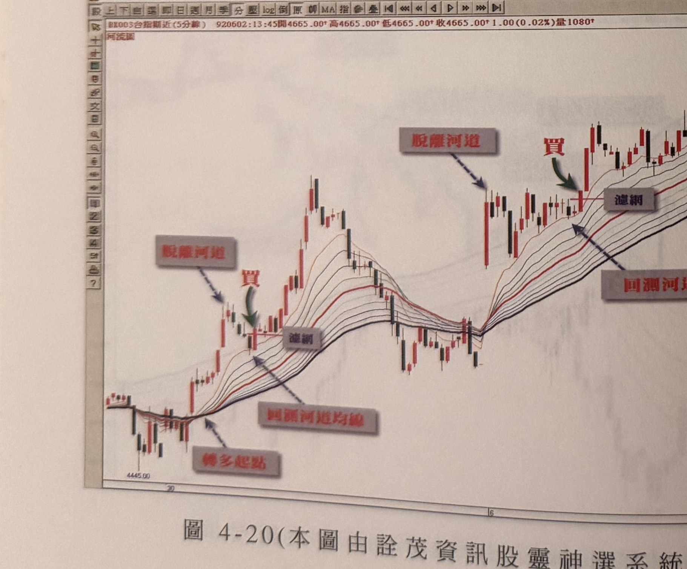

## p.154

**圖 1-19(本圖由詮茂資訊股靈神選系統提供)**［原書圖號印刷如此（1-19），依原書照錄，未加更動］

> 圖說（figure notes）：台指期近(5分線) 河流圖，左上角報價列「BX003台指期近(5分線) 920408:09:15開4532.00↑高4542.00↑低4532.00↑收4533.00↑1.00(0.02%)量724」。灰底紅字「轉多起點」標示均線轉多排低點（4257.00）處；灰底紅字「脫離河道」箭頭指向脫離河道的長紅K線；灰底紅字「濾網」與紅字「買」、綠色箭頭標示買進點；灰底紅字「回測河道均線」標示對應線。價格其後持續急漲，中途小幅震盪後續攻。橫軸標示 14、7。

**圖 4-20(本圖由詮茂資訊股靈神選系統提供)**

> 圖說（figure notes）：台指期近(5分線) 河流圖，左上角報價列「BX003台指期近(5分線) 920602:13:45開4665.00↑高4665.00↑低4665.00↑收4665.00↑1.00(0.02%)量1080」。灰底紅字「轉多起點」標示均線轉多排低點（4445.00）處，其後兩次灰底紅字「脫離河道」分別標示兩段脫離河道的長K線，各對應紅字「買」與綠色箭頭標示的買進點及「濾網」「回測河道均線」標示。價格呈波段式上攻，中段於高檔區間震盪整理後再度上攻。橫軸標示 30、6。

## p.155

# 河流圖結合突破區間高低點操作

採取突破區間的方式，在交易訊號之直覺操作下冊中，我們曾介紹期貨日線圖，在季線朝上發展，以突破 4 天區間最高點形成買進訊號的操作模式，或者在季線朝下發展，以跌破 4 天區間最低點做為放空訊號。如果在更小的時間單位走勢圖中，可以突破或跌破 8 根 K 線最高最低點來做為買進或放空的訊號進行操作，並以河流圖的河道流向做為多空趨勢，輔助我們判斷操作的方向。

我們用河流圖的河道做為多空操作方向的判斷，而各組成均線仍採用平滑因子，各平滑過的均線參數依序為 10、15、20、25、30、35、40、45、50、55 共十條均線，時間單位從 1 分鐘 K 線至 60 分鐘 K 線皆相同參數，當河道向上發展時，開始觀察價格折回均線，如果價格在觸及均線後，呈現震盪，即盤整狀況，某一根 K 線收盤若突破了它的前 8 根 K 線內之最高點，這就是一個買進的訊號，即可進場做多單操作，而操作的同時，以最靠近訊號點的波谷低點下方 1~3 點位置做為停損位置，反之，若是河道向下發展時，便是空頭趨勢，價格若反彈回測河流圖任一條均線，即呈現盤整狀況，當某一根 K 線收盤跌破了它的前 8 根 K 線內的最低點，將形成一個賣出放空的訊號，操作空單的同時，馬上確認停損位置，設在訊號點之前最靠近的波峰高點上方 1~3 點的位置。

空頭轉多頭市場，不採取全多排認定，而改採 EMA30 與 EMA55 黃金交叉向上，即認定市場扭轉為多頭，而多頭轉空頭市場，以 EMA30 與 EMA55 死亡交叉向下來認定市
