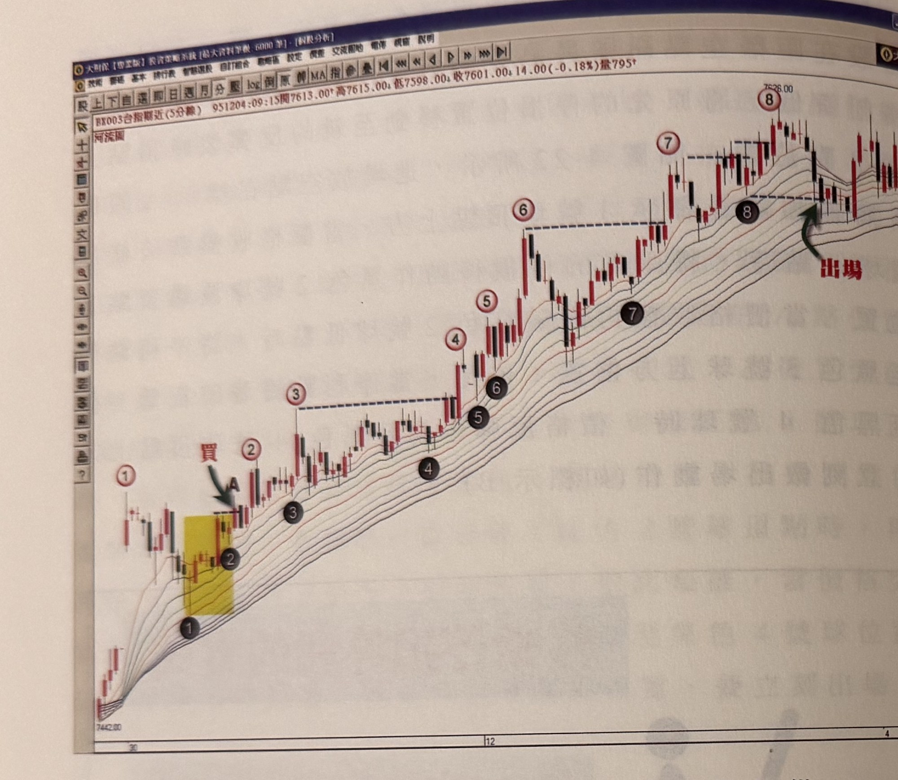

## p.158

**圖 4-23(本圖由詮茂資訊股靈神選系統提供)**

> 圖說（figure notes）：台指期近(5分線) 河流圖，左上角報價列「BX003台指期近(5分線) 951204:09:15開7613.00↑高7615.00↑低7598.00↓收7601.00↓14.00(-0.18%)量795」。價格自低點 7442.00 持續上攻，圖上以紅圈①②③④⑤⑥⑦⑧標示連續創高的波峰（隔一根前無遮蔽K線的突破點），黑球①②③④⑤⑥⑦標示對應的波谷（停損／停利參考點），黃底標示區域為標示A（紅字「買」，綠色箭頭標示進場點）附近的初始突破8根K線高點區間；各波峰間以藍色虛線標示前波高點水平供比對突破。最右側紅字「出場」與綠色箭頭標示黑色8號球低點被跌破的出場點。橫軸標示 30、12、4。

了解停損停利的機制後，我們來看圖 5-3 的實例，95 年 11 月 30 日，台指期出現了 EMA30 與 EMA55 黃金交叉，在標示 A 位置出現了價格回測均線後，向上突破了前 8 根 K 線高點(黃色區域)，可進場做多單，先把停損設在黑色 1 號球低點下方 1~3 點位置，隨著價格突破紅色 1 號球高點，將停損移動至黑色 2 號球低點位置，突破紅色 2 號球高點，就移動停利點至黑色 3 號球位置，價格在創出紅色 4 號球高點前，停利點一直設在黑色 3 號球低點，這段期間價格陷入盤整，從圖上看出它的盤整區間的低點仍然呈現墊高狀態，但只要價格沒有創新高的情形下，停利點的位置並不會更動

## p.159

的，當停利點不斷地提高到黑色 6 號球下方，在後續 K 線收盤沒有突破紅色 6 號球峰頂之前，停利位置都是保持在黑色 6 號球下方，而這裡我們要特別注意：突破前波波峰一定指的是 K 線收盤突破，不能只是上影線過高，而突破 K 線更要是一根前無遮蔽的 K 線，在紅色 7 號球及紅色 8 號球之前，有數根上影線過高及 K 線收盤過紅色 7 號球峰頂但前有遮蔽，所以都不是定義上的突破前波高的 K 線，整個操作透過停損停利點的移動，直到黑色 8 號球低點被跌破出場。

當然這期間仍然會有其它的突破 8 根 K 線高點出現，但是我們的最佳進場點，是 EMA30 與 EMA55 黃金交叉向上後，價格第一次回測均線再突破前 8 根 K 線最高點，這是我們最重要的切入點，第一次以後出現的訊號，可以當成是加碼點看待。

以突破 8 根 K 線高點做為操作策略，不限於使用在 5 分鐘 K 線圖，也可運用在 3 分鐘 K 線或 1 分鐘 K 線圖上，而且，並不限制當日平倉，也可以採取留倉方式操作，留倉唯一的風險在於隔日跳空不利倉位時，可能擴大虧損的點數，當然如果跳空往更有利的方向前進，那留倉的利潤是很可觀的，操作者在資金允許的停損空間下，是值得用留倉來操作波段行情。
