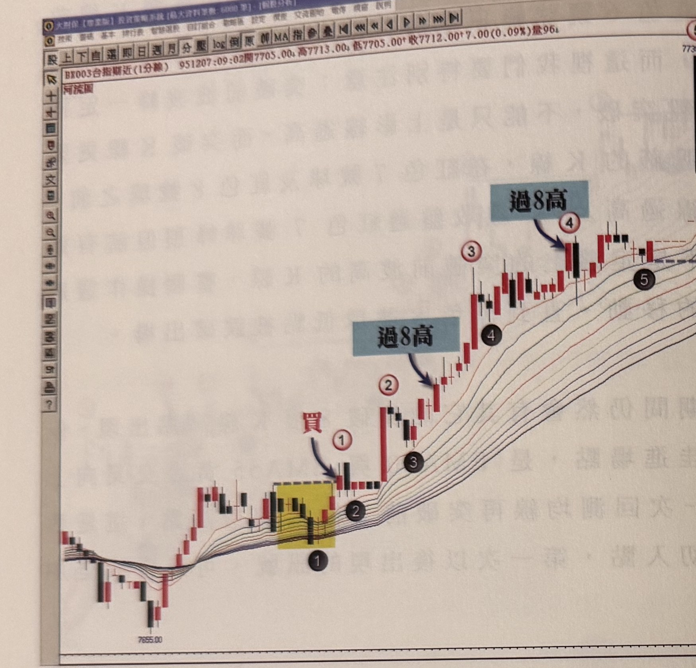
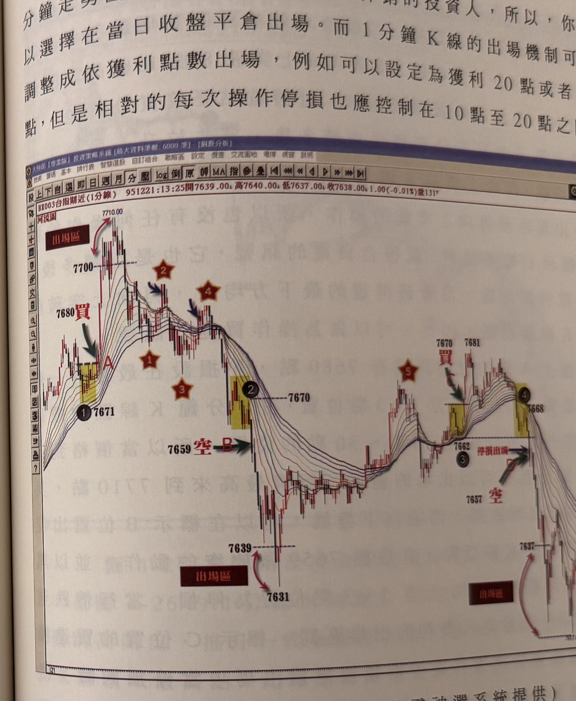

## p.160

**圖 4-24(本圖由詮茂資訊股靈神選系統提供)**

> 圖說（figure notes）：台指期近(1分線) 河流圖，左上角報價列「BX003台指期近(1分線) 951207:09:02開7705.00↓高7713.00↓低7705.00↑收7712.00↑7.00(0.09%)量96」。低點 7655.00 附近黃底標示區域為黑球①，紅字「買」與藍色箭頭標示買進點；其後紅圈①，藍底文字「過8高」箭頭指向紅圈②對應的突破K線，黑球②③，藍底文字「過8高」再次箭頭指向紅圈③④間的突破K線，黑球④，最右側紅圈⑤與「出場」標示。橫軸無額外標示。

圖 4-24 是以 1 分鐘 K 線為單位的台指期走勢圖，透過河流圖的河道流向指引操作方向，當標示 1 號球出現均線黃金交叉後，價格第一次從沒有觸及均線的峰頂回測均線，向上突破了前 8 根 K 線區間的最高點，形成一個買進訊號，並以黑色 1 號球低點下方 1~3 點做為停損位置，當 K 線收盤突破紅色 1 號頂點時，便將原來的停損位置移動至黑色 2 號球低點位置，當價格再突破紅色 2 號頂點時，它同時也過 8 高，這是個加碼點位置，如果有加碼動作，就把停損與原始進場的倉位停利點，全設在黑色 3 號球低點下方 1~3 點位置，一直用這種過高移動停損點的方式，一步一步地跟隨走勢向

## p.161

上，直到黑色 5 號球低點被點到為止，才出場。通常使用 1 分鐘走勢圖操作，大部分是當日沖銷的投資人，所以，你可以選擇在當日收盤平倉出場。而 1 分鐘 K 線的出場機制可以調整成依獲利點數出場，例如可以設定為獲利 20 點或者 30 點，但是相對的每次操作停損也應控制在 10 點至 20 點之間。

**圖 4-25(本圖由詮茂資訊股靈神選系統提供)**

> 圖說（figure notes）：台指期近(1分線) 河流圖，左上角報價列「BX003台指期近(1分線) 951221:13:25開7639.00↓高7640.00↓低7637.00↓收7638.00↓1.00(-0.01%)量131」。高點 7710.00 標示「出場區」（雙向紅箭頭），下方 7700 虛線水平；黑球①7671、紅字「買」與綠色箭頭標示買進點A（黃底標示區）；星形①②③④標示河道內反覆訊號點；7659 處紅字「空 B」與綠色箭頭標示放空點；黑球②7670（黃底）；價格下探至 7639／7631（「出場區」與雙向紅箭頭標示）；其後反彈整理，星形⑤標示，黃底標示區出現 7670「買」7681（綠色箭頭）；黑球③7662「停損出場」與 7657「空」；黃底標示區 7637（黑球④，右側續接下一頁）。

在以突破前 8 根 K 線高點配合河流圖操作時，如果在多頭發展中，價格曾跌破向上河道的最下方的均線，那麼它的買點必須是先拉高脫離河道的最上方均線一段距離後，價格再向上突破 8 根 K 線高點，且不能再破河道的最下方均線，才算是買點，以圖 4-25 的例子說明，在星號 1
