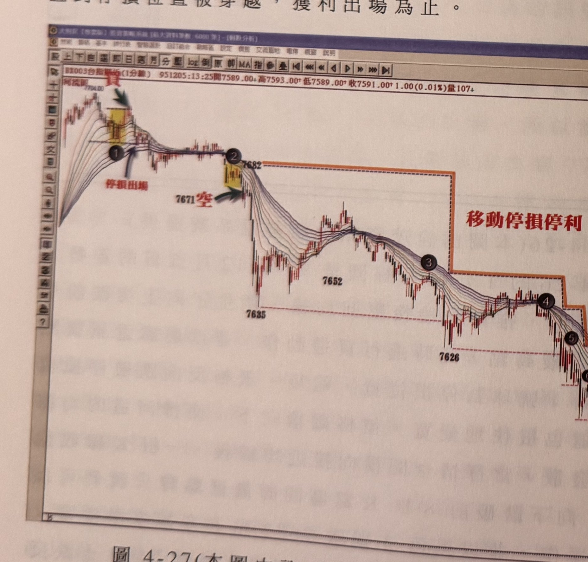
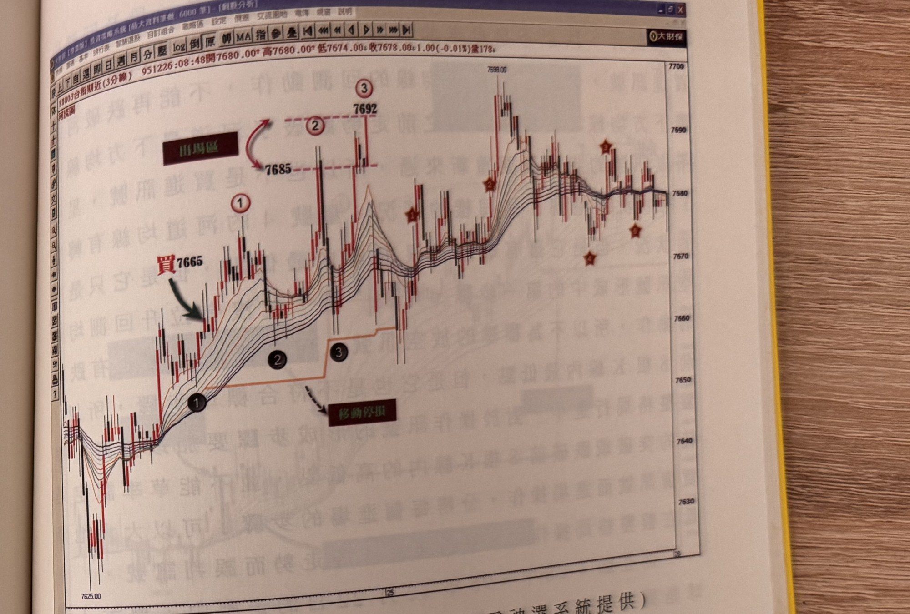

## p.164

彈，並沒有促使均線轉多，當反彈結束，河道重新向下變寬，表示跌勢重新啟動，當行情再度跌破前 8 根 K 線區間最低點，形成當日另一個放空的訊號，依此模式操作，當日共有四次的操作，三次獲勝，一次被停損出場，請見圖上說明。

如果採取移動停損停利的方式做為出場的策略，那麼在 7671 點放空後，可以根據行情創新低時，移動停損停利點，如圖 4-27 所示，當 7635 點波谷低點被跌破時，原先在黑色 2 號球的停損位置，便可移動至黑色 3 號球的上方，而當 7626 點波谷低點再被跌破時，停利點移動至黑色 4 號球上方，依此模式，每創一次新低，便移動停損至新的反彈高點上方，直到停損位置被穿越，獲利出場為止。

**圖 4-27(本圖由詮茂資訊股靈神選系統提供)**

> 圖說（figure notes）：台指期近(1分線) 河流圖，同圖 4-26 之延續走勢圖。高點 7704.00，黃底標示區「買」，黑球①「停損出場」；價格續跌，「7671 空」標示放空點，黃底標示區黑球②「7682」；價格續跌至「7635」，反彈後回落至黑球③附近，橙色階梯狀虛線標示「移動停損」逐步下移的停損軌跡（自②的7682下移至③附近再下移），下方「7652」「7626」為波谷低點標示，虛線水平延伸標示移動停損參考位置。

## p.165

**圖 4-28(本圖由詮茂資訊股靈神選系統提供)**

> 圖說（figure notes）：台指期近(3分線) 河流圖，左上角報價列「BX003台指期近(3分線) 951226:08:48開7680.00↑高7680.00↑低7674.00↓收7678.00↓1.00(-0.01%)量178」。低點 7625.00 附近黑球①，紅字「買7665」與綠色箭頭標示買進點；價格續攻，紅圈②「7692」與紅圈③「7692」（虛線水平7685、7692間標示「出場區」雙向箭頭）；橙色階梯狀虛線標示黑球②③處的「移動停損」逐步上移軌跡；價格持續上攻至高點 7698.00，其後於 7580～7600 區間反覆震盪，圖右側散布多枚星形標示（★）表示後續盤整格局中的訊號點。橫軸標示時間刻度「25」。

在行情進入盤整格局時，買賣訊號往往會有較多的雜訊，因此辨別什麼是突破 8 根 K 線高點的定義要更嚴格遵守，我們提過不管在空頭轉多頭，或者多頭轉成空頭市場，一定要出現拉高一段，回測均線，再突破前 8 根 K 線之最高一點，才形成一買進訊號，而空頭市場，一定要有先走跌一段，回測均線，再跌破前 8 根 K 線之最低點，如圖 4-28 是 95 年 12 月 22 日及 25 日的 3 分鐘 K 線走勢圖，在星號 1 位置附近跌河流圖之河道是向上發展，但是價格卻在 25 日開盤附近跌破了河道最下方均線，因此買點的訊號，須重新漲超過河道最上方均線，回測均線，再突破 8 根 K 線最高點，星號 1 雖
