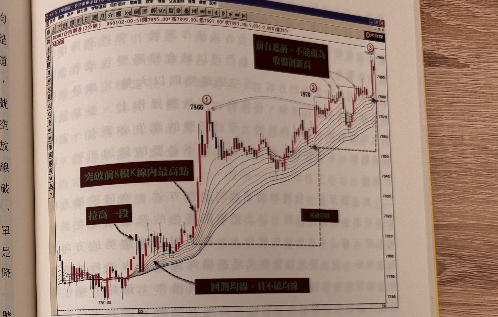

## p.166

突破了前 8 根 K 線內最高點，但是它少了拉高一段及回測均線的動作，所以不是標準的買進訊號，而星號 2 位置也不是買進訊號，因為在拉高過均線的回測動作，不能再跌破河道最下方均線，而星號 2 的之前走勢跌破了河道最下方均線，所以訊號的步驟又要重新來過，所以也不是買進訊號，星號 3 的狀況跟星號 1 是同樣的情況，星號 4 的河道均線有轉空的狀況，但是它雖有破前 8 根 K 線內最低點，但是它只是放空訊號形成中的第一步驟，先跌一段，並沒有拉升回測均線的動作，所以不為標準的放空訊號，而星號 5 位置也有跌破前 8 根 K 線內最低點，但是它也是不符合標準步驟，所以，盤整格局行進中，對於操作訊號的形成步驟要加以分辨，單純的突破或跌破前 8 根 K 線內的高低點，並不能草率認定是買賣訊號而進場操作，分辨每個進場的步驟，可以大大地降低在盤整格局操作中，被忽多忽空的走勢而誤判訊號。

而在圖 4-28 中，95 年 12 月 22 日的走勢中，標示 1 號球是買進 7665 後，立刻找出停損位置的設立位置，隨著行情推升新高，當新高過了紅色 1 號球高點時，停損可移動作黑色 2 號球低點下方，如果在當日是以 20 點以上做為獲利機制，那麼當行情到達 7685 點以上，都是準備出場的區間；如果按移動停損的機制出場，當移動停損移動至黑色 3 號球低點下方後，會在 25 日開盤後被點到停損，會小虧 5 點出場。

## p.167

**圖 4-29(本圖由詮茂資訊股靈神選系統提供)**

> 圖說（figure notes）：台指期近(3分線) 河流圖，左上角報價列「BX003台指期近(3分線) 960102:08:51開7895.00↑高7899.00↑低7891.00↑收7893.00↓5.00(-0.06%)量385」。低點 7781.00 附近，深綠底白字「回測均線，且不破均線」箭頭指向價格回測均線但未破均線處；深綠底白字「拉高一段」箭頭指向其後的上攻K線；深綠底白字「突破前8根K線內最高點」箭頭指向紅圈①「7866」處；價格續攻回檔後於紅圈②「7876」再創高，深綠底白字「移動停損」標示於①②間的虛線框內；價格持續上攻至紅圈③「7900.00」附近，深綠底白字「前有遮蔽，不能視為收盤創新高」箭頭指向③之前數根被前面K線上影線遮蔽、不算有效創高的K線；隨後價格急跌拉出長黑K線。橫軸標示時間刻度「29」。

因此在利用河流圖做為操作策略時，訊號發生之前的步驟要確實遵守，才不會誤判訊號，在圖 4-29 所呈現的是標準的步驟說明，而操作的出場若採取定點出場，可根據讀者的認定去制定，盤中以 2、30 點或更多皆可，但如果採取移動停損出場，那麼過高點或者過低點的認定，就是注意前無遮蔽的原則，即任一 K 線收盤超過了前波高點時，它的前面不能有其它 K 線的上影線擋著其收盤創新高的動作；換言之，收盤比前波高點更高外，還要比最靠近的 K 線上影線更高，才算是創新高點，所以像在紅色 2 號球高點之後，雖有 K 線收盤比紅色 2 號球高點高的狀況出現，但是都有上影線
