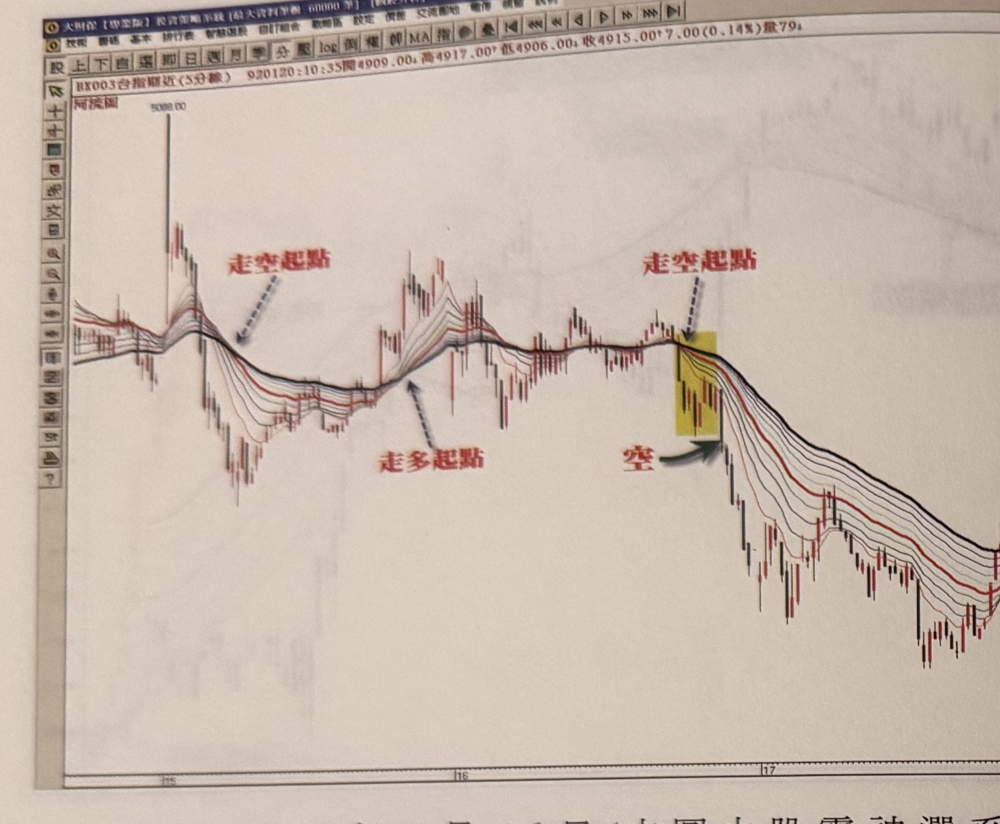
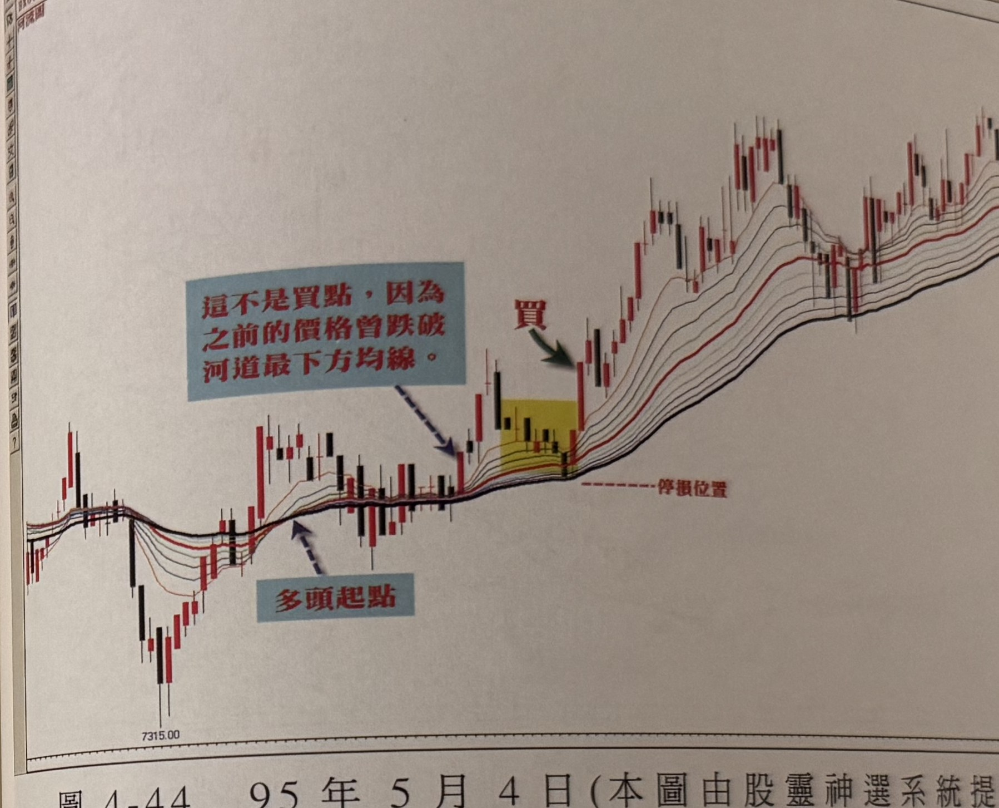
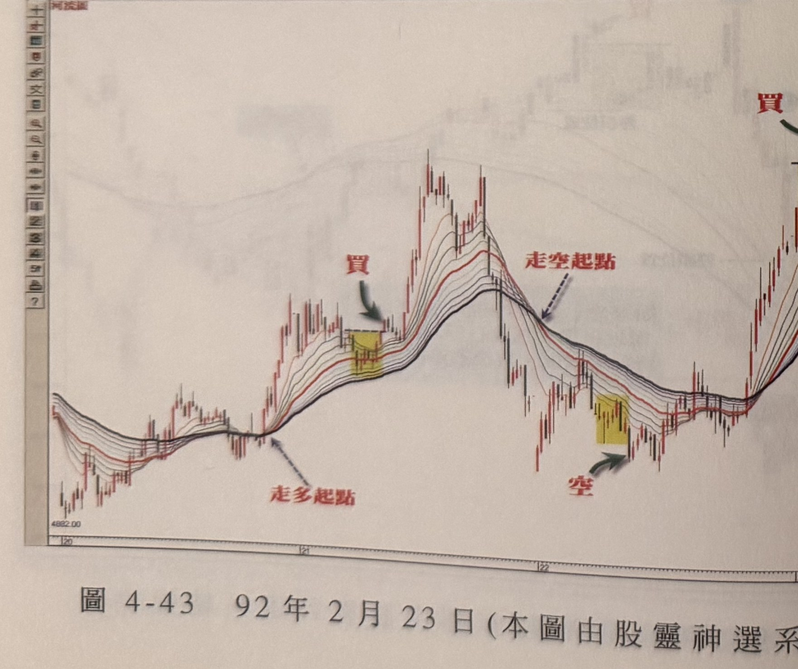
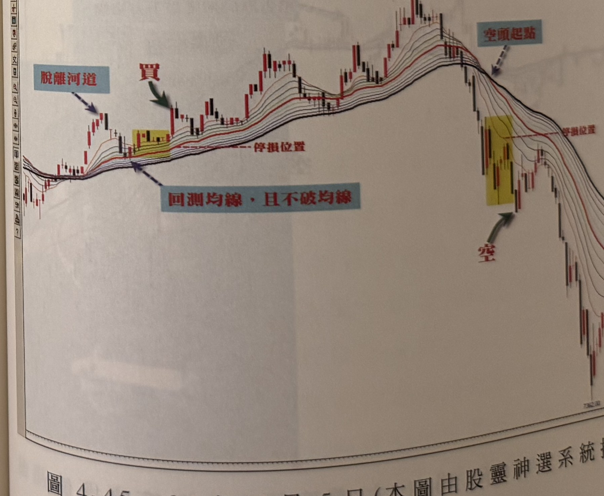

## p.176

**圖 4-42　92 年 1 月 16 日(本圖由股靈神選系統提供)**

> 圖說（figure notes）：台指期近(5分線) 河流圖，左上角報價列「BX003台指期近(5分線) 920120:10:35開4909.00↓高4917.00↑低4906.00↓收4915.00↑7.00(0.14%)量79」。左段高點5088.00附近紅字「走空起點」標示均線轉空排起點；紅字「走多起點」標示其後低點反彈轉多起點；圖中段再次紅字「走空起點」箭頭指向高檔反轉處，黃底標示區，紅字「空」與綠色箭頭標示放空點；價格其後持續下跌至圖右側低點。

## p.177

**圖 4-44　95 年 5 月 4 日(本圖由股靈神選系統提供)**

> 圖說（figure notes）：台指期近(1分線) 河流圖，左上角報價列「BX003台指期近(1分線) 950505:08:47開7375.00↑高7382.00↓低7375.00↓收7378.00↑3.00(0.04%)量206」。低點7315.00附近藍底黑字方塊「這不是買點，因為之前的價格曾跌破河道最下方均線」箭頭指向一段回升K線；紅字「多頭起點」標示均線轉多排起點；黃底標示區，紅字「買」與綠色箭頭標示買進點，右側「停損位置」虛線標示；價格其後持續上攻，中段高檔區間反覆震盪。

**圖 4-43　92 年 2 月 23 日(本圖由股靈神選系統提供)**

> 圖說（figure notes）：台指期近(5分線) 河流圖。低點4882.00附近紅字「走多起點」標示均線轉多排起點；黃底標示區，紅字「買」與綠色箭頭標示買進點；價格續攻至高點後，紅字「走空起點」箭頭指向高檔反轉處；黃底標示區，紅字「空」與綠色箭頭標示放空點；價格續跌後末段止跌回升，右上角另有紅字「買」標示新一次買進點。

**圖 4-45　95 年 5 月 5 日(本圖由股靈神選系統提供)**

> 圖說（figure notes）：台指期近(1分線) 河流圖。藍底黑字方塊「脫離河道」箭頭指向脫離均線的長紅K線；紅字「買」與綠色箭頭標示買進點，黃底標示區下方「停損位置」虛線標示；藍底黑字方塊「回測均線，且不破均線」箭頭指向回測未破均線處；價格持續上攻至高點後，藍底黑字方塊「空頭起點」箭頭指向高檔反轉處；黃底標示區，紅字「空」與綠色箭頭標示放空點，「停損位置」虛線標示；價格其後持續下跌至圖右側低點。
