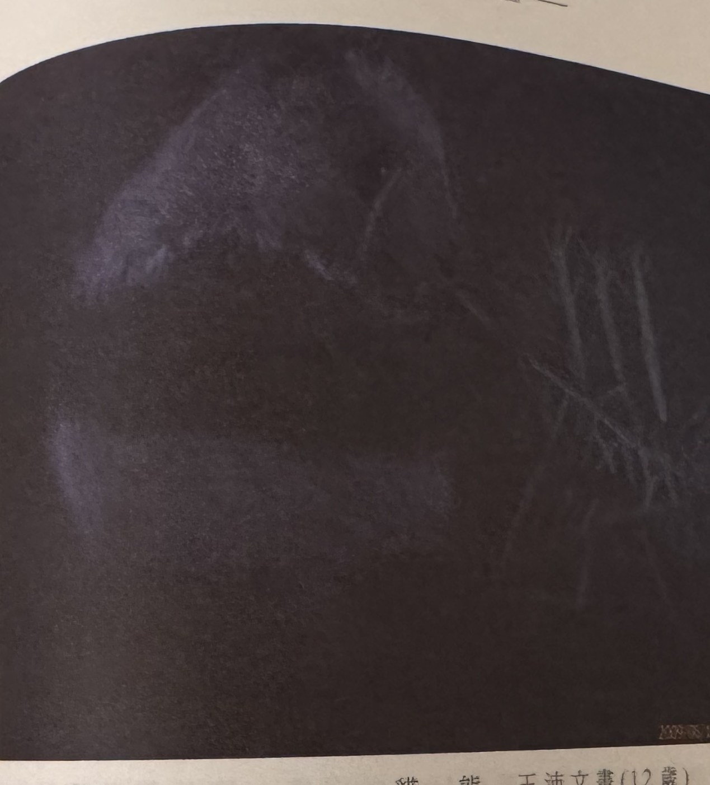
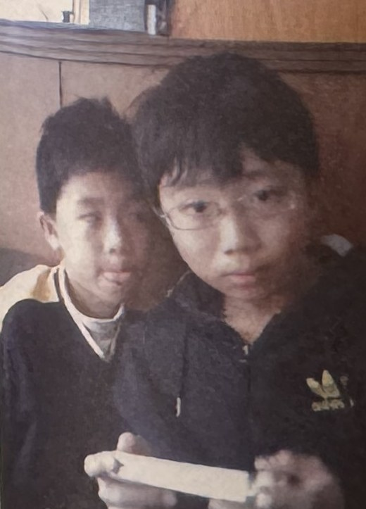

## p.178

**圖 4-46　92 年 4 月 6 日(本圖由股靈神選系統提供)**

> 圖說（figure notes）：台指期近(5分線) 河流圖，左上角報價列「BX003台指期近(5分線) 920407:12:15開4570.00↑高4573.00↓低4570.00↓收4573.00↑2.00(0.04%)量7?」。低點附近紅字「空頭起點」與紅字「多頭起點」分別標示均線轉空、轉多的起點；黃底標示區，紅字「買」與綠色箭頭標示買進點，右側「停損位置」虛線標示；價格其後持續急漲上攻至圖右側高點。

**圖 4-47　95 年 6 月 20 日(本圖由股靈神選系統提供)**

> 圖說（figure notes）：台指期近(3分線) 河流圖。藍底黑字方塊「有行進點」箭頭指向中段回測K線；圖右側藍底黑字方塊「這不是買點，因為之前的價格曾跌破河道最下方均線」與紅字「空頭起點」標示高檔反轉處；黃底標示區，紅字「空」與綠色箭頭標示放空點，「停損位置」虛線標示；價格其後持續下跌至圖右側低點。

## p.179

**貓熊　王沛文畫(12 歲)**

> 圖說（figure notes）：章節扉頁裝飾用兒童繪畫作品，深色背景（近黑），畫面呈現一隻貓熊的頭部輪廓（淺紫灰色暈染），背景有數道淺色枝狀線條。與交易內容無直接關聯，屬於書中各章前放置的兒童畫作系列（本頁位於第四章末）。

**貓畫由王沛文(右)、王奕荏(左)小朋友提供**

> 圖說（figure notes）：兩名男孩的生活照，右側男孩戴眼鏡、穿深色連帽外套，手持一張白色紙條/相片；左側男孩穿深色上衣、白色領口。背景為木質家具。

[本頁文字圖片左側另有極淡背面透印文字，非本頁內容，未轉錄]
