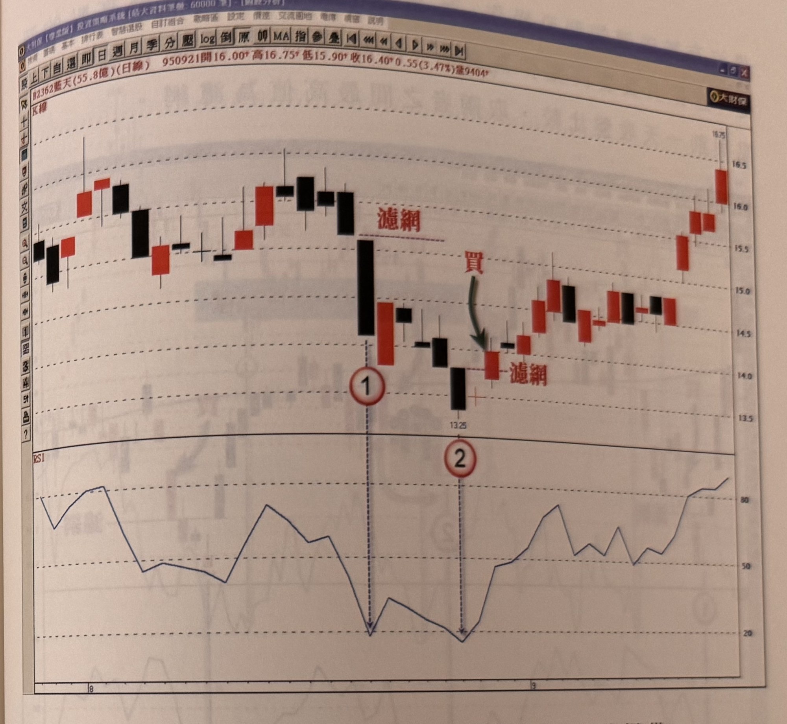

## p.188

檔程度，它可能在回檔 0.382 位置止跌，也有可能在 0.5 位置穩住，但也有可能探至波段漲幅回檔 0.618 位置，三個潛在的目標區，投資人不可能每一層都買吧！除非資金部位相當大，才能允許這樣的操作方式，但是加一道濾網機制，就可以掌握住可靠性高的彈升起漲日，如圖 5-4 中，瑞昱(2379)在 95 年 9 月自高點回檔整理，致使 RSI 強弱指標回測至超賣區，當下它會不會進一步下跌，不是我們所能預知的，它有可能下探至年線位置，這些都不必強作分析，只要 RSI 下探至 20 以下，價格 K 線收盤出現突破 RSI 值最低的 K 線最高點，就通過了濾網程序，如標示 1 位置，係 RSI 回探中的最低點，所以它的 K 線最高點，就是產生買點訊號的關鍵價位，假設價格收盤在後續行情比標示 1 的收盤價更低，那麼 RSI 的低點就會更低，所以，RSI 最低值是逐日觀察的動作，如同在量縮找買點的方式一樣，量縮的比較是逐日記錄的；當價格以長紅 K 線滿足了濾網的要求，就可以在收盤前做買進動作，並以 7%為最大停損程度，而本次的回檔程度並沒有跌破前一波低點，所以，它的後市自然有機會在漲勢慣性下，創另一波新高出現，而這個買點，它無法知道價格的彈升是很快速地創新高，還是溫吞緩步推升，它只是種操作的方式，而非大漲的保證。

## p.189

**圖 5-5(本圖由詮茂資訊股靈神選系統提供)**

> 圖說（figure notes）：藍天(2362) 日線圖（上：K線圖，下：RSI指標圖），左上角報價列「B2362藍天(55.8億)(日線) 950921開16.00↑高16.75↑低15.90↑收16.40↑0.55(3.47%)量9404」。K線圖中段標示①：一根長黑K線，上方紅字「濾網」水平虛線標示其高點（對應RSI第一次觸及20以下）；其後價格續跌，標示②（K線標示13.25）處RSI第二次觸及20以下，隨後一根長紅K線收盤突破濾網高點，紅字「買」與綠色箭頭標示買進點，另一「濾網」文字標示於該K線上方水平虛線。價格其後持續盤堅上攻至16.75附近。橫軸標示月份8、9。

再以圖 5-5 藍天(2362)為例說明，在 95 年 8 月的價格回檔中，RSI 曾二次觸及超賣區 20 以下，標示 1 出現第一次觸及 20 以下後，並沒有產生 K 線收盤通過 RSI 最低值 K 線之最高點的濾網程序，所以並沒有買進訊號，到了標示 2 位置，第二次觸及 20 以下，才出現通過濾網的買進訊號，而本例的漲勢結構維持得相當好，回檔程度沒有跌破前波低點，只要後市行情沒有觸動停損位置，那麼它的漲勢慣性，可以預見必有創新高的慣性延續，如果回檔跌破了前波低點，那麼後市行情創新高的可能性就降低了，所以，同一天有可能出現買進訊號的家數很多，但是我們應該選擇漲勢結
