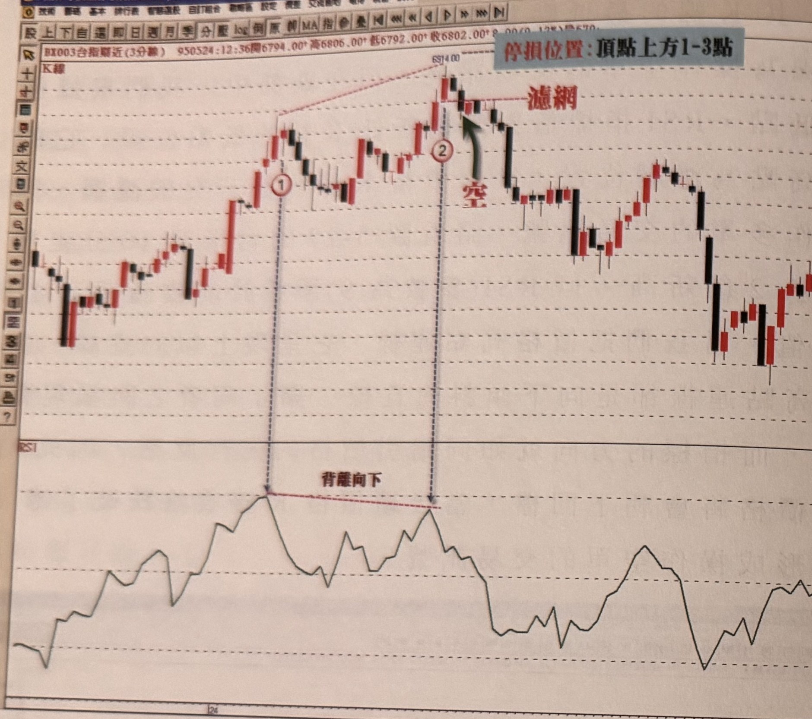
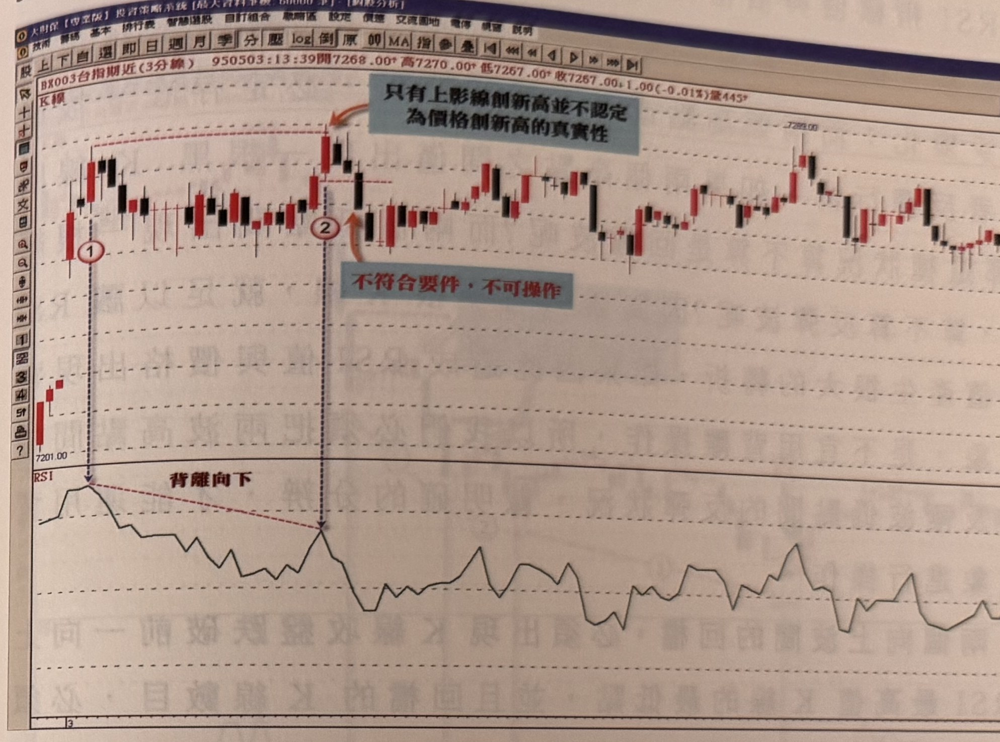
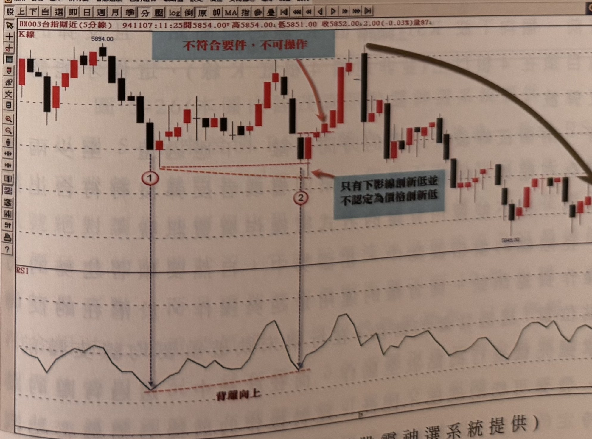

## p.204

**圖 5-23(本圖由詮茂資訊股靈神選系統提供)**

> 圖說（figure notes）：台指期近(3分線) 河流圖，左上角報價列「BX003台指期近(3分線) 950524:12:36開6794.00↑高6806.00↑低6792.00↓收6802.00↑8.00(0.12%)量670」。藍底「停損位置：頂點上方1-3點」文字方塊置於右上角。標示①：價格波峰（RSI對應高點）；紅色上傾趨勢線連至標示②（價格創新高6814.00），「濾網」水平虛線標示於標示②K線區間；紅字「空」與綠色箭頭標示放空點；下方RSI圖標示①②兩點連線呈下傾（「背離向下」），標示②的RSI低於標示①。價格其後回落整理，末段低檔震盪回升。

以 RSI 背離找尋交易訊號，可以運用在各時間單位的分時 K 線圖，RSI 的參數均設定為 9，日線上的參數設為 5；操作交易訊號的同時，必須馬上了解停損位置設在何處，我們以訊號發生之前的區間價格最高點上方 1~3 點的位置作為停損點。圖 5-23 是台指期 3 分鐘 K 線的走勢圖，當價格收盤比標示 1 的頂點價格更高時，RSI 沒有同步創新高，便要開始注意其背離現象的發展，而**此處所講到的創新高，是指 K 線收盤高出標示 1 頂點附近最高的上影線**，如果創新高只是 K 線的上影線比標示 1 的上影線高，並不認定為創新高，這個定義是觀察上非常重要的原則，須特別注意。請看圖

## p.205

5-24 及圖 5-25 的例子說明。

**圖 5-24(本圖由詮茂資訊股靈神選系統提供)**

> 圖說（figure notes）：台指期近(3分線) 河流圖，左上角報價列「BX003台指期近(3分線) 950503:13:39開7268.00↑高7270.00↑低7267.00↓收7267.00↓1.00(-0.01%)量445」。標示①（低點7201.00）；標示②：紅色虛線連接標示①②兩處K線高點（上影線），藍底紅字「只有上影線創新高並不認定為價格創新高的真實性」箭頭指向標示②的上影線；藍底紅字「不符合要件，不可操作」標示於標示②下方。下方RSI圖標示①②連線呈下傾「背離向下」。價格其後持續於高檔區間震盪整理。

**圖 5-25(本圖由詮茂資訊股靈神選系統提供)**

> 圖說（figure notes）：台指期近(5分線) 河流圖，左上角報價列「BX003台指期近(5分線) 941107:11:25開5854.00↑高5854.00↓低5851.00 收5852.00↓2.00(-0.03%)量87」。左上角藍底紅字「不符合要件，不可操作」箭頭指向標示①附近的K線；標示①（低點）與標示②（低點，下影線略低於①）之間以紅色虛線連接，藍底紅字「只有下影線創新低並不認定為價格創新低」箭頭指向標示②的下影線；下方RSI圖標示①②連線呈上傾「背離向上」。價格其後急漲一段後轉為下降趨勢（灰色弧線箭頭標示），持續下探至圖右側低點5845.00附近。
