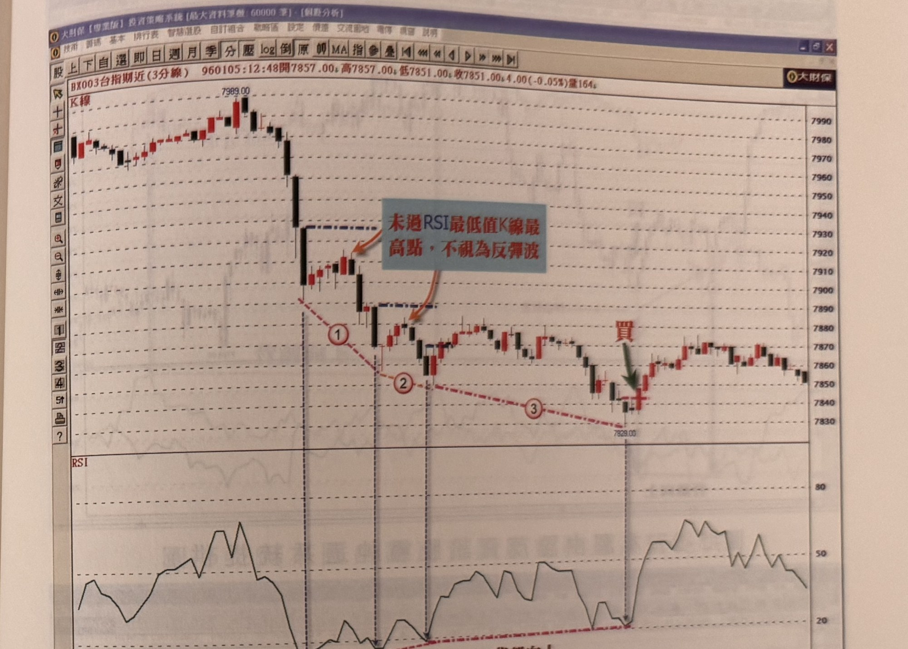

## p.206

RSI 指標值與價格的背離，是根據創新高或者創新低的波峰波谷，與前一波最高點或最低點，相互比對與 RSI 值是否同步變化；而兩個高點或者兩個低點間，必定存在一段回檔或者反彈行情，如果兩個高點之間僅出現一根黑 K 線回檔，那這種狀況算不算是回檔波呢？而兩個低點間出現一根紅 K 線，算不算反彈波呢？因為雖只有一根 K 線，就足以讓 RSI 指標值產生很大的轉折，如果因此造成 RSI 值與價格出現背離現象，是不宜用背離操作，所以我們必須把兩波高點間的回檔及兩波低點間的反彈狀況，做明確的分辨，才能運用背離現象進行操作。

兩個向上波間的回檔，必須出現 K 線收盤跌破前一向上波 RSI 最高值 K 線的最低點，並且回檔的 K 線數目，必須在 4 根以上(並非連續 4 根黑 K 線線)，才能認定它出現了回檔修正的情況，而兩個向下波間的反彈，必須出現 K 線收盤突破前一個向下波 RSI 最低值 K 線的最高點，且反彈的 K 線數目須在 4 根以上(並非連續 4 根紅 K 線)，這樣才能認定為反彈波。

再者，兩個波峰波谷之間的時間距離，不應過短，至少兩者之間存在超過 10 根 K 線，如果回檔或者反彈沒有符合上述的原則，都不能運用背離的方式來操作買賣訊號。

在短線的價格波動中，在漲勢中，自然要順著趨勢的方向操作買進訊號，而背離的運用是逆勢操作，於潛在的反轉頂點位置，透過背離的跡象，在行情未跌破重要均線支撐前，即掌握先機進行高點放空動作，而在跌勢中，透過背離的跡象，發覺可能的底部，因此，逆勢操作的前提必須嚴密地限制特定的模式，只有完全符合的情況下，才能進行逆勢操作，

## p.207

並嚴控停損機制，萬一情況有變，立刻能應變出場。

**圖 5-26(本圖由詮茂資訊股靈神選系統提供)**

> 圖說（figure notes）：台指期近(3分線) 河流圖，左上角報價列「BX003台指期近(3分線) 960105:12:48開7857.00↓高7857.00↓低7851.00↓收7851.00↓4.00(-0.05%)量164」。價格自高點7989.00反轉持續下跌，紅色下傾虛線依序連接標示①②③三個價格低點；藍底紅字「未過RSI最低值K線最高點，不視為反彈波」箭頭指向標示①②之間及②③之間的兩段反彈K線（皆以藍色虛線標示反彈未過前波RSI最低值K線最高點）；標示③（低點7829.00）後，紅字「買」與綠色箭頭標示買進點。下方RSI圖對應標示部分呈現走勢。價格其後小幅反彈整理，末段於7850～7880區間震盪。

以圖 5-26 來說明 RSI 背離的操作，並非一看到 RSI 指標出現背離，就認為底部出現，如果不限制特定條件，錯誤訊號絕對讓你被停損出場後，失去操作的信心，像在標示 1 及標示 2 的背離狀況，它的反彈波並沒有越過 RSI 最低值 K 線的最高點，而且兩個波谷低點距離不到 10 根 K 線，亦不符合用法上的重要原則，如果貿然進場操作，只有停損一途；正確的適用情況，只有標示 3 的背離現象是符合各個條件，因此，這種細節旨在篩選出較可靠的交易訊號。

以下附圖請讀者多加觀察演練。
