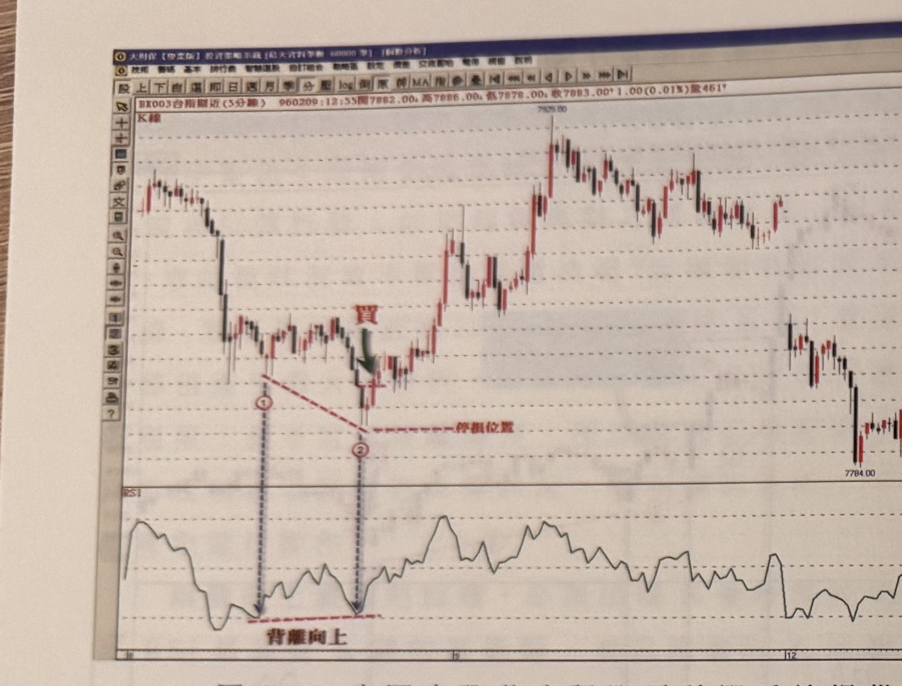
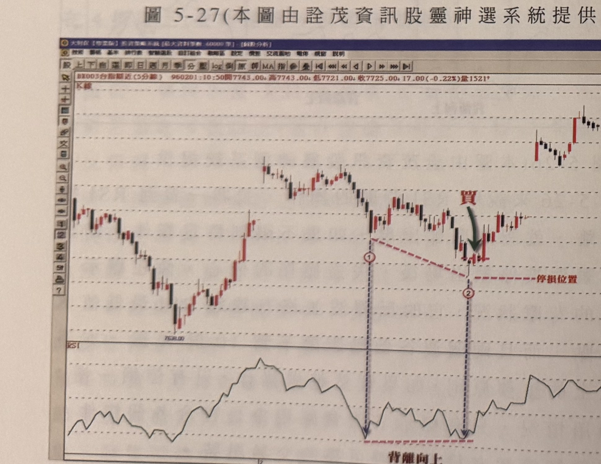
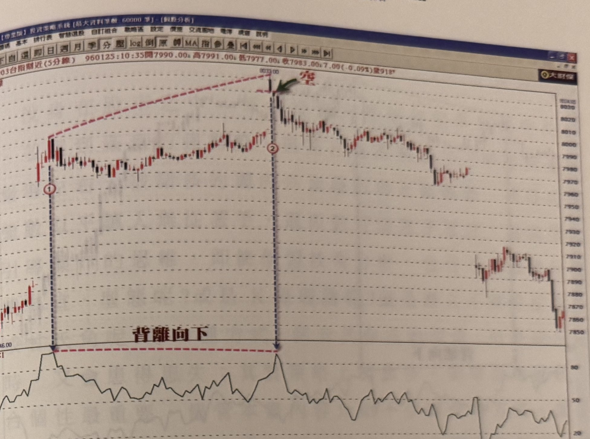
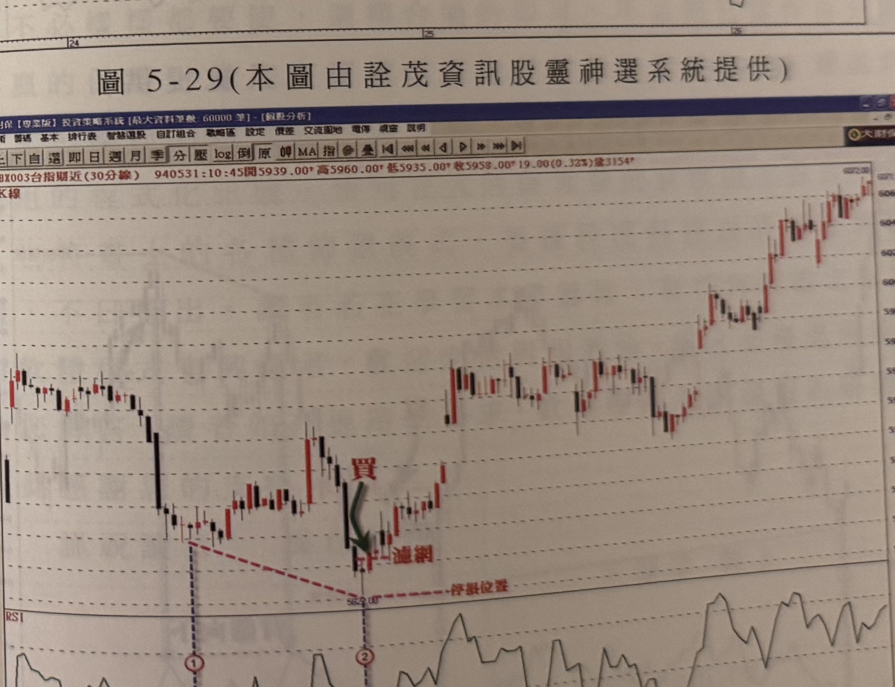

## p.208

（頁面僅有圖與圖說，無正文段落）

**圖 5-27**（本圖由詮茂資訊股靈神選系統提供）

> 圖說：台指期近 5 分鐘 K 線圖，時間戳 960209:12:55，開 7882.00、高 7886.00、低 7878.00、收
> 7883.00，+1.00(0.01%)，量 461。走勢先下跌後於低檔區間整理，標示①、②為 RSI 背離向上的兩個
> 低點（虛線紅色連接，標註「背離向上」），對應 K 線圖上①、②兩點以藍色虛線垂直對應，②點位置
> K 線出現「買」訊號（綠色箭頭指向買點 K 棒），並有紅色虛線標示「停損位置」（買點下方水平線）。
> 買進後價格持續上漲至右側高點 7929.00，隨後在高檔震盪。

**圖 5-28**（本圖由詮茂資訊股靈神選系統提供）

> 圖說：台指期近 5 分鐘 K 線圖，時間戳 960201:10:50，開 7743.00、高 7743.00、低 7721.00、收
> 7725.00，-17.00(-0.22%)，量 1521。走勢先下跌至低點 7638.00 後反彈，標示①、②為 RSI 背離
> 向上的兩個低點（紅色虛線連接，標註「背離向上」），K 線圖上①、②兩點以藍色虛線垂直對應，②
> 點位置出現「買」訊號（綠色箭頭），上方有紅色虛線標示「停損位置」。買進後價格續漲。

## p.209

第五章 運用 RSI 找尋買賣點

**圖 5-29**（本圖由詮茂資訊股靈神選系統提供）

> 圖說：台指期近 5 分鐘 K 線圖，時間戳 960125:10:35，開 7990.00、高 7991.00、低 7977.00、收
> 7983.00，-7.00(-0.09%)，量 918。走勢先上漲，標示①、②為 RSI 背離向下的兩個高點（紅色虛線
> 連接，標註「背離向下」），K 線圖上①、②兩點以藍色虛線垂直對應，②點價格創高（8033.00）後
> 出現「空」訊號（綠色箭頭指向放空點 K 棒），隨後價格反轉下跌。

**圖 5-30**（本圖由詮茂資訊股靈神選系統提供）

> 圖說：台指期近 30 分鐘 K 線圖，時間戳 940531:10:45，開 5939.00、高 5960.00、低 5935.00、收
> 5958.00，+19.00(0.32%)，量 3154。走勢先下跌至低點後止跌反彈，標示①為低點，K 線圖上①以藍色
> 虛線對應「買」訊號（綠色箭頭，並標註「濾網」），下方有紅色虛線標示「停損位置」。買進後價格
> 大幅上漲，形成標示②的高點（RSI 圖上①②為背離向上兩點，紅色虛線連接標註「背離向上」）。

[本頁下方另有跨頁裝訂處淡淡鏡像字跡，應為紙張背面透印，不轉錄]
