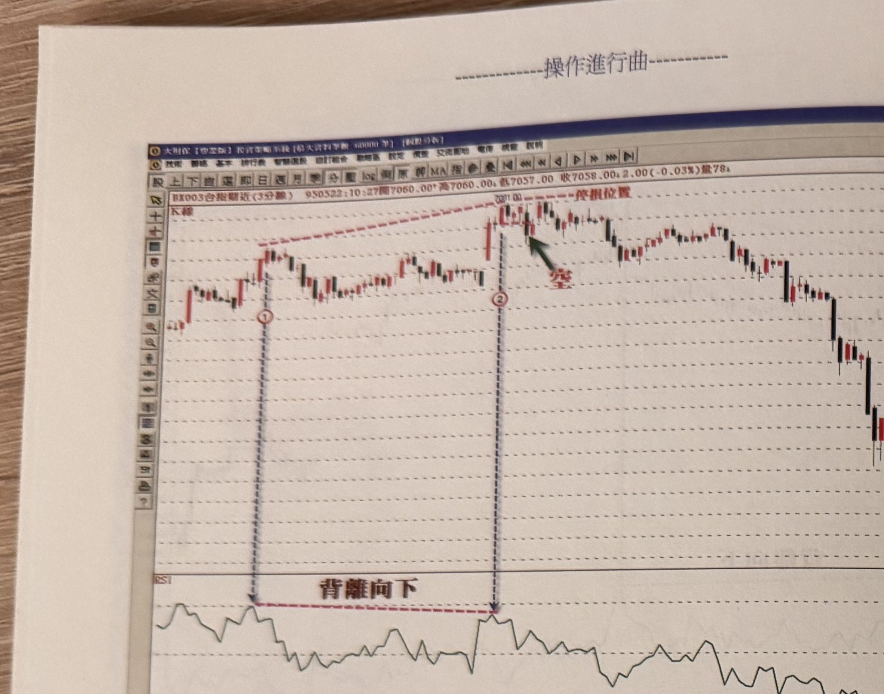
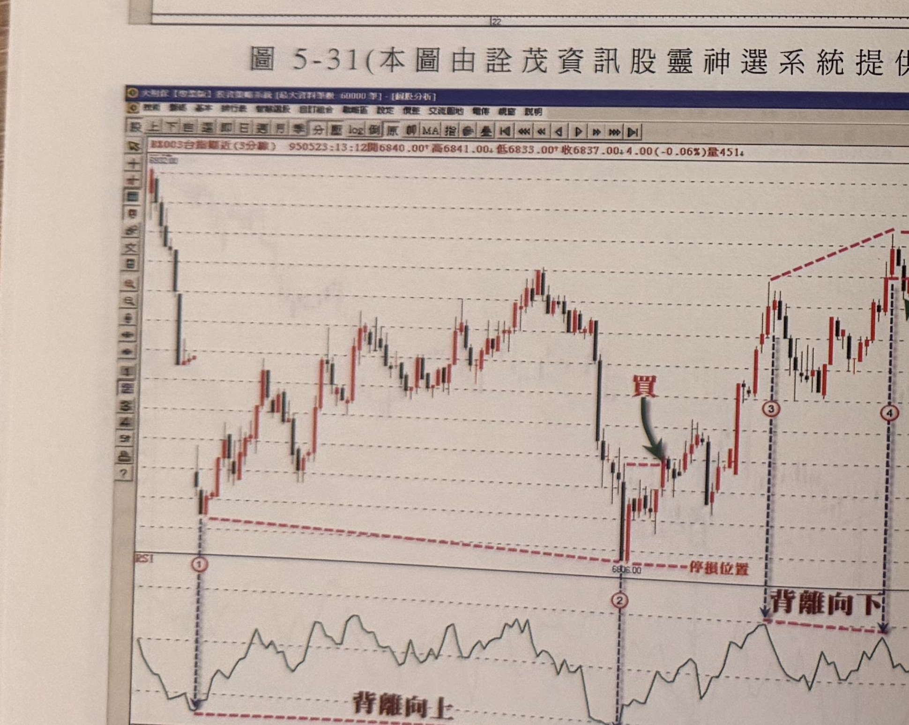

## p.210

（頁面僅有圖與圖說，無正文段落）

**圖 5-31**（本圖由詮茂資訊股靈神選系統提供）

> 圖說：台指期近 3 分鐘 K 線圖，時間戳 950522:10:27，開 7060.00、高 7060.00、低 7057.00、收
> 7058.00，2.00(-0.03%)，量 78。走勢先上漲整理，標示①為前高，隨後續創新高至標示②，②點上方
> 有紅色虛線「停損位置」，②點出現「空」訊號（綠色箭頭指向放空點），隨後價格反轉下跌。RSI 圖
> 上①、②為背離向下兩點（紅色虛線連接標註「背離向下」）。

**圖 5-32**（本圖由詮茂資訊股靈神選系統提供）

> 圖說：台指期近 3 分鐘 K 線圖，時間戳 950523:13:12，開 6840.00、高 6841.00、低 6833.00、收
> 6837.00，4.00(-0.06%)，量 451。走勢先下跌至標示①、②低點（RSI 背離向上，紅色虛線連接標註
> 「背離向上」），②點下方有紅色虛線「停損位置」，②點附近出現「買」訊號（綠色箭頭）。買進後
> 價格反彈上漲至標示③、④高點，④點附近有紅色虛線標示，並標註「背離向下」，隨後價格回落。

## p.211

後記

投身在股市之中，每個投資人都期望能掌握趨勢的動向，並選到滿意的強勢股，但是在這市場越久，
漸漸地被媒體報導左右，被諸多的國內外金融市場互動影響，使得判斷的變數似乎讓人無從著手，進而
對行情忽多忽空，沒個準則在引導操作的思維，即使學習技術分析，也有不知根據何種方式為宜，型態
呢？或是 K 線理論呢？還是歷久不衰的波浪理論或甘氏角呢？每一種方式，都有其存在的價值，但是綜
合運用時，又會患得患失；其實策略上勿貪多，簡單合用就好，適合個性最重要。儘管本書內容介紹不
少操作的方法，讀者卻不必樣樣都要使，選擇合適的即可，不必把它當作百分百必贏的保證。當您在運
用本書中某種策略進行操作，應能助您掌握操作的時機與控制風險，具有趨贏的可靠度，而書上使用的
程式化訊號，皆可在大財保專業投資軟體上設計，本人也將書上的各種篩選模式，委請詮茂科技設計成
套裝軟體，不日推出。讀者若在學習本書過程，有任何疑義之處或對軟體程式有興趣者，歡迎來信與我
討論，本人必竭盡所能，為您解答，讀者如有進階的需求，歡迎參加進階課程的研習，在此感謝您的
支持。

謹祝讀者　操作順利

王慶津 敬上

E-mail：supaeric@yahoo.com.tw

部落格　http://www.wretch.cc/blog/eric1964

[署名下方為淡淡背景圖案（一張小型走勢圖水印），非內容文字，不轉錄；本頁為「操作進行曲」全書
最末頁（後記），確認作者為王慶津]
