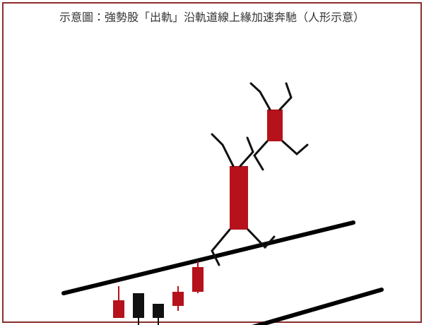

## 左頁（頁碼不可辨）

[左頁為目錄頁的背面透印（極淡且左右鏡像反轉的字跡與線條），可辨識出「義 目」（即反印的「目
義」/「目錄」殘影）及數個章節列與頁碼殘影，但均為背面穿透印跡，非本頁正面內容，依規範不予
轉錄；頁碼未見，記為 null]

## p.1

第一章　出軌-----從乖離率捕捉強勢股

**示意圖**（無圖號、無圖說文字，原始照片見 `股勝先選-p1-1.orig.jpg`）

> 圖說：概念示意圖，非真實 K 線截圖。畫面下方為一組沿著上升通道（兩條平行黑色軌道線）排列的
> 紅黑蠟燭（K 棒），紅色表上漲、黑色表下跌；蠟燭之後（右上方）以簡筆人形疊加在放大的紅色 K 棒
> 上，呈奔跑／攀爬的姿態，共兩節（軀幹分別為一根較大的紅 K 棒與其右上方一根較小的紅 K 棒），
> 象徵「強勢股出軌」時股價沿軌道線上緣加速奔馳、脫離常軌的意象，呼應正文「出軌現象」的比喻。

在我的系列書中，操作進行曲曾介紹強勢股與大盤比對的關係，說明個股領先大盤創新高是強勢股的
一種表態方式，但並非所有強勢股都是以領先姿態出場表演；一樣米百樣人，主力或莊家的個性亦然，
有些人選擇強出頭的領先猛攻方式，有些採取鴨子划水，低調而不顯眼；所謂強勢股通常指上漲幅度
大，且速率快，在一定的時間內漲幅領先一般個股。找強勢股比較像投機者，不願耐心等待，希望將
投入的時間做最大效益發揮，這同時也表示他願冒更大的機會成本，獲取不平凡的利潤。

在觀察價格發展成快速運行的基本方法，可以運用乖離率來檢測價格與平均價格的偏離程度，乖離率
並不像 RSI 或 KD 或威廉指標呈現 0～100 震盪，沒有鈍化的問題，透過價格的歷史軌跡，能夠了解個股
價格針對均線上下擺動的波形，各有波峰波谷的相對應的乖離數值，運用波峰波谷擺盪的慣性，就形成
軌道線的架構。

軌道線通常根據特定天期的移動平均線，上下各取一定的擺盪幅度，有些取 10%，有些取 7%，例如以
10 日均線為中心線，取 10% 為上界，取 -10% 為下界，假如 10 日均線剛好為 100 元，那麼

[頁面右下角另有淡淡背景鏡像文字（背面透印），不轉錄]
