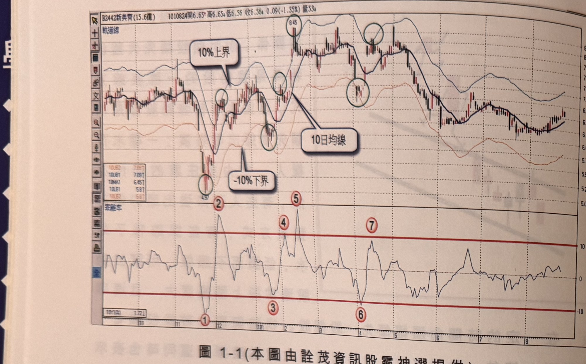
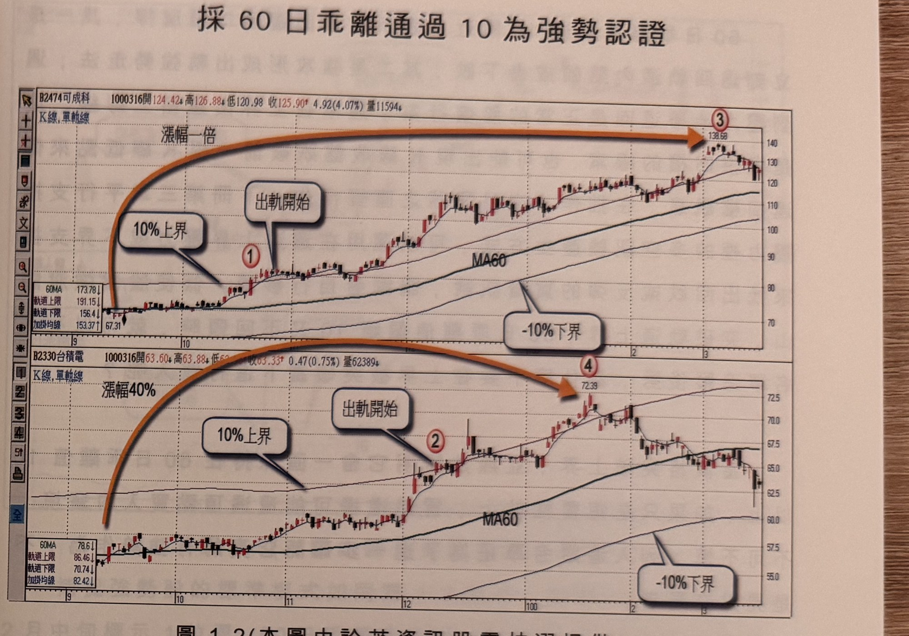

## p.2

取 10% 上界為壓力線，剛好在 100×(1+10%)=110 元位置；取 -10% 下界為支撐線，剛好在
100×(1-10%)=90 元位置，其實就是以 10 日乖離率，取正負 10 做為軌道的意思是一樣的，如圖 1-1。

**圖 1-1**（本圖由詮茂資訊股靈神選提供）

> 圖說：新美齊(2442)日線圖，時間戳 1010824，開 6.65、高 6.65、低 6.56、收 6.56，0.09(-1.35%)，
> 量 53。圖上疊加「軌道線」（10 日均線為中心的上下 10% 通道）與「10 日均線」黑色粗線，並標註
> 「10% 上界」、「-10% 下界」。價格於低點 4.97（標示②）大幅跌破下界後反彈，圖上以綠色圓圈標示
> 七個乖離率觸及上下界的位置，對應下方「乖離率」副圖上標示①～⑦（①為最深跌破 -10 的谷底，②
> 對應同一低點，④⑤為兩個突破 10 的高點，③⑥⑦為其餘穿越點）；乖離率上下各有一條紅色水平線
> 代表 +10 與 -10 的界限。

因此軌道線其實是乖離率另一種表現方式，把指標值反推到價格的 K 線圖上，方便目視判斷而已，在
乖離率的均線參數設為 10 日時，從圖上看出價格移動被限制在上下界之間擺盪，亦即價格處在 10 日
乖離率上下 10% 之間擺盪，碰到上界壓力線（乖離率為 +10），價格傾向被拉回，而跌到下界支撐線
附近（乖離率為 -10），價格則被推回均線的機會大，通常一般股票的運動的確會保持在軌道內，但當
價格快速突破上界不折回時，『出軌現象』可能會持續一段回的魔咒，而這個不正常的出軌行為正是
強勢股的寫照，而本章要捕捉的強勢就是從這個角度談起。

## p.3

第一章　從乖離率捕捉強勢股

採 60 日乖離通過 10 為強勢認證

**圖 1-2**（本圖由詮茂資訊股靈神選提供）

> 圖說：上下兩張日線圖疊圖，均含「單軌線, K線」與 MA60。上圖為可成科(2474)，時間戳 1000316，
> 開 124.42、高 126.88、低 120.98、收 125.90，+4.92(4.07%)，量 11594；圖上標示①為「出軌開始」
> 位置（60MA=173.78，軌道上限 191.15，軌道下限 156.4，加掛均線 153.37），橙色弧形箭頭指向右上
> 方標示③（138.68），並標註「漲幅一倍」，另標示「10% 上界」與「-10% 下界」。下圖為台積電(2330)，
> 時間戳同為 1000316，開 63.60、高 63.88、低 62.xx、收 63.33，+0.47(0.75%)，量 62389；圖上標示
> ②為「出軌開始」位置（60MA=78.6，軌道上限 86.46，軌道下限 70.74，加掛均線 82.42），橙色弧形
> 箭頭指向右方標示④（72.39），並標註「漲幅 40%」。兩圖對比說明可成在標示 1 位置即突破 10% 上界
> 展現強勢（乖離率突破 10 且倍數上漲），台積電則遲至標示 2 位置才突破，漲幅相對溫和（40%）。

在分析價格趨勢通常採取 60 日均線（季線）來判斷多空，季線持續朝上發展，稱為多頭走勢，而季線
持續朝下，則為空頭走勢，在多頭走勢中，有些個股沿著 60 日均線亦步亦趨地向上，屬於穩定型走法，
如果是強勢股則遠離 MA60，創造倍數漲幅，以圖 1-2 為例，上圖為可成日線圖，下圖則為台積電日線
圖，MA60 同樣朝上的區間，可成在標示 1 位置開始突破 10% 上界壓力線，表示 60 日乖離率數值穿越
10(%)，展現強勢走法，漲幅達到一倍，再看台積電同時期，遲至標示 2 位置才突破上界，突破不久就
呈現拉回軌道內，表示推升力道偏弱，屬於穩健走法，波段漲幅約在 40%，如果操作者來選股，自然
希望捕捉到可成這種漲速較快的個股。
