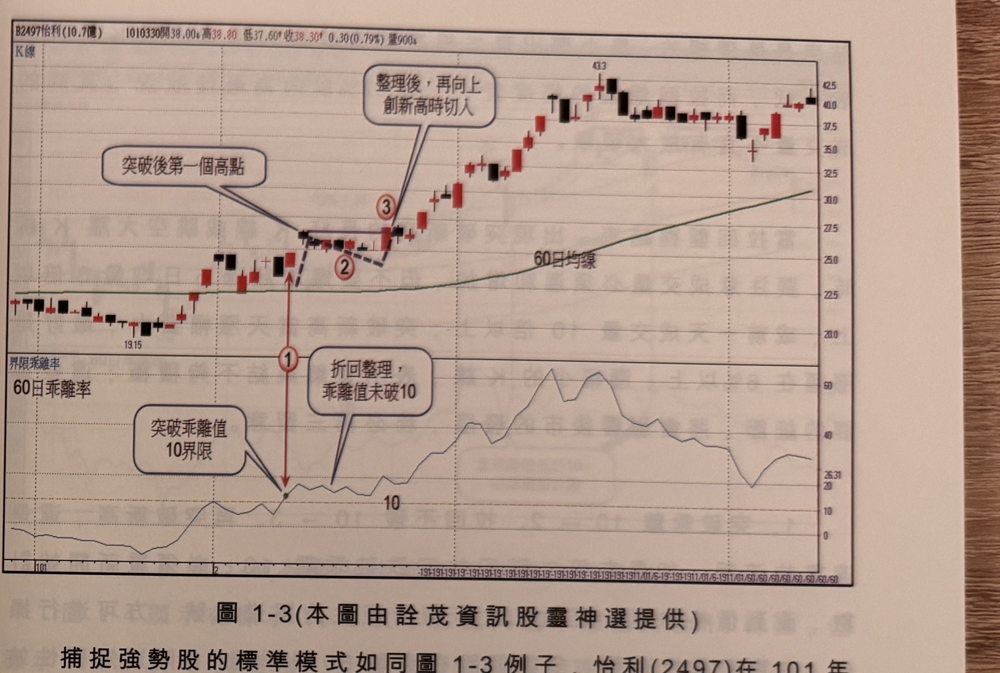

## p.4

60 日乖離率到達 10 附近，表示股價面臨到二種選擇，其一是立刻退回軌道內整頓或者下跌，其二是
強攻形成出軌強勢走法；遇到壓力地帶退回是正常的股價行為，通常在上界出量留上影線，這是提供
回檔的線索，也可能出現 K 線收盤跌破前一根 K 線低點來傳達回檔訊息，在拙作『交易訊號之直覺
操作』下冊第三章平行支撐壓力裡的多空訊號產生方式，可以運用在遭遇上界壓力或下界支撐來找出
回跌或反彈的買賣訊號，請讀者自行參閱。假使股價強渡關山，突破軌道上界，60 日乖離值偏離 10
又不回頭時，就可以列入名單追蹤後勢，為什麼不要在上界被突破當下進行買入呢？

當價格突破上界，並無法證明它會一直保持在 60 日乖離值 10 以上，如果只是短暫性站上，冒然進場
可能遭遇頂點買入的窘境，不可不慎；列入追蹤名單是為了進一步確認它真的有強勢作為，不是晃點
交易者。

強勢股捕捉三步驟

強勢股的條件之一，股價始終保持在 60 日乖離值 10 之上運行，這在突破當下是無法預知的，但是
可以透過觀察它折回是否跌破 10 進行觀察；突破上界後，股價若進行回檔整理或者橫向整理，乖離值
卻沒跌破 10，等它向上突破創新高時，這就是進場買進的時機；這三個步驟類似 N 型結構，即第一
步驟為突破上界列入追蹤，第二步驟觀察回檔，乖離值未跌破 10，第三步驟價格向上突破新高時切入。

## p.5

第一章　從乖離率捕捉強勢股

結束是最理想的，最小要出現二根高點遞減的 K 線或出現 K 線收盤破一低，而拉回盤整的幅度宜小，
在 7% 以內為最佳狀況，其間的成交量不宜有放大現象。

當拉回盤整結束，出現突破新高的長紅 K 線或跳空大漲 K 線時，要注意成交量必須溫和增加，但不要
爆增超過 5 日均量 3 倍以上，或前一天成交量 10 倍以上；突破新高當天漲幅要大，最好是漲幅在 6%
以上，漲幅小的 K 線，表示買氣集結不夠積極；這些重要的細節，將會影響後市的發展，務必再三留意。

1、突破乖離 10 → 2、拉回不破 10 → 3、再突破新高，這是連貫的流程，如果在第二階段拉回跌破
乖離 10，必須重新開始計數，直到價格的運行遵循三大步驟所產生的買進訊號，方可進行操作，在
實際尋找過程，多數個股在突破 60 日乖離 10 附近短暫性站上後，即遭逢獲利賣壓折返，能夠持續
保持在乖離 10 之上者，具有轉強資格，列入追蹤，等待它突破盤局，產生切入買訊。

**圖 1-3**（本圖由詮茂資訊股靈神選提供）

> 圖說：怡利(2497)日線圖，時間戳 1010330，開 38.00、高 38.80、低 37.60、收 38.30，0.30(0.79%)，
> 量 900，含 60 日均線與下方「界限乖離率／60 日乖離率」副圖。標示①為「突破乖離值 10 界限」點
> （紅色箭頭向上指向 K 線圖上「突破後第一個高點」），標示②為隨後「折回整理，乖離值未破 10」
> 的低點，標示③為「整理後，再向上創新高時切入」的位置；乖離率副圖上以文字框對應標出①、②
> 兩點的乖離率走勢，顯示①後乖離率維持在 10 以上、僅小幅回落而未跌破。

捕捉強勢股的標準模式如同圖 1-3 例子，怡利(2497)在 101 年 2 月中旬標示 1 位置，60 日乖離率突破
10 之後，見高後折回整理，如標示 2 所代表的橫向整理數天，其乖離值並未跌破 10 的狀況，這代表
交易者的操作機會即將到來，隨後在標示 3 位置突破創新高，形成切入買點，三個步驟一氣呵成。

三大步驟中，從突破 60 日乖離值 10 後，到見第一個高點，如果漲幅超大，那就失去介入的意義，
例如突破 10 後，股價連續大漲 4 根漲停板以上，則即使再出現拉回創高的動作，切入後能否續漲，的
確難以評估，最佳狀況是突破 10 後，行情續升在 20% 以內，即見高拉回，再者，突破乖離值 10 到見
高之間的 K 線若頻出上下影線，實體短的 K 線，亦非強勢股應有的起步行為。

見高後的拉回盤整，注意時間不宜拖太長，在 10 根 K 線以內
