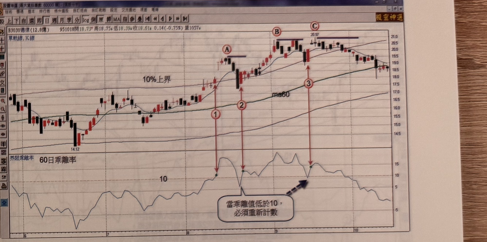
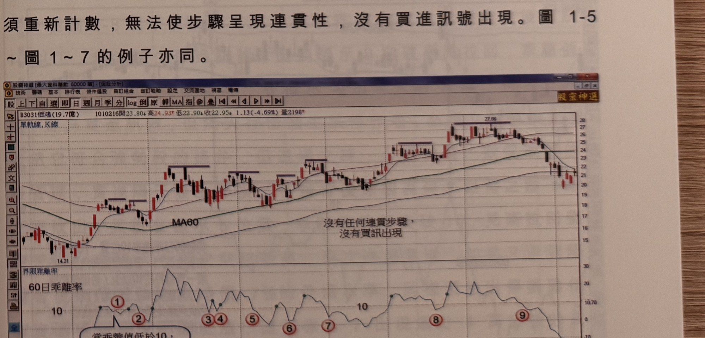

## p.6

結束是最理想的，最小要出現二根高點遞減的 K 線或出現 K 線收盤破一低，而拉回盤整的幅度宜小，
在 7% 以內為最佳狀況，其間的成交量不宜有放大現象。

當拉回盤整結束，出現突破新高的長紅 K 線或跳空大漲 K 線時，要注意成交量必須溫和增加，但不要
爆增超過 5 日均量 3 倍以上，或前一天成交量 10 倍以上；突破新高當天漲幅要大，最好是漲幅在 6%
以上，漲幅小的 K 線，表示買氣集結不夠積極；這些重要的細節，將會影響後市的發展，務必再三留意。

1、突破乖離 10 → 2、拉回不破 10 → 3、再突破新高，這是連貫的流程，如果在第二階段拉回跌破
乖離 10，必須重新開始計數，直到價格的運行遵循三大步驟所產生的買進訊號，方可進行操作，在
實際尋找過程，多數個股在突破 60 日乖離 10 附近短暫性站上後，即遭逢獲利賣壓折返，能夠持續
保持在乖離 10 之上者，具有轉強資格，列入追蹤，等待它突破盤局，產生切入買訊。

## p.7

第一章　從乖離率捕捉強勢股

**圖 1-4**（本圖由詮茂資訊股靈神選提供）

> 圖說：德律(3030)日線圖，時間戳 951018，開 18.73、高 18.75、低 18.39、收 18.61，0.14(-0.75%)，
> 量 1057，含「單軌線,K線」與 MA60、「10% 上界」標示，下方為 60 日乖離率副圖。K 線圖上以紅色
> 雙箭頭直線連接標示①②③與其上方對應的高點 A、B、C（低點 14.12 起漲）；乖離率副圖上①②③
> 三個綠點為乖離率向上穿越 10 的位置，A、B、C 三個綠點則為隨後乖離率又跌破 10 的位置，並有
> 文字框「當乖離值低於 10，必須重新計數」與箭頭指向 C 點附近。

圖 1-4 顯示在標示 1、2 及 3 位置同屬乖離值突破 10 轉強，但標示 A、B 及 C 見高後，行情拉回乖離值
都跌破 10 以下，因為必須重新計數，無法使步驟呈現連貫性，沒有買進訊號出現。圖 1-5 ~ 圖 1~7 的
例子亦同。

**圖 1-5**（本圖由詮茂資訊股靈神選提供）

> 圖說：佰鴻(3031)日線圖，時間戳 1010216，開 23.80、高 24.93、低 22.90、收 22.95，1.13(-4.69%)，
> 量 2198，含「單軌線,K線」與 MA60（低點 14.12→14.31 起漲，高點 27.86）。下方 60 日乖離率副圖
> 上以綠點標出①～⑨共九個乖離率穿越 10 的位置，皆未能連續保持在 10 以上，圖上文字標註「沒有
> 任何連貫步驟，沒有買訊出現」，並有文字框（部分文字因跨頁裁切不完整）：「當乖離值低於 10，
> ...」。

[本頁底部另有文字框「當乖離值低於10，...」因裁切延伸至頁面下緣，未能完整拍攝，內容與圖1-4的
提示文字相同，故不重複轉錄]
