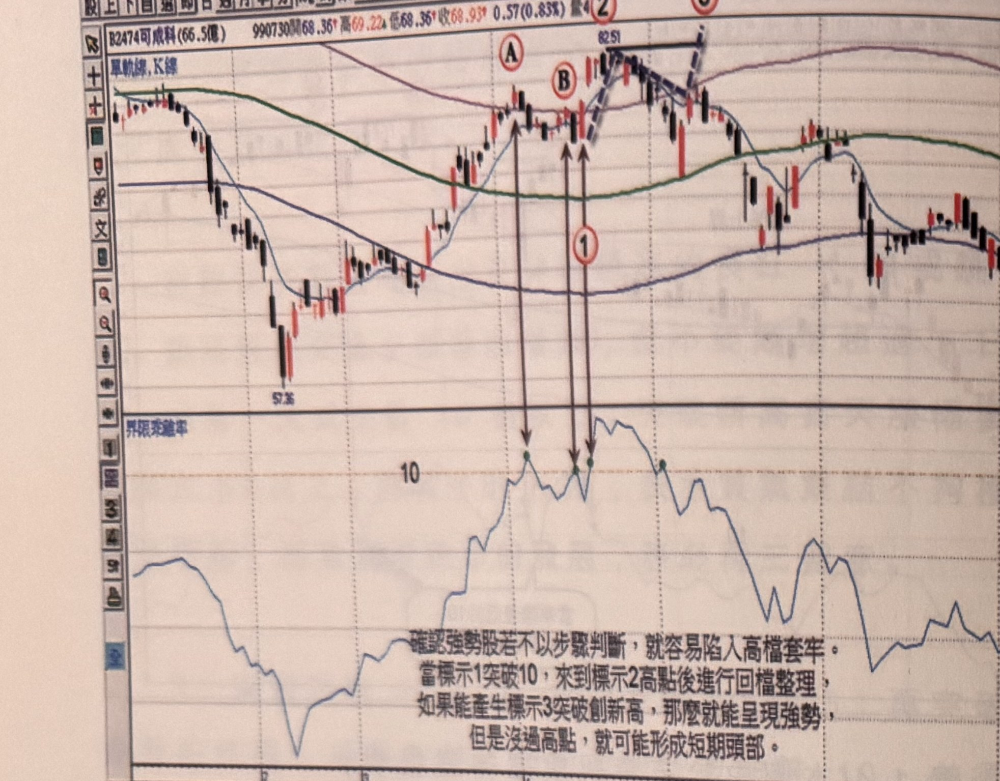
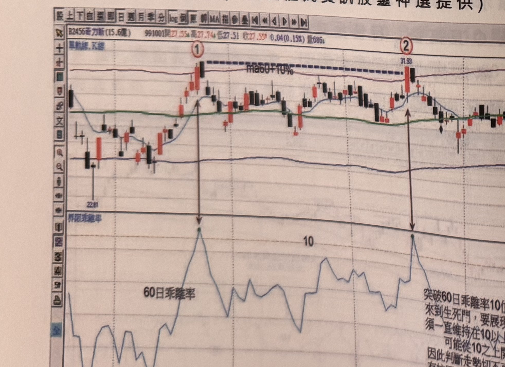
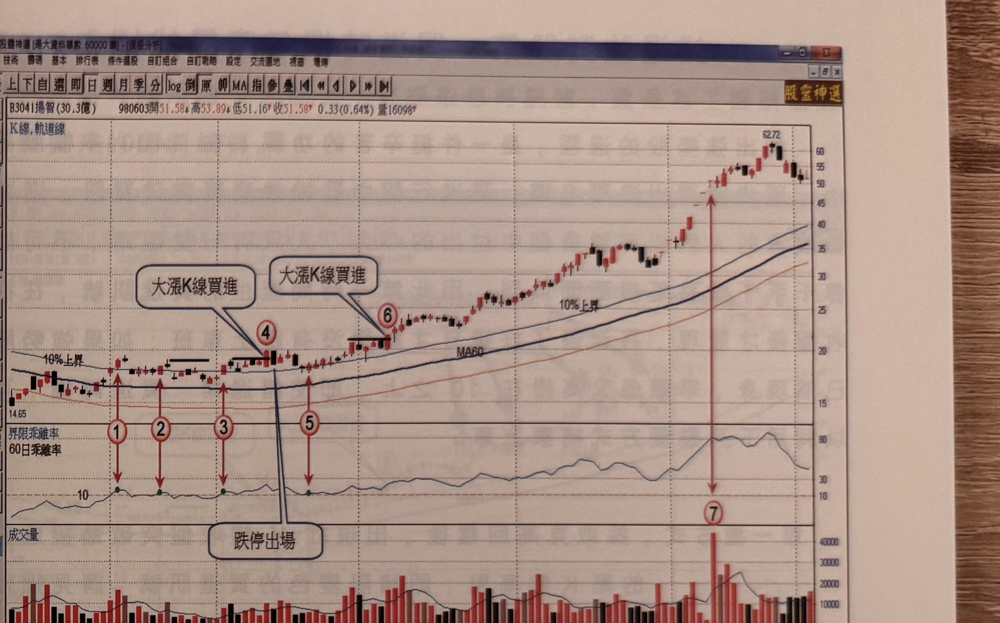

## p.8

（頁面僅有圖與圖說，無獨立段落正文）

**圖 1-6**（本圖由詮茂資訊股靈神選提供）

> 圖說：可成科(2474)日線圖，時間戳 990730，開 68.36、高 69.22、低 68.36、收 68.93，0.57(0.83%)，
> 量約 4 萬，含單軌線、K 線與 60 日乖離率副圖。低點 57.36 起漲，標示①為乖離率突破 10 位置（K 線
> 圖上以長黑箭頭對應），隨後見高點 A，回檔後再上攻見高點 B、標示②，再上攻見高點 C 附近標示③
> （高點 82.51，有虛線畫出的上升楔形）。乖離率副圖上①②③三點以綠點標示，皆貼近 10 值附近。
> 圖下方文字說明：「確認強勢股若不以步驟判斷，就容易陷入高檔套牢。當標示 1 突破 10，來到標示
> 2 高點後進行回檔整理，如果能產生標示 3 突破創新高，那麼就能呈現強勢，但是沒過高點，就可能
> 形成短期頭部。」

**圖 1-7**（本圖由詮茂資訊股靈神選提供）

> 圖說：華立新(2456)日線圖，時間戳 991001，開 27.55、高 27.74、低 27.51、收 27.55，0.04(0.15%)，
> 量 686，含單軌線、K 線（圖上標有 ma60+10% 虛線）與 60 日乖離率副圖。低點 22.81 起漲，標示①
> 為乖離率突破 10 位置（高點對應價格觸及 ma60+10% 上緣），隨後價格回落整理，再上攻至標示②
> （高點 31.93），乖離率副圖上①②兩點以綠點標示，皆貼近 10 值。圖下方文字說明：「60 日乖離率
> ——突破 60 日乖離率 10 位置，代表價格來到生死門，要展現強勢角色，必須一直維持在 10 以上，
> 否則價格極可能從 10 之上開始下跌，因此判斷走勢切不可衝動進場，沒有拉回破 10，再突破新高的
> 情況出現，不可躁進。」

## p.9

第一章　從乖離率捕捉強勢股

**圖 1-8**（本圖由詮茂資訊股靈神選提供）

> 圖說：揚智(3041)日線圖，時間戳 980603，開 51.58、高 53.89、低 51.16、收 51.58，0.33(0.64%)，
> 量 16098，含 K 線、軌道線（10% 上界）、MA60 與 60 日乖離率、成交量副圖。低點 14.65 起漲，
> 乖離率副圖以綠點標出①②③⑤四個突破 10 的位置（皆貼近 10 值），K 線圖上標示④為「大漲 K 線
> 買進」點（隨後文字框「跌停出場」指向④右側一根黑 K 線），標示⑥為第二次「大漲 K 線買進」點，
> 隨後價格持續上漲創高至 62.72（標示⑦），成交量副圖在⑦處出現逾 4 萬張的爆量長紅棒。

在圖 1-8 例子，標示 1 及 2 突破乖離 10，但乖離值之後都跌破 10 以下，無法產生買進訊號，直到標示
3 突破見高拉回，乖離值未跌破 10，並向上突破新高，在標示 4 出現大漲 K 線，符合三大步驟，是為
買進訊號，但隔天行情發生跌停作收，必須立刻停損出場，雖然它符合強勢股的條件，但進場之時，
必需做萬一狀況改變的風險管理，買進隔天發生停損，不論背後原因為何？錯愕之餘，必須立馬砍出；
其後在標示 5 位置，乖離值重新突破 10，見高拉回整理四天後，在標示 6 再次突破新高，再次進場
買進，如果又遇到隔天或者後來行情跌破進場價 7% 的停損水準，同樣要做出停損動作，事實上後市
表現不斷上漲，直到標示 7 出現爆出 4 萬多張的成交量，週轉率已達股本 30 億的 10% 以上，屬於
危險量，開始準備減碼出場。
