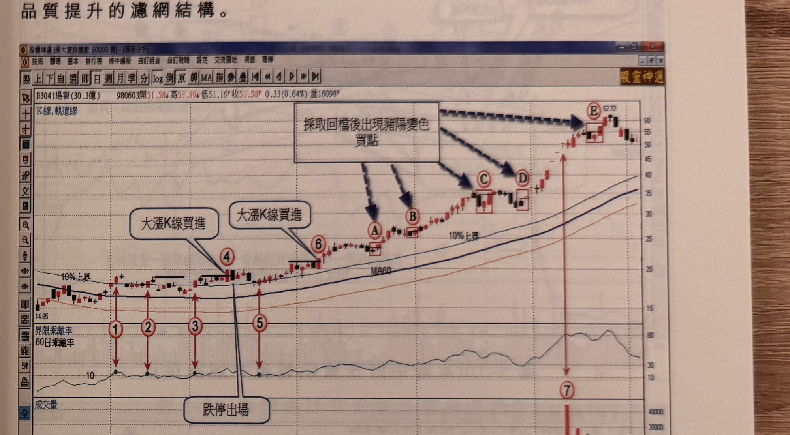

## p.10

錯過強勢股第一買進時機怎麼尋找切入

找出強勢股的過程，是一件挺辛苦的功課，在 1400 多檔股票中，逐步篩選出追蹤名單，再進行盤中
監控並發現突破買訊，這非做股票的人們能夠體會個中付出的心力，人只有一雙眼睛，不可能像千手
千眼菩薩般面面俱到，因此第一時間產生的買進訊號，往往收盤後才發現，甚至過了好幾日才驚覺沒
有跟上車班；如果強勢股已然現身，乖離值又高掛在 10 之上，即使錯過第一買進時機，可以利用下列
幾個方式補票上車。

第一種方式，採取見高回檔後，出現紅 K 線收盤突破最接近它的黑 K 線高點，即豬陽變色的買進訊號，
請見拙作『交易訊號之直覺操作』下冊第一章有詳細說明，做為買進切入點。

第二種方式，採取回檔後過，K 線收盤突破前一天 K 線最高點（即過一高模式）尋找買點。

第三種方式，採取 RSI(參數 5) 跌破 50 再回升 50 的點位進行買進。

第四種方式，透過觀察回檔的最低量的 K 線最高點為濾網，尋找過此關鍵價位的 K 線收盤，即量縮
買點模式，可以參閱『操作進行曲』第一章說明，找出進場點。

這四種方法，出現買進訊號時，須注意訊號 K 線離回檔最低點的天數不宜超過三天，即當回檔最低點
出現後，在二日內出現豬陽

## p.11

第一章　從乖離率捕捉強勢股

變色買訊或過一高買點或 RSI 過 50 之買進訊號，離回檔最低點時間超過 3 天以上，宜採取忽略訊號，
這是為了讓訊號的品質提升的濾網結構。

**圖 1-9**（本圖由詮茂資訊股靈神選提供）

> 圖說：群聯(3041 代碼標示為 B3041，實際票面顯示「B8299群聯(7.1億)」)日線圖，時間戳 960116，
> 開 117.92、高 120.83、低 116.47、收 116.88，0.63(-0.54%)，量 2026，含 K 線、軌道線、MA60、
> 60 日乖離率與成交量副圖。標示①③為乖離率突破 10 及「第一買進」點（文字框指向標示③），隨後
> 見高拉回於標示④再度出現「大漲 K 線買進」，標示⑥為第二次「大漲 K 線買進」，其下方文字框
> 「跌停出場」指向④下方一根黑 K 線；價格持續墊高，A、B、C、D、E 為採取「回檔後出現豬陽變色
> 買點」的訊號（虛線箭頭指向），標示⑦位置價格急殺留下長黑棒（成交量副圖同步爆量）。

延續圖 1-8 的例子，當圖 1-9 在標示 6 的買進訊號被錯過切入後，該個股的 60 日乖離值始終保持在 10
以上游走，表示它保持著出軌狀態，雖第一買進時機錯過，可以利用價格回檔整理出現紅 K 線收盤突破
最接近它的黑 K 線最高點(即豬陽變色訊號)來進行買進動作，如圖上標示 A~E 都屬於豬陽變色買點，
雖然它在推升階段，會出現數個豬陽變色買點，並不是每一次的買點都能百分百提供獲利的操作，價格
推升至高檔區域，豬陽變色買點的可靠度及獲利空間相對變小，因此，只可選擇 A 及 B 兩個訊號為
補救切入點為宜；像標示 C 及 E 就容易造成虧損。其它範例請參閱圖 1-10 及圖 1-11。
