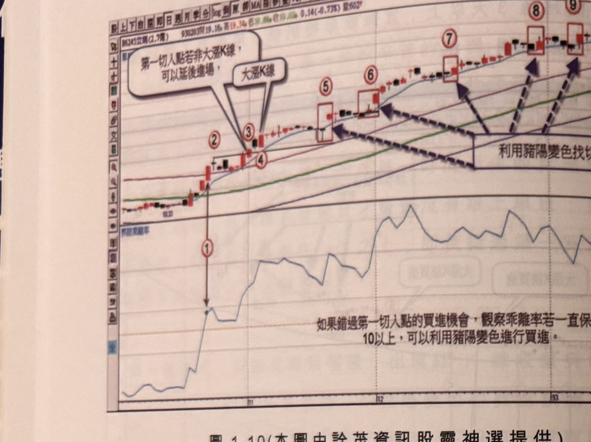
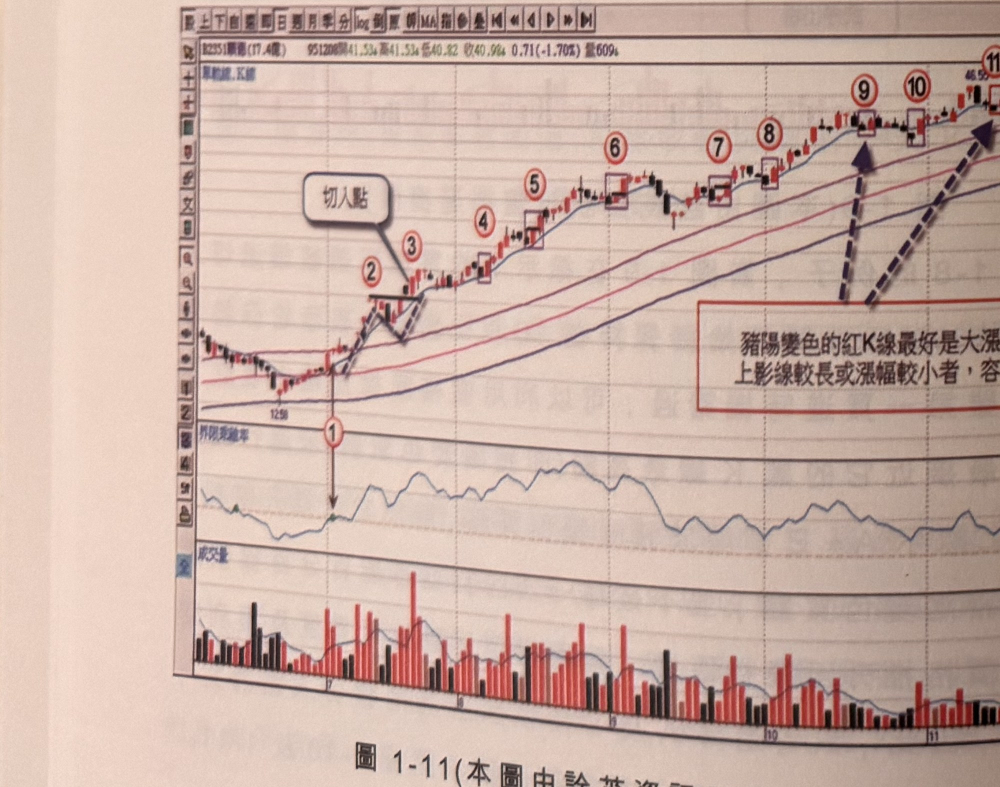
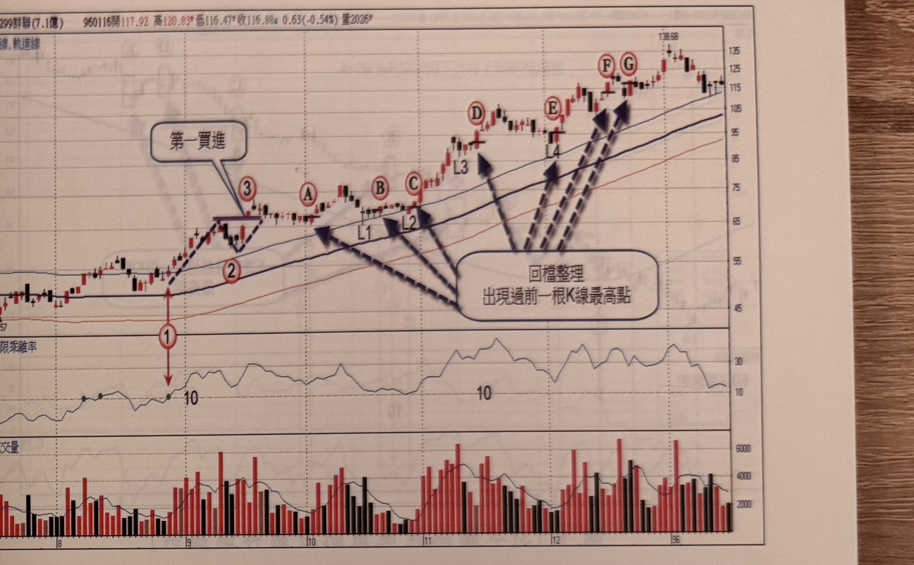

## p.12

（頁面僅有圖與圖說，無獨立段落正文）

**圖 1-10**（本圖由詮茂資訊股靈神選提供）

> 圖說：宏達電(B6245宏達(2.7億)，票面顯示為「宏達」)日線圖，時間戳 930203，開 19.16、高 19.34、
> 低?、收?，0.14(-0.73%)，量 602。標示①為乖離率突破 10（K 線圖對應標示②③，文字框「第一
> 切入點若非大漲 K 線，可以延後進場」與「大漲 K 線」指向標示③④附近），隨後標示⑤⑥⑦⑧⑨為
> 沿均線上升過程中，以虛線箭頭標出「利用豬陽變色找切入買進」的多個訊號點（方框標示 K 棒）。
> 圖下文字說明：「如果錯過第一切入點的買進機會，觀察乖離率若一直保持在 10 以上，可以利用豬陽
> 變色進行買進。」

**圖 1-11**（本圖由詮茂資訊股靈神選提供）

> 圖說：麗信(B2351麗信(17.4億))日線圖，時間戳 951208，開 41.53、高 41.53、低 40.82、收 40.98，
> 0.71(-1.70%)，量 609，含單軌線、K 線與 60 日乖離率、成交量副圖。標示①為乖離率突破 10（文字
> 框「切入點」指向標示②③附近的 V 形整理），隨後沿均線上升過程中標示④⑤⑥⑦⑧⑨⑩⑪⑫依序為
> 多個豬陽變色切入買進訊號（方框標示 K 棒，虛線箭頭指向），右側文字框註明「豬陽變色的紅 K 線
> 最好是大漲 K 線，上影線較長或漲幅較小者，容易失敗」。

## p.13

第一章　從乖離率捕捉強勢股

**圖 1-12**（本圖由詮茂資訊股靈神選提供）

> 圖說：群聯(B8299群聯(7.1億))日線圖，時間戳 960116，開 117.92、高 120.83、低 116.47、收 116.88，
> 0.63(-0.54%)，量 2026，含 K 線、軌道線與成交量副圖。標示①③為乖離率突破 10 及「第一買進」點，
> 隨後見高拉回、標示②，再上攻過程中以文字框「回檔整理出現過前一根 K 線最高點」搭配虛線箭頭
> 指出標示 A、B、C、D、E、F、G 共七個過一高切入點，並標出回檔谷點 L1、L2、L3、L4。

第二種切入方法，以圖 1-12 為例，當第一買進點錯過後，可以利用行情回檔整理過程，尋找 K 線收盤
突破前一根 K 線最高點，在某些狀況下，它跟豬陽變色買訊會出現在同一位置，圖上標示 A~G 為整理
後 K 線收盤突破前一根 K 線最高點，可提供再切入機會，而在標示 B 及 D 位置距離拉回整理階段的
最低谷點 L1 及 L3 都超過 2 根 K 線以上，不是合適的切入點，通常選擇忽略，而這種過一高的訊號
K 線最好出現大漲 K 線，對於整理結束開始上攻具有堅決的表態。其它例子請參閱圖 1-13 及圖 1-14。

（版面下方另有一行文字因跨頁裝訂處與淡淡背面透印重疊，模糊不可辨，略過不轉錄）
