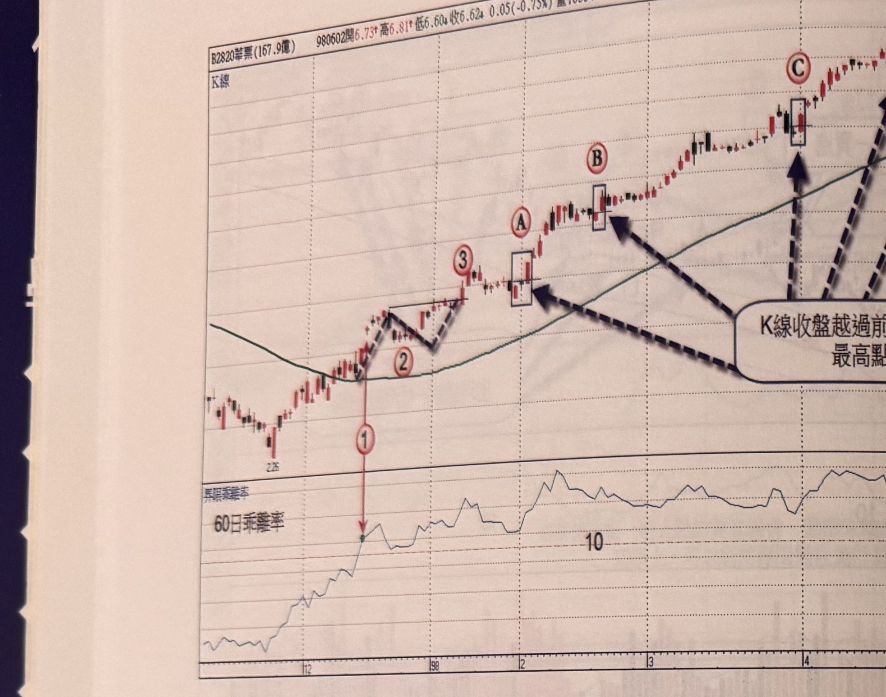
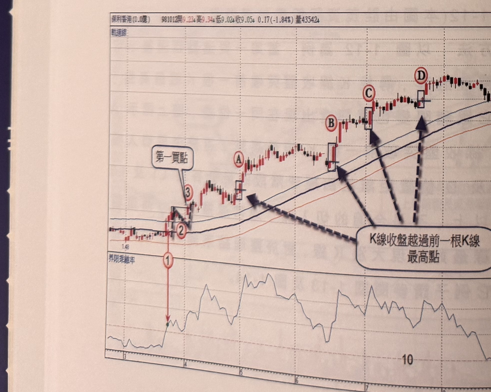
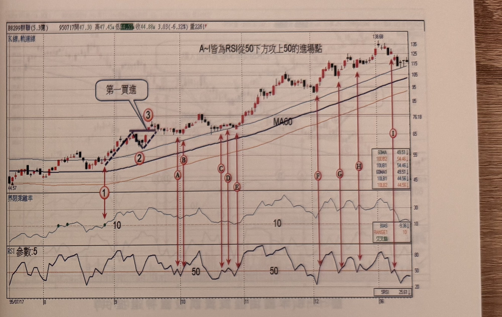

## p.14

（頁面僅有圖與圖說，無獨立段落正文）

**圖 1-13**（本圖由詮茂資訊股靈神選提供）

> 圖說：華票(B2820華票(167.9億))日線圖，時間戳 980602，開 6.73、高 6.81、低 6.60、收 6.62，
> 0.05(-0.75%)，量約 1 萬，含 K 線與 60 日乖離率副圖。低點 2.26 起漲，標示①為乖離率突破 10（K
> 線圖對應標示②，V 形回檔後標示③為「切入點」候選），隨後標示 A、B、C 為依序出現的過一高／
> 豬陽變色買進訊號（方框標示 K 棒，虛線箭頭指向文字框「K 線收盤越過前一根 K 線最高點」）。

**圖 1-14**（本圖由詮茂資訊股靈神選提供）

> 圖說：保利香港日線圖，時間戳 981012，開 9.23、高 9.34、低 9.02、收 9.05，0.17(-1.84%)，量
> 43542，含軌道線、K 線與 60 日乖離率副圖。低點 1.48 起漲，標示①為乖離率突破 10（標示②③，
> 文字框「第一買點」），隨後標示 A、B、C、D 為依序出現的過一高切入訊號（方框標示 K 棒，虛線
> 箭頭指向文字框「K 線收盤越過前一根 K 線最高點」）。

## p.15

第一章　從乖離率捕捉強勢股

**圖 1-15**（本圖由詮茂資訊股靈神選提供）

> 圖說：群聯(B8299群聯(5.3億))日線圖，時間戳 950717，開 47.30、高 47.45、低 44.57、收 44.88，
> 3.03(-6.32%)，量 2261，含 K 線、軌道線、MA60、60 日乖離率與 RSI(參數:5) 副圖，圖上文字「A~I
> 皆為 RSI 從 50 下方攻上 50 的進場點」。標示①③為乖離率突破 10 及「第一買進」點，隨後標示
> A、B、C、D、E、F、G、H、I 依序為 RSI 由 50 下方向上穿越 50 的九個買進點（紅色箭頭連接 K 線
> 與下方 RSI 副圖對應位置），RSI 副圖上以水平線標示 50 值；末端價格上漲至高點 138.68。

第三種再切入方式，利用 RSI 指標(參數為 5 天)，當個股行情保持在出軌狀態下，代表它的上攻角度
比普通個股陡，用 RSI 來尋找買進點是個相當不錯的選擇，觀察 RSI 指標跌破 50 後，再重新站上 50
的點位，圖 1-15 中標示 A~I 均為 RSI 突破 50 的買進點，根據 RSI 上 50 的訊號，要注意同價格區域
只取一個，例如在標示 A 及 B 屬同價格區，所以只有 A 位置切入，而標示 C、D 及 E 亦屬同價區，但是
C 及 D 離谷點超過 2 根 K 線以上，E 前面有二根陰線，為另一次拉回，因此 E 為最低點，適合切入；
其它 F、G 及 H 都符合濾網，但是之前提過，整段推升過程，訊號愈到高檔，愈容易有停損風險，因此
只建議二次再切入點，後來出現的訊號宜謹慎斟酌。其它範例請參閱圖 1-16 及圖 1-17。

（版面下方另有一行文字因跨頁裝訂處與淡淡背面透印重疊，模糊不可辨，略過不轉錄）
