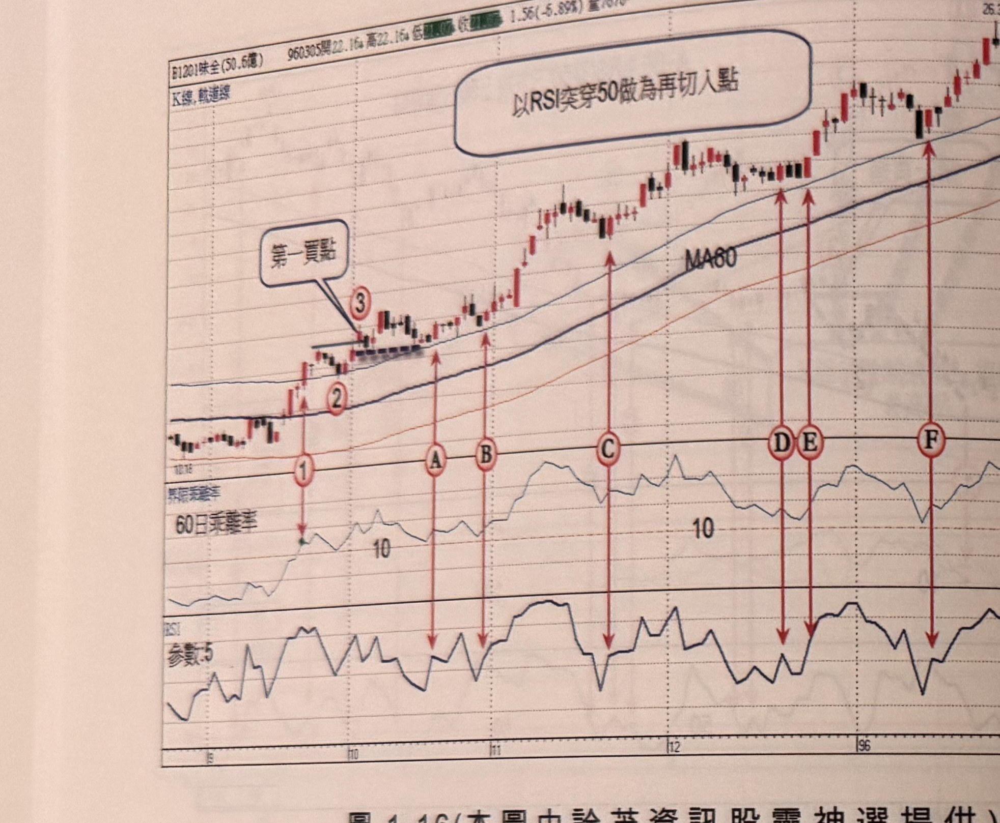
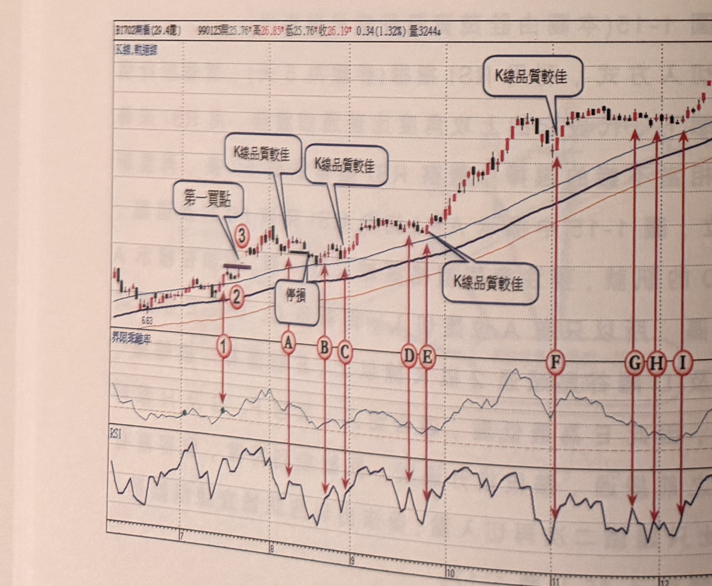
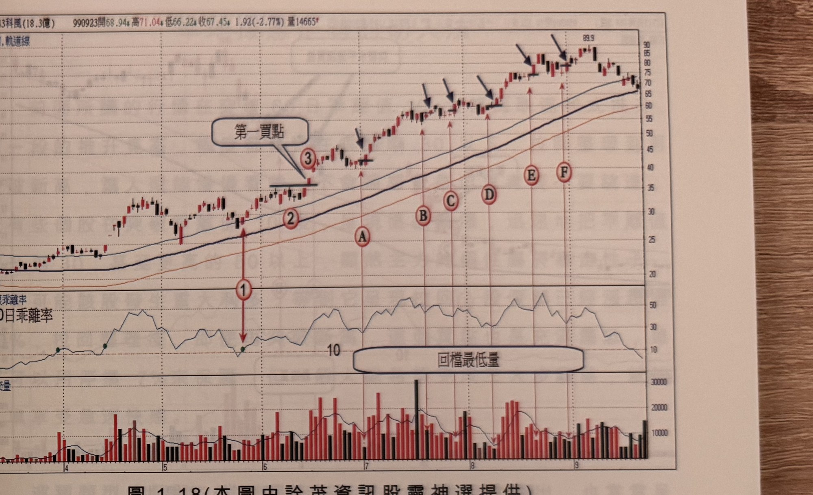

## p.16

（頁面僅有圖與圖說，無獨立段落正文）

**圖 1-16**（本圖由詮茂資訊股靈神選提供）

> 圖說：味全(B1201味全(50.6億))日線圖，時間戳 960305，開 22.16、高 22.16，0.1(-5.89%)，量約
> 7676，含 K 線、軌道線、MA60、60 日乖離率與 RSI(參數:5) 副圖，圖上文字「以 RSI 突穿 50 做為
> 再切入點」。標示①③為乖離率突破 10 及「第一買點」，隨後標示 A、B、C、D、E、F 依序為 RSI
> 由 50 下方突破 50 的六個買進點（紅色箭頭連接 K 線與下方 RSI 副圖對應位置），末端價格漲至
> 26.32。

**圖 1-17**（本圖由詮茂資訊股靈神選提供）

> 圖說：南仁湖(B1702南仁(29.4億))日線圖，時間戳 990125，開 25.76、高 26.85、低 25.76、收
> 26.19，0.34(1.32%)，量 3244，含 K 線、軌道線、60 日乖離率與 RSI 副圖。標示①③為乖離率突破
> 10 及「第一買點」，隨後標示 A、B、C 附近文字框多次標註「K 線品質較佳」（K 棒實體飽滿、上
> 影線短），另有文字框「停損」指向一次假突破，接著標示 D、E、F 附近再度標註「K 線品質較佳」，
> 末端標示 G、H、I 為價格於高檔 30.61 附近的訊號點。

## p.17

第一章　從乖離率捕捉強勢股

**圖 1-18**（本圖由詮茂資訊股靈神選提供）

> 圖說：科風(B3043科風(18.3億))日線圖，時間戳 990923，開 68.94、高 71.04、低 66.22、收 67.45，
> 1.92(-2.77%)，量 14665，含 K 線、軌道線、60 日乖離率與成交量副圖。標示①③為乖離率突破 10
> 及「第一買點」，隨後標示②，接著標示 A~F 為「回檔最低量」濾網法找出的量縮買點（黑色箭頭與
> 紅色垂直線指向 K 棒，方框標示回檔期間量最低的 K 線高點），末端價格漲至 89.9。

第四種再切入方式，根據回檔或橫向整理期間，觀察成交量最縮的 K 線，取其最高點做為買點濾網，
當後續 K 線收盤越過濾網，視為買進訊號；如圖 1-18 標示 A~F 位置，為拉回或橫向整理出現的最低
量，(所謂最低量指某一高點回跌開始到目前所出現的最低成交量)，將最低量的 K 線最高點畫水平線
當作濾網，圖上藍色箭頭所標示為 K 線收盤通過濾網的買進訊號，量縮買點並沒有強制限定離谷點幾根
以內為適宜，但最佳的狀況仍然離谷點越近越好，一檔個股只要 60 日乖離值一直保持在 10 以上，運用
各種指標的買進條件去尋找切入點皆可收到不錯的效果，例如用 KD 指標的黃金交叉當作買進訊號去
運作，亦有同樣可靠度。其它範例請參閱圖 1-19 及圖 1-20，請注意量縮 K 線最高點，當出現跳空情形，
必須以真實高點為濾網，即比較量縮 K 線最高點及前一天收盤價取兩者較高為濾網。
