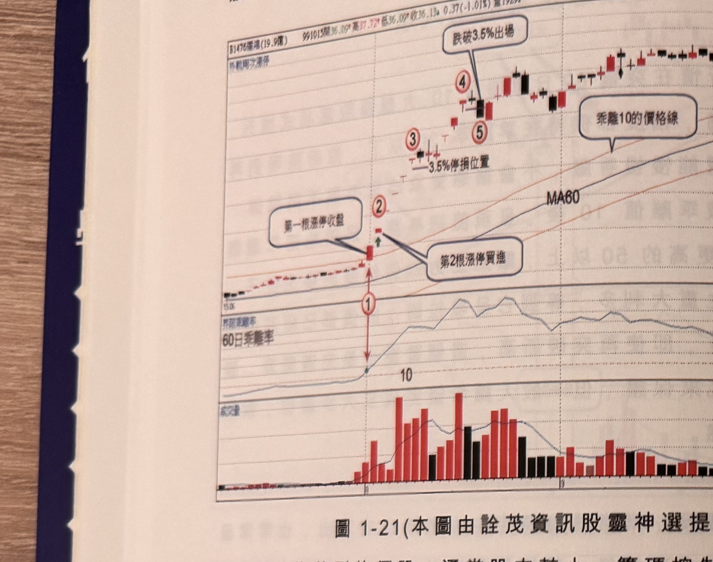
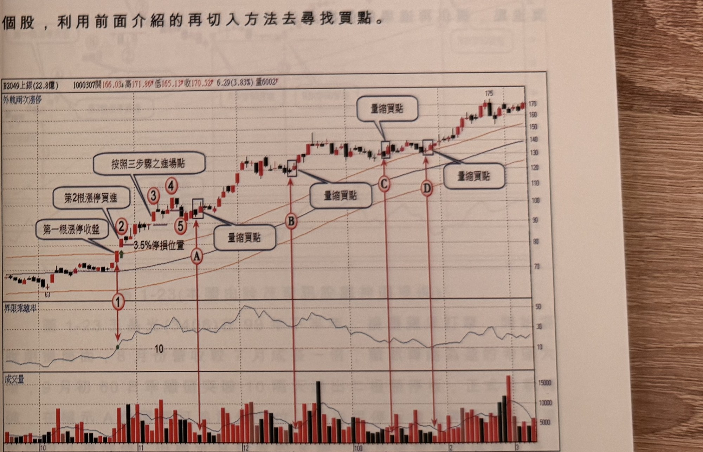

## p.20

**圖 1-21**（本圖由詮茂資訊股靈神選提供）

> 圖說：儒鴻(B1476儒鴻(19.9億))日線圖，時間戳 991015，開 36.09、高 37.72、低 36.09、收 36.13，
> 0.37(-1.01%)，量 1929，含 K 線、外軌兩次漲停標示、60 日乖離率與成交量副圖。標示①為乖離率
> 突破 10（文字框「第一根漲停收盤」指向標示②，「第2根漲停買進」指向②右側紅 K），中間標示③
> 附近有「3.5% 停損位置」水平線，隨後標示④⑤（文字框「跌破 3.5% 出場」指向④⑤附近），末端
> 價格續漲至 39.84 附近，圖上另有文字框「乖離 10 的價格線」指向 MA60 曲線。

旱地拔蔥型的個股，通常股本較小，籌碼控制容易，股本大的個股出現旱地拔蔥式暴走機率甚小，一般
而言股本在 30 億以下比較有機會出現，股本超過 30 億的個股，連續出現 2 根停板，不容易繼續發展
成連出 5 根漲停甚至 10 根漲停的機會。

圖 1-21 儒鴻股本 19.3 億，屬中小型股，在 99 年 8 月之前，成交量稀少，價格震幅極小，7 月份營收
月成長近 3 成，同時 Q2 的 EPS 為 1.49 元創下四年單季新高，但是在 8 月初，這些資訊還未公布，
消息靈通人士，奮力搶買，8 月第一個交易日，突破急拉到漲停，乖離值突破 10，首度出軌，代表轉
強的可能性，第二個交易日跳空接近漲停板，這時就要跟著跳進去，如標示 2 位置，風險設在半根停
板位置，以防意外發生，之前連續再攻四根漲停板，請注意這種連續漲停的出場方式，隨著每天漲停
移動，在標示 3 位置的隔天不再漲停，出現震盪，這時停損設在標示 3 漲停位置向下

## p.21

第一章　從乖離率捕捉強勢股

3.5% 價位，在沒有跌破的情況下，繼續持股不放，隨後再攻 3 根漲停攻抵標示 4 位置，並在標示 5
觸及其 3.5% 停損位置，立即出場。

後市只要該股之乖離值都保持在 10 以上，可以繼續操作這檔個股，利用前面介紹的再切入方法去尋找
買點。

**圖 1-22**（本圖由詮茂資訊股靈神選提供）

> 圖說：上銀(B2049上銀(22.8億))日線圖，時間戳 1000307，開 166.03、高 171.86、低 165.13、收
> 170.52，6.29(3.83%)，量 6002，含外軌兩次漲停標示、K 線、60 日乖離率與成交量副圖。標示①
> 為「第一根漲停收盤」，標示②為「第2根漲停買進」，其下有「3.5% 停損位置」，標示③④文字框
> 「按照三步驟之進場點」，標示⑤附近文字框「量縮買點」，隨後 A、B、C、D 依序為「量縮買點」
> （方框標示 K 棒，箭頭指向），末端價格漲至 175 附近。

從圖 1-22 的進場買點及按照三步驟之進場點比較，根據 2 次漲停的買點比較早，而本例中上銀在 99
年 2~10 月營收都呈現成長，且 Q2 的 EPS 高達 2.82 元，皆是創新記錄，因此，當基本面如此出色，
在 9 月底乖離值突破 10 同時收漲停板，隔天續推漲停，可以在攻抵漲停搶進，並以半根停板為停損，
如果後市以每日漲停上攻，則停利策略以漲停價向下 3.5% 位置做為出場點，但如果後市非日日漲停，
則以大漲 K 線真實低點(比較該 K 線最低點與前一天
