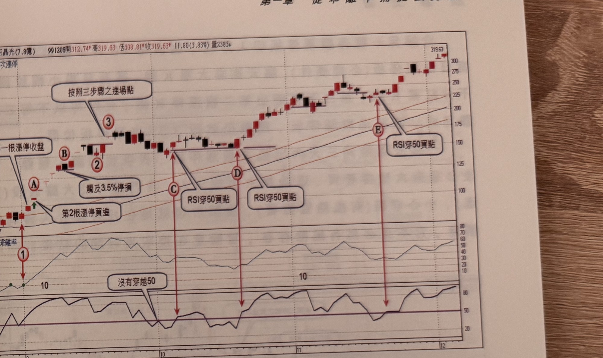

## p.22

收盤價孰低)做為停損停利位置，在本例中，標示 5 位置跌破標示 4 長紅 K 線最低點，須在此獲利出場；
只要該股仍維持在乖離值 10 以上，則可以利用再切入方式，尋找買點，標示 A~D 位置為量縮買進點，
提供再進場的依據。

[本頁下方約三分之二版面為前頁內容的淡淡背面透印（左右鏡像反轉的圖形與文字殘影），非本頁正面
印刷內容，依規範略過不轉錄]

## p.23

第一章　從乖離率捕捉強勢股

**圖 1-23**（本圖由詮茂資訊股靈神選提供）

> 圖說：玉晶光(B3406玉晶光(7.8億))日線圖，時間戳 991206，開 312.74、高 319.63、低 308.81、收
> 319.63，11.80(3.83%)，量 2383，含外軌兩次漲停標示、K 線、60 日乖離率與 RSI 副圖。標示①為
> 乖離率突破 10（文字框「第一根漲停收盤」指向標示 A，「觸及 3.5% 停損」指向標示 B，「第2根
> 漲停買進」指向標示②附近），隨後文字框「按照三步驟之進場點」指向標示③，接著 RSI 副圖上以
> 「沒有穿越 50」標註兩處未達訊號的低點，標示 C、D、E 為「RSI 穿 50 買點」（紅色箭頭連接 K 線
> 圖與 RSI 副圖對應位置），末端價格漲至 319.63。

圖 1-23 玉晶光(3406)在 99 年下半年，接獲蘋果訂單，開始擺脫虧損局面，8 月份營收較 7 月成長一
倍，顯然轉虧為盈的希望大增，9 月初 60 日乖離值突破 10 隔天連出二根漲停板，正式出軌轉強，在
標示 A 位置便可追漲停價位，以半根停板做為停損位置，果然再攻 4 根漲停，但標示 B 位置的 K 線，
觸及停損必須停利出場。像這種突破乖離值 10 便直線上攻，要等待完成三大步驟，便須等到標示 3
位置，幾乎是突破軌道後一倍的漲幅，顯然不合理，進場的意願怎麼提起呢？

當停利出場後，可以觀察其它再切入的買點，本例我們利用 RSI(參數 5) 穿越 50 做為再切入的依據，
可以選擇在標示 C~E 位置做為切入買點。

（本頁下方另有一行文字因跨頁裝訂處與淡淡背面透印重疊，模糊不可辨，略過不轉錄）
