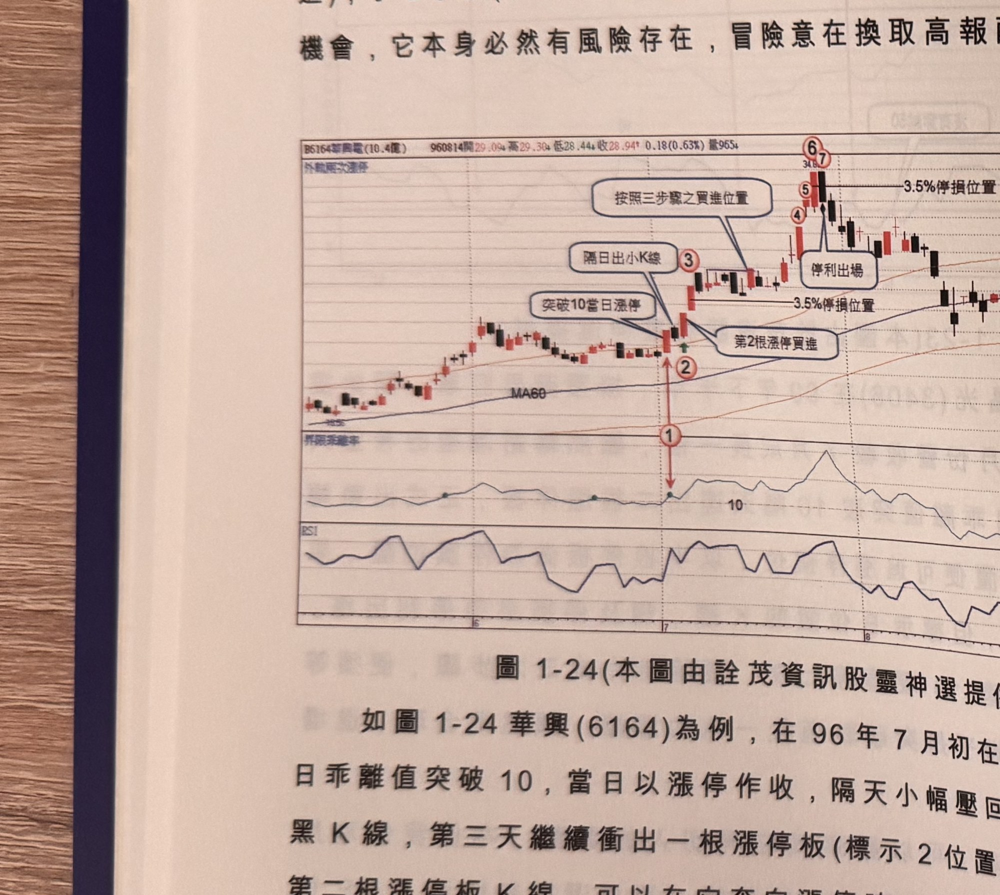
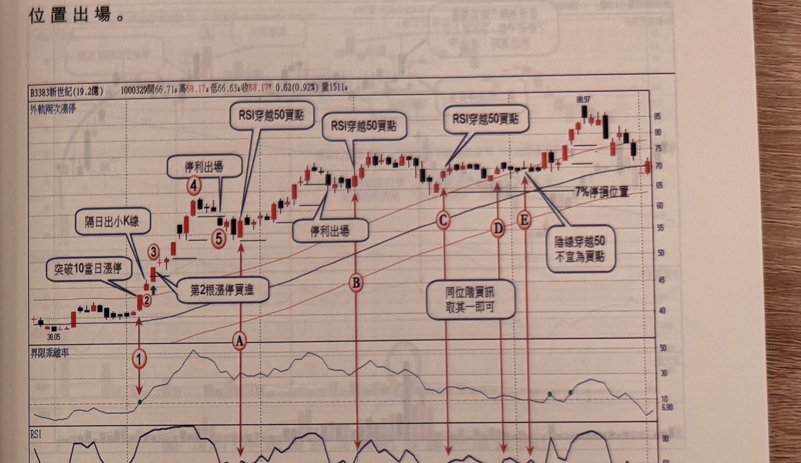

## p.24

介紹另一種連續漲停板切入方式，當價格 60 日乖離值突破 10 當日為漲停板(必要條件)，隔天則非大漲
K 線，甚至呈現小幅拉回，當日為漲停板(必要條件)，隔天則非大漲 K 線，甚至呈現小幅拉回，當第三
天再衝出第二根漲停 K 線，此時可以不等三步驟完成，直接追買漲停板，風險仍然設 3.5% 半根停板
位置。

一檔股票能夠三天內出現 2 根漲停板，表現也夠讓人驚艷，背後必須有大咖撐著買，遑論是主力或
法人，我們儘可能大膽假設(買進)，小心求證(有風險管控著)，股票市場就是在找各種介入獲利的
機會，它本身必然有風險存在，冒險意在換取高報酬的結果。

**圖 1-24**（本圖由詮茂資訊股靈神選提供）

> 圖說：華興電(B6164華興電(10.4億))日線圖，時間戳 960814，開 29.09、高 29.30、低 28.44、收
> 28.94，0.18(0.63%)，量 965，含外軌兩次漲停標示、K 線、MA60、60 日乖離率與 RSI 副圖。標示①
> 為乖離率突破 10（文字框「突破 10 當日漲停」指向標示②，「隔日出小 K 線」指向標示③，「第2根
> 漲停買進」指向③右側紅 K，「按照三步驟之買進位置」指向標示④），隨後標示⑤⑥⑦（文字框「停利
> 出場」，另有「3.5% 停損位置」水平線兩條），末端價格觸及約 34.8 附近後回落。

如圖 1-24 華興(6164)為例，在 96 年 7 月初在日乖離值突破 10，當日以漲停作收，隔天小幅壓回收
一根小實體黑 K 線，第三天繼續衝出一根漲停板(標示 2 位置)，這是三天內的第二根漲停板 K 線，
可以在它奔向漲停時，奮勇跳進漲停，買進隔天又出一根漲停，將停利點設在標示 3 水平線(半根停板
位置)，稍後的拉回整理並沒有跌破，再衝出標示 4、5、6 三根漲停板，最後在標示 7 黑 K 線跌破標示
6 半根停板停利

## p.25

第一章　從乖離率捕捉強勢股

位置出場。

**圖 1-25**（本圖由詮茂資訊股靈神選提供）

> 圖說：新世紀(B3383新世紀(19.2億))日線圖，時間戳 1000329，開 66.71、高 68.17、低 66.63、收
> 68.17，0.62(0.92%)，量 1511，含外軌兩次漲停標示、K 線、MA60、60 日乖離率與 RSI 副圖。標示
> ①為「突破 10 當日漲停」，標示②為「第2根漲停買進」，標示③為「隔日出小 K 線」，標示④為
> 「停利出場」，標示⑤，隨後標示 A、B、C、D、E 為「RSI 穿越 50 買點」（部分處註記「同位階買訊
> 取其一即可」），標示 D、E 附近另有文字框「陰線穿越 50 不宜為買點」，右側有「7% 停損位置」
> 水平線，末端價格漲至 88.97。

圖 1-25 為新世紀(3383)日線圖，在 99 年創下連 11 個月營收成長，季盈餘同樣亮麗，全年度 EPS 達
3.71 元，重振佳績；在 100 年 1 月初 60 日乖離值突破 10，標示 1 位置以漲停作收，隔天續高，但是
一根實體小的 K 線(標示 2)，第三天奮力再拉第二根漲停 K 線，此時已表明它攻勢企圖旺盛，追買
漲停板，並設下半根停板的停損，後市果然繼續推升，停利方式可以大紅 K 線低點移動，圖上藍色
水平線所示，當標示 5 黑 K 線跌破標示 4 紅 K 線最低點，停利出場。行情都維持在乖離 10 以上，採取
RSI 穿越 50 尋找再切入點。

（本頁下方另有兩行文字因與下一頁淡淡背面透印重疊且部分裁切，模糊不可辨，略過不轉錄）
