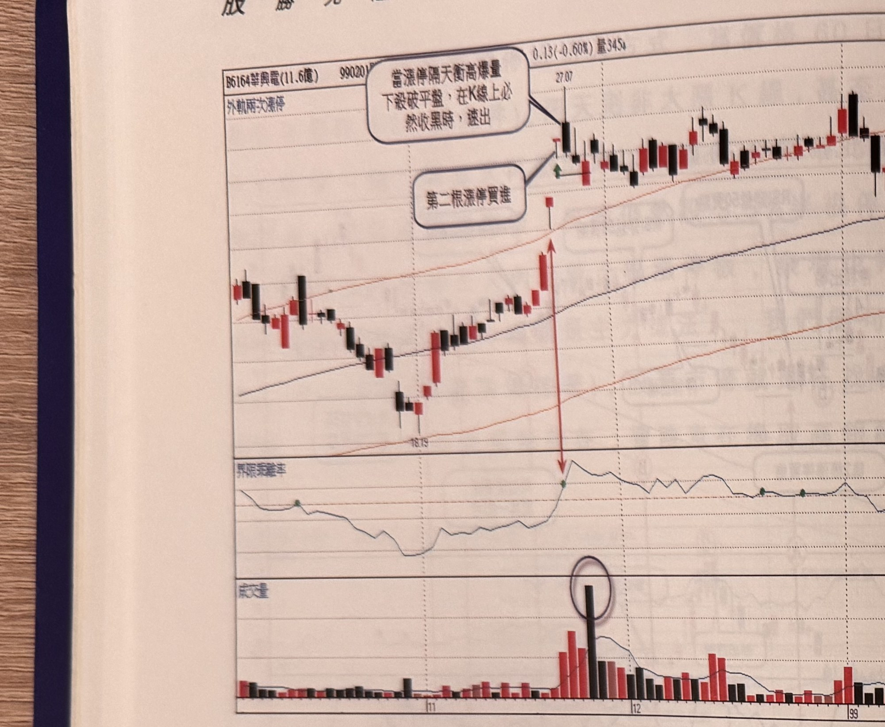
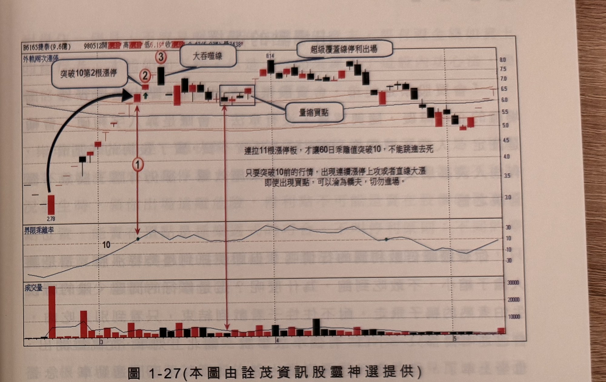

## p.26

**圖 1-26**（本圖由詮茂資訊股靈神選提供）

> 圖說：華興電(B6164華興電(11.6億))日線圖，時間戳 990201，0.13(-0.60%)，量 345，含外軌兩次
> 漲停標示、K 線、60 日乖離率與成交量副圖。圖上文字框「當漲停隔天衝高爆量下殺破平盤，在 K 線
> 上必然收黑時，速出」與「第二根漲停買進」分別指向 27.07 高點附近的黑 K 及其左側紅 K；乖離率
> 副圖上以紅色雙箭頭直線標出突破 10 的位置，下方成交量副圖以圓圈標出爆量長黑棒。

並不是每次乖離值突破 10 又連出 2 根漲停的個股，必然飛天龍嘯，有時候也會虎頭蛇尾，以圖 1-26
華興(6164)，98 年前三季 EPS 為 0.8 元，獲利並不突出，雖然 60 日乖離值突破 10，也攻 2 根停板，
在第 2 根漲停追買隔天，跳空開盤，衝高爆量後，直殺平盤下，必然是一根爆量黑 K 線，宜快速跟著
將持股停損殺出，雖然進場都希望它能一飛衝天，但當意外狀況出現時，保命保本要緊，先撤再說。

## p.27

第一章　從乖離率捕捉強勢股

**圖 1-27**（本圖由詮茂資訊股靈神選提供）

> 圖說：捷泰(B6165捷泰(9.6億))日線圖，時間戳 980512，量 2438，含外軌兩次漲停標示、K 線與 60
> 日乖離率、成交量副圖。低點 2.78 起漲，標示①②③依序為乖離率突破 10（文字框「突破 10 第2根
> 漲停」指向標示②）、「大吞噬線」（指向一根長黑棒）、「超級覆蓋線停利出場」（指向右側高點
> 8.14 附近的紅 K），中段方框標示「量縮買點」；圖中另有文字框說明：「連拉 11 根漲停板，才讓
> 60 日乖離值突破 10，不能跳進去死」，及「只要突破 10 前的行情，出現連續漲停上攻或者直線大
> 漲，即使出現買點，可以淪為驚夫，切勿進場。」

另一種情況發生時，不能呆呆地看到訊號就進場，當 60 日乖離值突破 10，同樣出現 2 根漲停板，但在
突破 10 之前的行情，早已經飆漲一大段，有這種情形，除非獲利大躍進，不然不碰為妙！請看圖 1-27
的例子，捷泰(6165)在 96 與 97 年都呈現虧損狀態，在 98 年 2 月出現無量暴跌，從 6 元直摔 2.78 元，
突然打開跌停直拉漲停後，日日漲停急攻，當乖離值突破 10 時，已經是第 11 根漲停板，隔天也是拉
漲停，這時雖然符合條件，但不宜跳進去買。

在操作的過程，對於策略總是希望他帶領你累積財富，但策略本身是死的，操作是活的，現實是殘酷
的，失誤的訊號總是打擊你的信心；如果有一種遊戲，賠 1 賺 5，甚至賺 20，有這種優勢條件，那你
應該一直玩下去，不用煩惱不用急著換招式，中國有句老掉牙的俗語，『心急吃不了熱年糕』，道理
總是要慢慢體會，時間一到就懂！
