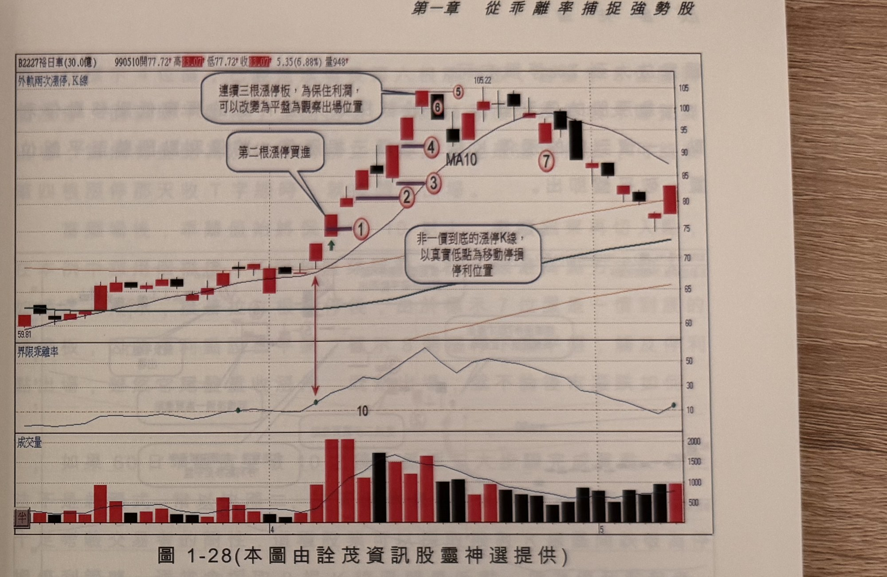

## p.30

才能放下貪與怕，了解人事萬物都不曾完美過，了解缺點就不會汲汲追補失落的足跡，股票市場天天
開，經驗是慢慢累積的，財富亦然，暴利的股票遇之則喜，無遇亦無礙。

在固定的停損停利策略中，針對不同現象作微調應變是必須的，我們說過方法是死的，操作是活的，
保持彈性，隨機調整，自然對於出場不會有患得患失的感觸，在過去出版的系列書中，曾提到不同的
出場策略，提供給讀者參考，基本上已經完備，針對特殊狀況，我們再補充介紹。

當運用本章挑選出強勢股，通常漲速比較快，有些會連續漲停出現，如果使用階梯出場策略，顯然
有點緩不濟急，階梯出場策略是根據創高新的紅 K 線與前一根 K 線，取兩者較低的 K 線最低點作為
停損停利位置，當二根 K 線都是漲停板時，停利點便是第一根漲停 K 線的真實低點，代表從第二根
漲停收盤向下跌 14% 才遇停利點，甚至如果隔天開漲停後，需下殺 21% 才殺到停利點，停利的美意
就大打折扣；如果使用破幾根 K 線區間最低點的停利策略，那更有可能坐電梯上去又坐下來，特殊
情形需作調整，才不會陷入被策略綁死的窘境。

## p.31

第一章　從乖離率捕捉強勢股

**圖 1-28**（本圖由詮茂資訊股靈神選提供）

> 圖說：裕日車(B2227裕日車(30.0億))日線圖，時間戳 990510，開 77.72、高 83.07、低 77.72、收
> 83.07，5.35(6.88%)，量 948，含外軌兩次漲停標示、K 線、MA10 與 60 日乖離率、成交量副圖。
> 低點 59.81 起漲，標示①為「第二根漲停買進」（乖離率突破 10），隨後標示②③（文字框「非一
> 價到底的漲停 K 線，以真實低點為移動停損停利位置」），標示④，標示⑤⑥附近文字框「連續三根
> 漲停板，為保住利潤，可以改變為平盤為觀察出場位置」（高點 105.22），標示⑦為出場點，末端
> 價格回落。

以圖 1-28 裕日車(2227)為例，在 99 年 4 月發動一波急速上漲行情，在出現突破 60 日乖離值 10 第二
根漲停板，進場買進後，先訂下 3.5% 的停損位置，如標示 1 位置，隔天繼續推升，接著將停利點
移至標示 2 位置，這根 K 線是跳高開盤且漲停作收，因此停利點設在其真實低點，取當根 K 線低點
與前一根 K 線收盤較低者，標示 3 及標示 4 都是漲停 K 線，停利線仍設在真實低點位置，當標示 5
當根 K 線也是漲停板時，這已經是連續第三根漲停板，為了保障獲利，將停利點移動到收盤價位置，
換言之，隔天標示 6 的行情，不能收盤比平盤低，不然就出場，因此當標示 6 開低時，即要準備出場，
哪怕後來又攻上去；如果推升過程，出現一價到底的漲停板，隔天只要開盤開平盤或開低，可以立刻
殺出，這不包括進場買進當天是一價到底的漲停板情況，初進場買進之停損設半根停損，有些
