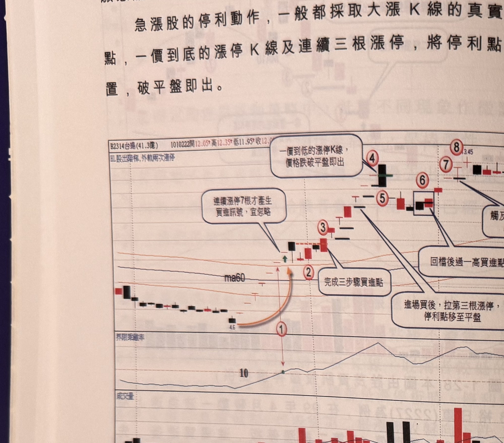

## p.32

願意放大到 7% 停損亦可。

急漲股的停利動作，一般都採取大漲 K 線的真實低點移動停利點，一價到底的漲停 K 線及連續三根
漲停，將停利點調整至平盤位置，破平盤即出。

**圖 1-29**（本圖由詮茂資訊股靈神選提供）

> 圖說：台揚(B2314台揚(41.3億))日線圖，時間戳 1010222，開 12.05、高 12.35、低 11.95、收 12.0x，
> 含「以股出階梯,外軌兩次漲停」、K 線、ma60 與 60 日乖離率、成交量副圖。低點 4.6 起漲，標示①
> 為乖離率突破 10（橙色弧形箭頭指向，文字框「連續漲停7根才產生買進訊號，宜忽略」），標示②
> 為「完成三步驟買進點」，標示③，隨後文字框「進場買後，拉第三根漲停，停利點移至平盤」指向
> 標示④附近，標示⑤，標示④文字框「一價到底的漲停K線，價格跌破平盤即出」，標示⑥⑦（文字框
> 「回檔後過一高買進點」），標示⑧為 3.45 高點附近。

圖 1-29 為台揚(2314)日線圖，在 100 年 12 月中旬，大盤觸底回升，台揚雖然業績虧損，卻也隨勢
展開絕地反攻，60 日乖離值突破 10 之上，第二根漲停板雖符合買進條件，但從最低點翻升已是第 7
根漲停板，切入的危險甚大，同時它一價到底，不見得掛得到，當隔天開漲停殺到快接近跌停，產生
激烈震盪，盤整四天後，當標示 3 位置突破新高，符合三大步驟買進條件，可以進場，隔天開始又連
拉 3 根漲停，可以將停利位置移動到平盤位置，見圖上說明，之後繼續拉 3 根漲停板，最後在標示 7
黑 K 線跌破標示 6 半根停板停利

## p.33

第一章　從乖離率捕捉強勢股

置，到標示 4 位置，已經是進場後第六根漲停板，當標示 5 位置開盤漲停，直殺破平盤時，立刻出場，
不致於等殺到跌停板才驚覺要出場，當然有些認為漲停打開就立刻殺出，但是這種作法，可能在第四
根漲停那天收 T 字線時，就被誤砍出場。

當離場後，乖離值始終保持在 10 以上，繼續觀察再切入點，在本例中採用回檔後 K 線收盤穿越前一
根 K 線最高點方式切入，如標示 6 所示，接著拉二根漲停後，由於標示 7 位置是一價到底的漲停板，
因此停利點設在平盤，標示 8 開漲停下殺平盤，觸及停利點出場，雖然它尾盤重收漲停，既然出場，
就不論後市漲跌如何。

如果 60 日乖離值突破 10 之後，係採三大步驟完成買點，但走法不是急漲式，常以快漲二、三天便
休息，或以細小 K 線慢步推升，十足考驗交易者的耐性，這種股票可以採取根數 K 線區間跌破為停損
停利策略，通常會採取 8 根 K 線區間最低點，做為停利點參考，也可以採 4 根 K 線區間最低點來判斷
停利位置，根數採取愈多根，風險係數愈低，但是過大的根數，卻會造成獲利回吐太多的遺憾；因此，
運用根數區間低點來設置停利點，當出現直拉現象或特殊的 K 線反轉組合時，要隨之彈性調整；例如：

1、遇到一價到底的漲停板 K 線，必須將停利點移至隔日的平盤位置。

2、爆出推升以來最大量，K 線卻是開超高收小漲的黑 K 線，震幅超過 5% 以上，也是回檔先兆。

3、K 線連續 3 根以上成交量超出 5 日均量，且均量線的推升角度大，並且行情推升超過 2 成，突然
成交量萎縮低於 5 日均量，通常是回檔開始。這些小狀況出現時，要彈性調整停利點位置。

（本頁下方另有一行文字因跨頁裝訂處與淡淡背面透印重疊，模糊不可辨，略過不轉錄）
